# Software Requirements Specification (SRS)

**Product:** LeonoreVault  
**Version:** 1.0 (MVP)  
**Author:** Architecture Team + AI  
**Date:** 2026-02-08  
**Status:** Draft  
**Reference:** [PRD v1.0 Rev 3](file:///d:/LeonoreKingdom/Project/Development/Web%20Development/LeonoreVault/.ai-docs/02-prd.md)

---

## Table of Contents

1. [System Overview](#1-system-overview)
2. [Functional Requirements](#2-functional-requirements)
3. [Non-Functional Requirements](#3-non-functional-requirements)
4. [Data Requirements](#4-data-requirements)
5. [External Interfaces](#5-external-interfaces)
6. [System Constraints](#6-system-constraints)
7. [Acceptance Criteria](#7-acceptance-criteria)

---

## 1. System Overview

### 1.1 System Description

LeonoreVault is a **Progressive Web Application (PWA)** for household inventory management. It enables family members to catalog, locate, and track the status of physical belongings through a shared digital inventory. The system uses QR codes for rapid item identification, Google Drive for attachment storage, and supports offline operation with background sync.

**Key capabilities:**

- Item CRUD with photos, categories, and hierarchical locations
- QR code generation and scanning for physical item tagging
- Household-based multi-user access with role-based permissions
- Lost & Found workflow for missing item tracking
- Offline-first PWA with IndexedDB cache and background sync
- Google Drive integration for photo/document storage (zero Supabase Storage usage)

### 1.2 System Architecture Overview

The system follows a **three-tier architecture** with a clear separation between the client (PWA), the API layer (Express.js), and the data/storage layer (Supabase + Google Drive).

**Layer responsibilities:**

| Layer            | Technology            | Responsibility                                                                                                            |
| ---------------- | --------------------- | ------------------------------------------------------------------------------------------------------------------------- |
| **Client**       | Next.js + TailwindCSS | UI rendering, offline caching (Service Worker + IndexedDB), QR scanning (camera API), i18n                                |
| **API**          | Express.js (Render)   | Input validation, business logic, Google Drive uploads (server-side with admin's refresh token), sync conflict resolution |
| **Database**     | Supabase Postgres     | Persistent storage with RLS, realtime subscriptions, auth (JWT + Google OAuth)                                            |
| **File Storage** | Google Drive API      | All photos/documents stored on household admin's Drive; DB stores only metadata/links                                     |

### 1.3 System Context

```mermaid
graph LR
    USER["👤 Household Members<br/>(Browser / PWA)"]
    ADMIN["👤 Household Admin<br/>(Browser / PWA)"]

    subgraph LV ["LeonoreVault System"]
        FE["Next.js PWA<br/>(Vercel)"]
        BE["Express.js API<br/>(Render)"]
    end

    SUPA["☁️ Supabase<br/>(Auth + DB + Realtime)"]
    GDRIVE["☁️ Google Drive API<br/>(File Storage)"]
    GOAUTH["☁️ Google OAuth 2.0<br/>(Identity Provider)"]
    FCM["☁️ Firebase FCM<br/>(Push Notifications — P1)"]

    USER -->|HTTPS| FE
    ADMIN -->|HTTPS| FE
    FE -->|REST API| BE
    BE -->|SQL + Realtime| SUPA
    BE -->|Upload / Read| GDRIVE
    FE -->|Auth Flow| GOAUTH
    BE -->|Token Verify| SUPA
    BE -.->|"Push (P1)"| FCM
```

**External actors:**

| Actor                | Role                                                                                           |
| -------------------- | ---------------------------------------------------------------------------------------------- |
| **Household Member** | End user who browses, searches, scans QR, adds/edits items                                     |
| **Household Admin**  | Member with elevated privileges: manage members, roles, household settings; Google Drive owner |
| **Supabase**         | Managed PostgreSQL database, authentication, and realtime engine                               |
| **Google Drive API** | File storage backend (admin's 2TB Google One account)                                          |
| **Google OAuth 2.0** | Identity provider for social login and Drive API authorization                                 |
| **Firebase FCM**     | Push notification delivery (post-MVP, P1)                                                      |

---

## 2. Functional Requirements

### 2.1 Item Management (CMS)

| FR-ID  | Description                                                                | Inputs                                                                                           | Processing                                                                                                                                                      | Outputs                                                                          | Priority |
| ------ | -------------------------------------------------------------------------- | ------------------------------------------------------------------------------------------------ | --------------------------------------------------------------------------------------------------------------------------------------------------------------- | -------------------------------------------------------------------------------- | -------- |
| FR-001 | System shall allow users to **create a new item** with structured details  | `name` (required), `description`, `photo(s)`, `category_id`, `location_id`, `quantity`, `tags[]` | Validate required fields → upload photos to Google Drive via Express API → store Drive file IDs in DB → generate UUID → insert item row → auto-generate QR code | Confirmation message; item visible in list; QR code available                    | P0       |
| FR-002 | System shall allow users to **edit any field** of an existing item         | Item ID + any updated fields                                                                     | Validate input → update DB record → log `updated_at` timestamp and `updated_by` user                                                                            | Updated item detail; changes reflected in all views immediately                  | P0       |
| FR-003 | System shall **soft-delete** items with 30-day retention                   | Item ID + confirmation                                                                           | Set `deleted_at` timestamp → hide from default views → retain in DB for 30 days → permanent delete via scheduled job after retention                            | Item removed from views; "Recently Deleted" list shows item; restorable for 30d  | P0       |
| FR-004 | System shall provide **full-text search** with filters                     | Search query string; optional filters: `category`, `location`, `status`, `assigned_to`           | Debounce input (300ms) → query Supabase with `ilike` or `tsvector` match → apply filters → return paginated results                                             | Filtered item list (20/page) with thumbnails, name, location; results in < 500ms | P0       |
| FR-005 | System shall support **list view and grid view** toggle                    | View mode preference                                                                             | Store preference in localStorage → render items in selected layout                                                                                              | Toggled view; preference persisted across sessions                               | P0       |
| FR-006 | System shall provide an **item detail page** with tabbed sections          | Item ID                                                                                          | Fetch item record + attachments + activity history → render tabs: Info, History, Attachments                                                                    | Tabbed detail view with all item data, photos, status transitions, and files     | P0       |
| FR-007 | System shall support **infinite scroll or pagination** (20 items per page) | Page number or scroll offset                                                                     | Fetch next batch from DB → append to view                                                                                                                       | Seamless loading of additional items                                             | P0       |

### 2.2 Category & Location Management

| FR-ID  | Description                                                                        | Inputs                                                          | Processing                                                                                                      | Outputs                                                      | Priority |
| ------ | ---------------------------------------------------------------------------------- | --------------------------------------------------------------- | --------------------------------------------------------------------------------------------------------------- | ------------------------------------------------------------ | -------- |
| FR-008 | System shall allow CRUD operations on **categories** with nesting (≤ 3 levels)     | `name`, `parent_id` (optional), `icon`, `color`, `household_id` | Validate uniqueness within household → check nesting depth ≤ 3 → insert/update/delete                           | Category tree; items re-categorizable; breadcrumb navigation | P0       |
| FR-009 | System shall **seed default categories** on household creation                     | Household creation event                                        | Auto-insert predefined set: Electronics, Kitchen, Bathroom, Bedroom, Tools, Documents, Clothing, Sports, Others | 9 default categories available immediately                   | P0       |
| FR-010 | System shall allow CRUD on **locations** with hierarchy (Room → Furniture → Shelf) | `name`, `parent_id` (optional), `description`, `household_id`   | Validate nesting depth ≤ 3 → insert/update/delete → prompt for room-first setup during onboarding               | Location tree; breadcrumb displayed on item cards            | P0       |
| FR-011 | System shall **log location changes** with timestamp and user attribution          | Item ID, new location ID, user ID                               | Update `location_id` on item → insert row in `item_activity` log with old/new location, user, timestamp         | Item shows updated location; history tab shows change entry  | P0       |

### 2.3 QR Code Scanning & Generation

| FR-ID  | Description                                                                      | Inputs                | Processing                                                                                                                         | Outputs                                             | Priority |
| ------ | -------------------------------------------------------------------------------- | --------------------- | ---------------------------------------------------------------------------------------------------------------------------------- | --------------------------------------------------- | -------- |
| FR-012 | System shall **generate a unique QR code** per item encoding the item UUID       | Item ID               | Encode UUID into QR data payload → render as SVG/PNG                                                                               | Downloadable/printable QR code image                | P0       |
| FR-013 | System shall support **batch QR generation** as printable PDF (A4 label sheets)  | Array of item IDs     | Generate QR for each → layout in grid on A4 template → export as PDF                                                               | Downloadable PDF with multiple QR labels            | P0       |
| FR-014 | System shall **decode QR codes via device camera** within 1 second               | Camera video stream   | Request camera permission → open viewfinder → continuously decode frames using `html5-qrcode` / `zxing` → match UUID to item in DB | Item detail quick-action overlay                    | P0       |
| FR-015 | System shall show a **quick-action menu after scan**: Move, Borrow, Return, Lost | Decoded item ID       | Lookup item → display overlay with contextual actions (e.g., hide "Return" if not borrowed by current user)                        | Action sheet; selected action completes in ≤ 2 taps | P0       |
| FR-016 | System shall support **front/rear camera toggle** and **flash/torch** control    | Camera switch request | Switch camera device → toggle torch via MediaStream track capabilities                                                             | Camera switched; torch on/off                       | P0       |
| FR-017 | System shall prompt **item creation for unrecognized QR codes**                  | Unknown QR data       | Check if UUID exists in DB → if not found, display "Item not found. Create new?" prompt                                            | Pre-filled create item form or error message        | P0       |

### 2.4 Authentication & Household Management

| FR-ID  | Description                                                                         | Inputs              | Processing                                                                                                                                            | Outputs                                                                | Priority |
| ------ | ----------------------------------------------------------------------------------- | ------------------- | ----------------------------------------------------------------------------------------------------------------------------------------------------- | ---------------------------------------------------------------------- | -------- |
| FR-018 | System shall support **email/password registration** with email verification        | Email, password     | Validate email format + password strength (min 8 chars, 1 number, 1 special) → create auth user via Supabase → send verification email                | Account created; verification email sent; login blocked until verified | P0       |
| FR-019 | System shall support **Google OAuth sign-in** (also obtaining Drive access)         | Google OAuth token  | Redirect to Google consent screen (scopes: `openid`, `email`, `profile`, `drive.file`) → exchange code for tokens → create/link user in Supabase Auth | User authenticated; Drive refresh token stored for admin users         | P0       |
| FR-020 | System shall allow admins to **create a household** and be auto-assigned Admin role | `household_name`    | Insert household row → insert membership row (user as `admin`) → seed default categories → prompt location setup                                      | Household created; admin assigned; setup wizard starts                 | P0       |
| FR-021 | System shall generate **invite links/codes** (7-day expiry, regeneratable)          | Admin action        | Generate unique invite code → store with expiry timestamp → allow sharing via link                                                                    | Shareable invite link or 6-digit code                                  | P0       |
| FR-022 | System shall allow invited users to **join a household**                            | Invite code or link | Validate code is active and not expired → add user as `member` role → notify admin                                                                    | User added to household with Member role                               | P0       |
| FR-023 | System shall enforce **role-based access control** (Admin, Member, Viewer)          | User action + role  | Check role on every API request via middleware: Admin = full CRUD + member mgmt; Member = item CRUD + scan; Viewer = read-only                        | Action permitted or 403 Forbidden                                      | P0       |
| FR-024 | System shall maintain **persistent sessions** (30-day JWT with refresh)             | Auth token          | Issue JWT on login (1h expiry) + refresh token (30 days) → auto-refresh on API calls → invalidate on logout                                           | Seamless session; no re-login for 30 days unless explicitly logged out | P0       |

### 2.5 Lost & Found System

| FR-ID  | Description                                                                    | Inputs                                     | Processing                                                                                                            | Outputs                                                                | Priority |
| ------ | ------------------------------------------------------------------------------ | ------------------------------------------ | --------------------------------------------------------------------------------------------------------------------- | ---------------------------------------------------------------------- | -------- |
| FR-025 | System shall allow users to **mark an item as "Lost"**                         | Item ID, optional last-known location note | Update item `status` to `lost` → log activity with reporter + timestamp → add to Lost & Found dashboard               | Item appears in Lost & Found; status badge changes; activity logged    | P0       |
| FR-026 | System shall allow users to **report an item as "Found"**                      | Item ID, location found, optional photo    | Update item `status` to `in_lost_found` → log activity → if photo provided, upload to Google Drive via API            | Item status updated; found photo attached; original reporter can claim | P0       |
| FR-027 | System shall provide a **Lost & Found dashboard** listing all lost/found items | Household ID                               | Query items where `status IN ('lost', 'in_lost_found')` → display in dedicated UI section                             | Filterable list of unresolved items with status, reporter, timestamps  | P0       |
| FR-028 | System shall allow users to **claim a found item** and return it to a location | Item ID, new location ID                   | Update `status` to `stored` → update `location_id` → log activity with claimer + timestamp                            | Item returns to normal inventory; activity log updated                 | P1       |
| FR-029 | System shall enforce **item status state machine** transitions                 | Current status + requested transition      | Validate: `stored↔lost`, `lost→in_lost_found`, `in_lost_found→stored`, `stored↔borrowed` → reject invalid transitions | Valid transitions processed; invalid transitions return error          | P0       |

### 2.6 Offline Mode (PWA)

| FR-ID  | Description                                                                    | Inputs                       | Processing                                                                                                                               | Outputs                                                                            | Priority |
| ------ | ------------------------------------------------------------------------------ | ---------------------------- | ---------------------------------------------------------------------------------------------------------------------------------------- | ---------------------------------------------------------------------------------- | -------- |
| FR-030 | System shall **precache the app shell and critical assets** via Service Worker | App build artifacts          | Workbox precache manifest → cache HTML, CSS, JS, icons on install → serve from cache on subsequent visits                                | App loads from cache in < 1s; offline indicator shown when no network              | P0       |
| FR-031 | System shall cache **recently viewed items** in IndexedDB for offline browsing | Item data from API responses | On fetch: store item data in Dexie.js tables → serve from IndexedDB when offline → show "Offline" badge                                  | Users can browse cached items without network                                      | P0       |
| FR-032 | System shall allow **offline item creation, editing, and QR scanning**         | User input while offline     | Store mutations in sync queue (IndexedDB) → show "Pending sync" indicator → queue items for background sync                              | Items appear locally with "sync pending" badge; user is not blocked                | P0       |
| FR-033 | System shall **automatically sync offline changes** when connectivity resumes  | Connectivity change event    | Service Worker detects `online` event → replay sync queue → apply last-write-wins for conflicts → update sync status → log any conflicts | All pending changes synced; conflict log available; sync count badge clears        | P0       |
| FR-034 | System shall show **sync status indicator** (pending count, synced, error)     | Sync queue state             | Count pending items → display badge → update on sync completion/failure                                                                  | Visual indicator: "3 changes pending" / "All synced" / "1 sync error"              | P0       |
| FR-035 | System shall provide a **Web App Manifest** for PWA installation               | Manifest file                | Serve `manifest.json` with: name, icons (192/512px), `display: standalone`, theme color, start URL                                       | "Install App" prompt appears on supported browsers; installed app opens standalone | P0       |

### 2.7 Push Notifications (Post-MVP)

| FR-ID  | Description                                                                    | Inputs                        | Processing                                                                                                                                     | Outputs                                                 | Priority |
| ------ | ------------------------------------------------------------------------------ | ----------------------------- | ---------------------------------------------------------------------------------------------------------------------------------------------- | ------------------------------------------------------- | -------- |
| FR-036 | System shall send **push notifications** for lost/found/borrow events via FCM  | Event trigger (status change) | Detect event → build notification payload (title, body, item thumbnail, deep link) → send via Firebase Admin SDK to household members' devices | Push notification delivered to subscribed devices       | P1       |
| FR-037 | System shall provide an **in-app notification center** with read/unread states | User ID                       | Store notifications in DB → display list with read/unread → mark read on view                                                                  | Notification list with badge count; deep links to items | P1       |
| FR-038 | System shall support **borrow return reminders** on due date                   | Borrow event with due date    | Store due date → cron job (Supabase Edge Function) checks daily → send reminder at T-0 and T+1 day → highlight overdue in dashboard            | Reminder notifications; overdue items visually flagged  | P1       |
| FR-039 | System shall allow users to **opt-in/out per notification type**               | User preferences              | Store preferences in `user_settings` → filter notifications before sending                                                                     | Only subscribed notification types delivered            | P1       |

### 2.8 Google Drive Attachment Storage

| FR-ID  | Description                                                                                | Inputs                                            | Processing                                                                                                                                                                                                                             | Outputs                                                                                              | Priority |
| ------ | ------------------------------------------------------------------------------------------ | ------------------------------------------------- | -------------------------------------------------------------------------------------------------------------------------------------------------------------------------------------------------------------------------------------- | ---------------------------------------------------------------------------------------------------- | -------- |
| FR-040 | System shall **upload files to admin's Google Drive** via Express API (server-side)        | File binary (JPEG/PNG/PDF/DOCX, max 2MB), item ID | Client compresses image → sends to Express API → API authenticates with admin's stored refresh token → uploads to `LeonoreVault/{household}/items/{item_uuid}/` on Drive → stores `fileId`, `thumbnailLink`, `webViewLink` in Supabase | Attachment metadata stored in DB; thumbnail visible in item detail                                   | P0       |
| FR-041 | System shall **auto-create Drive folder structure** per household                          | Household creation/first upload event             | Check if `LeonoreVault/{household_name}/items/` folder exists on admin's Drive → create if missing → create `lost-found/` subfolder                                                                                                    | Folder hierarchy ready: `LeonoreVault/{household}/items/` and `LeonoreVault/{household}/lost-found/` | P0       |
| FR-042 | System shall allow users to **link existing Google Drive files** via Drive Picker          | Selected file(s) from Google Drive Picker         | Display Drive Picker (client-side) → user selects file → store `fileId`, `name`, `mimeType`, `thumbnailLink`, `webViewLink` in Supabase → no file copy/move                                                                            | File linked to item; thumbnail preview in app; tap opens in Drive                                    | P0       |
| FR-043 | System shall **display attachment thumbnails** in item detail and open full files in Drive | Attachment metadata from DB                       | Load `thumbnailLink` for preview → on tap, open `webViewLink` in new tab → fallback to generic file icon if thumbnail unavailable                                                                                                      | Thumbnail previews in Attachments tab; full file opens in Google Drive                               | P0       |
| FR-044 | System shall **enforce max 10 attachments per item**                                       | Upload/link request + current attachment count    | Check count < 10 before processing → reject with message if limit reached                                                                                                                                                              | Upload succeeds or error: "Maximum 10 attachments reached"                                           | P0       |
| FR-045 | System shall **queue offline uploads** and sync to Drive when online                       | File captured while offline                       | Store file blob in IndexedDB → add to sync queue → on reconnect, upload to Drive via Express API → save metadata                                                                                                                       | File uploaded after reconnect; sync status updated                                                   | P0       |
| FR-046 | System shall **cache attachment thumbnails** locally for offline viewing                   | Thumbnail URLs from DB                            | Service Worker intercepts thumbnail requests → cache in CacheStorage → serve from cache when offline                                                                                                                                   | Thumbnails visible offline; placeholder for uncached items                                           | P0       |

### 2.9 Real-Time Chat (Post-MVP)

| FR-ID  | Description                                                           | Inputs                                | Processing                                                                               | Outputs                                                  | Priority |
| ------ | --------------------------------------------------------------------- | ------------------------------------- | ---------------------------------------------------------------------------------------- | -------------------------------------------------------- | -------- |
| FR-047 | System shall provide a **household group chat** via Supabase Realtime | Message text, sender ID, household ID | Insert message to `messages` table → broadcast via Realtime channel → display in chat UI | Real-time message delivery; chat history with pagination | P2       |
| FR-048 | System shall support **item-specific discussion threads**             | Message text, sender ID, item ID      | Insert message with `item_id` reference → display thread in item detail "Discuss" tab    | Contextual chat thread linked to specific item           | P2       |

---

## 3. Non-Functional Requirements

### 3.1 Performance

| NFR-ID  | Requirement                      | Specification                                                                                          | Verification Method                            |
| ------- | -------------------------------- | ------------------------------------------------------------------------------------------------------ | ---------------------------------------------- |
| NFR-001 | **Page load time**               | First Contentful Paint (FCP) < 1.5s; Largest Contentful Paint (LCP) < 2.5s; Total load < 3s on 4G      | Lighthouse audit; WebPageTest on throttled 4G  |
| NFR-002 | **Search response time**         | Full-text search returns results in < 500ms (server-side); UI debounce at 300ms                        | API response time logging; Chrome DevTools     |
| NFR-003 | **QR code decode time**          | QR decoded within 1 second after camera focuses on code                                                | Manual testing with stopwatch; automated timer |
| NFR-004 | **Offline app load time**        | Cached app shell loads in < 1s from Service Worker                                                     | Lighthouse offline audit; manual test          |
| NFR-005 | **API response time**            | 95th percentile API responses < 300ms (excluding Drive uploads); Drive uploads < 5s for 2MB file       | Render metrics dashboard; custom logging       |
| NFR-006 | **Concurrent users**             | Support 10 concurrent users per household without degradation (MVP); 50 users per household (post-MVP) | Load testing with k6 or Artillery              |
| NFR-007 | **Lighthouse Performance score** | ≥ 80 overall; Core Web Vitals (CLS < 0.1, FID < 100ms, LCP < 2.5s) pass                                | Lighthouse CI in deployment pipeline           |

### 3.2 Security

| NFR-ID  | Requirement                     | Specification                                                                                                                                                               | Verification Method                                       |
| ------- | ------------------------------- | --------------------------------------------------------------------------------------------------------------------------------------------------------------------------- | --------------------------------------------------------- |
| NFR-008 | **Authentication**              | Supabase Auth with JWT (1h access token, 30-day refresh). Google OAuth 2.0 (PKCE flow for SPAs)                                                                             | Auth flow testing; token expiry validation                |
| NFR-009 | **Authorization (RLS)**         | Row-Level Security on all Supabase tables. Every query filtered by `household_id`. No cross-household data access                                                           | SQL RLS policy audit; penetration testing                 |
| NFR-010 | **Transport encryption**        | HTTPS enforced (TLS 1.2+) on all endpoints. HSTS header enabled. No mixed content                                                                                           | SSL Labs test (A+ rating target); Content-Security-Policy |
| NFR-011 | **Input validation**            | Server-side validation on Express API for all inputs (type, length, format). Sanitize against XSS (DOMPurify) and SQL injection (parameterized queries)                     | Automated OWASP ZAP scan; code review                     |
| NFR-012 | **Secret management**           | All API keys, tokens, and credentials stored as environment variables (Render/Vercel env settings). No secrets in client bundle                                             | Dependency audit; bundle analysis; code review            |
| NFR-013 | **Google Drive token security** | Admin's refresh token encrypted at rest in Supabase (pgcrypto). Access token refreshed server-side only (Express API); never exposed to other users                         | Encryption audit; API inspection                          |
| NFR-014 | **CORS policy**                 | Express API accepts requests only from allowed origins (Vercel domain). Credentials mode enabled for auth cookies                                                           | CORS header testing; curl verification                    |
| NFR-015 | **Rate limiting**               | Express API rate limit: 100 req/min per user; 20 uploads/min per user. Brute-force protection on auth endpoints (10 attempts, then 15min lockout)                           | Load test; abuse scenario testing                         |
| NFR-016 | **OWASP Top 10 compliance**     | Address: Injection, Broken Auth, Sensitive Data Exposure, XXE, Broken Access Control, Misconfig, XSS, Insecure Deserialization, Vulnerable Components, Insufficient Logging | OWASP ZAP automated scan; manual code review              |

### 3.3 Reliability

| NFR-ID  | Requirement                  | Specification                                                                                                                                                     | Verification Method                             |
| ------- | ---------------------------- | ----------------------------------------------------------------------------------------------------------------------------------------------------------------- | ----------------------------------------------- |
| NFR-017 | **System uptime**            | Target 99.5% availability (measured monthly). Dependent on Supabase (99.9% SLA on Pro) and Render uptime                                                          | Uptime monitoring (UptimeRobot or Better Stack) |
| NFR-018 | **Offline sync reliability** | ≥ 99% of offline mutations sync correctly without data loss. Conflict log available for manual review                                                             | Sync error rate tracking; E2E offline tests     |
| NFR-019 | **Data backup**              | Supabase daily backups (free tier: 7-day retention, Pro: point-in-time). Google Drive files backed up by Google                                                   | Supabase dashboard verification                 |
| NFR-020 | **Disaster recovery**        | DB schema and seed data exportable for migration to self-hosted Postgres. RPO: 24 hours; RTO: 4 hours                                                             | Annual DR drill                                 |
| NFR-021 | **Graceful degradation**     | If Google Drive API is unavailable: items can still be created/edited (attachments queued). If Supabase is down: offline mode provides read access to cached data | Service failure simulation testing              |

### 3.4 Scalability

| NFR-ID  | Requirement                     | Specification                                                                                                                                          | Verification Method              |
| ------- | ------------------------------- | ------------------------------------------------------------------------------------------------------------------------------------------------------ | -------------------------------- |
| NFR-022 | **Database capacity (MVP)**     | Supabase free tier: 500MB database, 50K MAU. Estimated: ~100 items × 1KB avg = 100KB per household. Capacity: ~5,000 households at 100 items each      | Supabase usage monitoring        |
| NFR-023 | **File storage capacity**       | Google Drive (admin's account): 2TB available. Estimated: 10 photos × 2MB × 100 items = 2GB per household. Capacity: ~1,000 households per admin Drive | Drive storage monitoring via API |
| NFR-024 | **Horizontal scaling strategy** | Express API on Render: scale instances as needed. Supabase: upgrade to Pro ($25/mo) when approaching limits. Next.js on Vercel: auto-scales            | Cost monitoring; usage alerts    |

### 3.5 Usability

| NFR-ID  | Requirement                     | Specification                                                                                                                     | Verification Method                                    |
| ------- | ------------------------------- | --------------------------------------------------------------------------------------------------------------------------------- | ------------------------------------------------------ |
| NFR-025 | **Accessibility (WCAG 2.1 AA)** | Keyboard navigable; screen reader friendly; ARIA labels on interactive elements; color contrast ≥ 4.5:1; focus indicators visible | axe-core automated audit; manual screen reader testing |
| NFR-026 | **Responsive design**           | Mobile-first layout. Fully usable: 320px–1440px+. Breakpoints: mobile (320–767), tablet (768–1023), desktop (1024+)               | Cross-device testing; Chrome Responsive mode           |
| NFR-027 | **Browser support**             | Chrome 90+, Safari 15+, Firefox 90+, Edge 90+. PWA install: Android Chrome, iOS Safari (with limitations noted)                   | Cross-browser testing matrix                           |
| NFR-028 | **Internationalization (i18n)** | i18n framework (`next-intl` or `react-intl`) integrated from start. English primary; Bahasa Indonesia best-effort for MVP         | Language toggle testing; string extraction audit       |
| NFR-029 | **Onboarding time**             | New user can complete signup → create household → add first item in < 5 minutes                                                   | User testing with 5 participants                       |

### 3.6 Maintainability

| NFR-ID  | Requirement               | Specification                                                                                                                    | Verification Method                          |
| ------- | ------------------------- | -------------------------------------------------------------------------------------------------------------------------------- | -------------------------------------------- |
| NFR-030 | **Code standards**        | TypeScript (strict mode). ESLint + Prettier enforced. Naming: camelCase (JS), snake_case (DB). Conventional Commits              | CI lint checks; PR review checklist          |
| NFR-031 | **Test coverage**         | Minimum 60% unit test coverage (critical paths: auth, CRUD, sync). E2E tests for core user flows (onboarding, add item, scan QR) | Jest + React Testing Library; Playwright E2E |
| NFR-032 | **API documentation**     | OpenAPI 3.0 spec for all Express API routes. Auto-generated from code comments (Swagger)                                         | Swagger UI accessible at `/api-docs`         |
| NFR-033 | **Deployment pipeline**   | CI/CD via GitHub Actions: lint → test → build → deploy. Staging environment mirrors production                                   | Pipeline execution logs                      |
| NFR-034 | **Dependency management** | `package-lock.json` committed. Dependabot or Renovate for automated updates. No pinned major versions without reason             | Monthly dependency audit                     |

---

## 4. Data Requirements

### 4.1 Data Entities Overview

### 4.2 Data Retention Policies

| Data Type               | Retention Policy                                                                                                            |
| ----------------------- | --------------------------------------------------------------------------------------------------------------------------- |
| **Active items**        | Retained indefinitely while household is active                                                                             |
| **Soft-deleted items**  | 30-day retention in "Recently Deleted"; permanently purged after 30 days via scheduled job (Supabase Edge Function or cron) |
| **Item activity log**   | Retained indefinitely (audit trail); consider archiving entries older than 1 year in post-MVP                               |
| **Chat messages**       | Retained indefinitely within household; bulk export and delete planned for v2.0                                             |
| **Attachments (Drive)** | Files remain on admin's Google Drive until manually deleted; DB metadata deleted with item                                  |
| **Auth tokens**         | Access token: 1 hour; Refresh token: 30 days; Google refresh token: stored until admin revokes                              |
| **Invite codes**        | Auto-expire after 7 days; expired codes cleaned up periodically                                                             |
| **Sync queue (local)**  | Cleared after successful sync; retained locally until synced; no server-side persistence                                    |

### 4.3 Data Privacy Requirements

| Requirement                            | Details                                                                                                                                             |
| -------------------------------------- | --------------------------------------------------------------------------------------------------------------------------------------------------- |
| **Data isolation**                     | All data scoped by `household_id`. RLS ensures users cannot access other households' data via any API call or query                                 |
| **Personal data stored**               | Email, display name, avatar URL. No sensitive PII (SSN, banking). Google refresh token for admin only (encrypted)                                   |
| **Data portability**                   | Users can export their household inventory data (planned post-MVP). DB schema allows CSV/JSON export                                                |
| **Right to delete**                    | Users can delete their account → remove membership; if admin, transfer admin role first or delete household. Orphaned data cleaned by scheduled job |
| **Consent**                            | Google OAuth consent screen clearly states requested scopes (`drive.file`). Users must accept before Drive access is granted                        |
| **Third-party data sharing**           | No user data shared with third parties. Google Drive API used only for file storage; no analytics data sent to Google                               |
| **Cookie / local storage disclosures** | PWA stores: JWT in localStorage/httpOnly cookie, item cache in IndexedDB, preferences in localStorage. Disclose in privacy policy                   |

> [!NOTE]
> Full GDPR compliance is not required for MVP (personal/family use), but the architecture supports it. Privacy policy and ToS will be drafted before SaaS launch.

---

## 5. External Interfaces

### 5.1 User Interfaces (Screens)

| Screen ID | Screen Name                | Description                                                                                                   | Key Components                                              |
| --------- | -------------------------- | ------------------------------------------------------------------------------------------------------------- | ----------------------------------------------------------- |
| UI-001    | **Landing Page**           | Public marketing page with product overview, screenshots, CTA to sign up                                      | Hero section, features grid, CTA button                     |
| UI-002    | **Registration / Login**   | Auth forms: email+password or Google OAuth; password reset flow                                               | Form inputs, Google sign-in button, validation messages     |
| UI-003    | **Onboarding Wizard**      | 3-step guided setup after first sign-in: create household → add rooms → add first item                        | Stepper UI, room templates, item form, QR print prompt      |
| UI-004    | **Dashboard (Home)**       | Main screen: recent items, quick stats (total items, lost items), quick actions (add, scan)                   | Stats cards, item grid/list, FAB (+), bottom nav            |
| UI-005    | **Item List / Search**     | Searchable, filterable item listing with grid/list toggle                                                     | Search bar, filter chips, item cards, infinite scroll       |
| UI-006    | **Item Detail**            | Tabbed view: Info (fields), History (activity log), Attachments (Drive files). Action buttons: Edit, QR, Lost | Tabs, photo carousel, metadata fields, action buttons       |
| UI-007    | **Add / Edit Item Form**   | Create or edit item with all fields. Category and location dropdowns with search                              | Form inputs, camera/upload, cascading dropdowns, tags input |
| UI-008    | **QR Scanner**             | Camera viewfinder with target overlay. Flash toggle. Quick-action sheet on decode                             | Camera feed, overlay frame, action sheet                    |
| UI-009    | **QR Label Generator**     | Select items → preview QR labels → download/print as PDF                                                      | Multi-select list, QR preview grid, PDF download button     |
| UI-010    | **Lost & Found Dashboard** | List of items with `lost` or `in_lost_found` status. Actions: Report Found, Claim                             | Status badges, filter tabs, action buttons                  |
| UI-011    | **Household Settings**     | Manage: household name, members (invite, remove, change role), categories, locations                          | Member list with roles, invite link/code generator          |
| UI-012    | **Profile / Settings**     | User profile, notification preferences (P1), language toggle, app version                                     | Avatar, name, preferences toggles                           |
| UI-013    | **Offline Indicator**      | Global banner/badge showing offline status and pending sync count                                             | Top bar banner or badge on sync icon                        |

### 5.2 API Interfaces (External Services)

| API                     | Version / Docs                                                                               | Usage                                       | Auth Method                                           | Key Endpoints Used                                                              |
| ----------------------- | -------------------------------------------------------------------------------------------- | ------------------------------------------- | ----------------------------------------------------- | ------------------------------------------------------------------------------- |
| **Supabase REST API**   | PostgREST (auto-generated from schema)                                                       | CRUD on all tables                          | JWT Bearer token (Supabase Auth)                      | `GET/POST/PATCH/DELETE` on `/rest/v1/{table}`                                   |
| **Supabase Auth API**   | [docs.supabase.com/auth](https://supabase.com/docs/guides/auth)                              | User registration, login, token refresh     | API key + JWT                                         | `/auth/v1/signup`, `/auth/v1/token`, `/auth/v1/user`                            |
| **Supabase Realtime**   | [docs.supabase.com/realtime](https://supabase.com/docs/guides/realtime)                      | Realtime item updates, chat (P2)            | JWT + WebSocket                                       | `subscribe('items', 'INSERT')`, `subscribe('messages', 'INSERT')`               |
| **Google OAuth 2.0**    | [developers.google.com/identity](https://developers.google.com/identity)                     | Social login + Drive authorization          | OAuth 2.0 PKCE (client) + authorization code (server) | `/o/oauth2/v2/auth`, `/token`                                                   |
| **Google Drive API v3** | [developers.google.com/drive](https://developers.google.com/drive/api/v3)                    | File upload, folder creation, file metadata | OAuth 2.0 Bearer token (admin's refresh token)        | `files.create`, `files.get`, `files.list`, `files.update` (sharing permissions) |
| **Google Drive Picker** | [developers.google.com/picker](https://developers.google.com/drive/picker)                   | Client-side file selection from Drive       | API key + OAuth token                                 | `google.picker.PickerBuilder` (client-side JS)                                  |
| **Firebase FCM** (P1)   | [firebase.google.com/docs/cloud-messaging](https://firebase.google.com/docs/cloud-messaging) | Push notifications                          | Firebase Admin SDK (server-side)                      | `admin.messaging().send()`                                                      |

### 5.3 Hardware Interfaces

| Interface         | Requirement                                                                                                                              |
| ----------------- | ---------------------------------------------------------------------------------------------------------------------------------------- |
| **Device camera** | Access via MediaDevices API (`getUserMedia`). Front and rear camera support. Torch/flash control via `MediaTrackCapabilities`            |
| **Printer**       | QR label PDF designed for standard A4 or letter-size printers. No direct printer API — user downloads PDF and prints via OS print dialog |
| **Touch screen**  | Touch-optimized UI: minimum 44×44px tap targets, swipe gestures for navigation                                                           |

---

## 6. System Constraints

### 6.1 Technology Constraints

| Constraint                        | Details                                                                                                                                                  |
| --------------------------------- | -------------------------------------------------------------------------------------------------------------------------------------------------------- |
| **Supabase free tier limits**     | 500MB database, 50K MAU, 500MB file storage (unused — all files on Drive), 2 million Edge Function invocations. Monitor and plan upgrade at 80% capacity |
| **Render free tier limits**       | 750 hours/month (sufficient for 24/7 single instance). Auto-sleep after 15min idle → cold starts ~3s. Single instance only                               |
| **Google Drive API quotas**       | 1 billion queries/day (free). Per-user rate limit: 12,000 queries/15min. File upload limit: 750GB/day per user account                                   |
| **Vercel free tier limits**       | 100GB bandwidth/month, 100 deployments/day, serverless function timeout: 10s (Hobby), 1 concurrent build                                                 |
| **PWA limitations on iOS Safari** | No push notifications (until iOS 16.4+, limited support); no background sync; IndexedDB storage may be purged after 7 days without use                   |
| **Browser camera API**            | Requires HTTPS. Permission prompt required. Some browsers restrict camera in cross-origin iframes                                                        |
| **Google OAuth consent screen**   | If app is in "testing" mode: limited to 100 test users. Must pass Google verification for production (takes 2–6 weeks)                                   |
| **TypeScript strict mode**        | All code must pass TypeScript strict checks. No `any` types without documented justification                                                             |

### 6.2 Business Constraints

| Constraint                    | Details                                                                                                   |
| ----------------------------- | --------------------------------------------------------------------------------------------------------- |
| **Timeline**                  | MVP must be delivered within 1 week (~40 development hours)                                               |
| **Budget**                    | Near-zero infrastructure cost for MVP. All services must operate on free tiers                            |
| **Solo / small team**         | Development by 1–2 developers; architecture must minimize operational complexity                          |
| **Admin dependency**          | Google Drive storage depends on admin's personal Google account. Admin leaving = storage migration needed |
| **Family user tech literacy** | UI must be simple enough for low-tech users (age 10–65+). No technical jargon in interface                |

### 6.3 Regulatory Constraints

| Constraint                      | Details                                                                                                                                                                         |
| ------------------------------- | ------------------------------------------------------------------------------------------------------------------------------------------------------------------------------- |
| **Google API Terms of Service** | Must comply with Google API Services User Data Policy. Limited use: only access data necessary for app functionality                                                            |
| **Data residency**              | Supabase project region selected based on user geography (Southeast Asia preferred). Google Drive data follows user's Google account region                                     |
| **Privacy policy (SaaS)**       | Required before public SaaS launch. Must disclose data collected, storage locations, third-party services, and user rights. Not blocking MVP (personal use)                     |
| **Children's data (COPPA)**     | App supports users age 10+. No targeted advertising or data selling. Parental account (admin) manages child accounts. If expanding to US market, COPPA compliance review needed |

---

## 7. Acceptance Criteria

### 7.1 Functional Acceptance Matrix

| FR-ID Range | Feature                  | Verification Method                                                                                                 | Pass Criteria                                                                             |
| ----------- | ------------------------ | ------------------------------------------------------------------------------------------------------------------- | ----------------------------------------------------------------------------------------- |
| FR-001–007  | Item CMS                 | E2E test: create, edit, search, delete item. Verify soft-delete retention and pagination                            | All CRUD operations succeed; search < 500ms; deleted items recoverable for 30 days        |
| FR-008–011  | Category & Location      | E2E test: create nested categories/locations (3 levels). Move item, verify history log                              | Nesting up to 3 levels; breadcrumbs render; history log shows all location changes        |
| FR-012–017  | QR Scanning & Generation | Manual test: generate QR → print → scan with phone camera. Test front/rear camera, flash, unknown QR                | QR decodes in < 1s; actions complete in ≤ 2 taps; batch PDF generates                     |
| FR-018–024  | Auth & Households        | E2E test: register (email + Google), create household, invite member, verify role restrictions                      | Registration, login, invite, role enforcement all work; RLS blocks cross-household access |
| FR-025–029  | Lost & Found             | E2E test: mark lost → report found → claim → verify status transitions and activity log                             | Status machine enforced; dashboard shows correct items; invalid transitions rejected      |
| FR-030–035  | Offline Mode (PWA)       | Manual test: go offline → browse, add items, scan QR → go online → verify sync                                      | Offline CRUD works; sync completes < 30s after reconnect; no data loss                    |
| FR-036–039  | Notifications (P1)       | Integration test: trigger event → verify FCM delivery → verify in-app notification center                           | Notifications delivered within 5s; opt-out respected; deep links work                     |
| FR-040–046  | Google Drive Storage     | Integration test: upload file → verify on Drive → verify DB metadata → thumbnail display. Test offline upload queue | Files appear in correct Drive folder; thumbnails load; offline queue syncs                |
| FR-047–048  | Chat (P2)                | E2E test: send message → verify realtime delivery → verify item-specific threads                                    | Messages appear in < 2s; thread linked to correct item                                    |

### 7.2 Non-Functional Acceptance Matrix

| NFR-ID Range | Category        | Verification Method                                                                | Pass Criteria                                                                      |
| ------------ | --------------- | ---------------------------------------------------------------------------------- | ---------------------------------------------------------------------------------- |
| NFR-001–007  | Performance     | Lighthouse audit (score ≥ 80); API load test (k6); manual QR timing                | All performance targets met under normal load                                      |
| NFR-008–016  | Security        | OWASP ZAP scan; RLS policy audit; manual auth flow testing                         | No critical/high vulnerabilities; RLS blocks all cross-household queries           |
| NFR-017–021  | Reliability     | 48-hour uptime test; offline sync test (100 mutations); service failure simulation | 99.5% uptime; ≥ 99% sync success; graceful degradation confirmed                   |
| NFR-022–024  | Scalability     | Load test: 50 items/household × 100 concurrent requests                            | DB and API respond within targets; no errors under expected load                   |
| NFR-025–029  | Usability       | axe-core audit (0 critical issues); 5-user onboarding test                         | WCAG 2.1 AA pass; users complete onboarding < 5 min; responsive across breakpoints |
| NFR-030–034  | Maintainability | CI pipeline check; coverage report; Swagger doc generation                         | 60% test coverage; all lints pass; API docs up-to-date                             |

### 7.3 Traceability: PRD → SRS

| PRD User Story | SRS Functional Req(s)                  | Feature Area        |
| -------------- | -------------------------------------- | ------------------- |
| US-001         | FR-001                                 | Item CMS            |
| US-002         | FR-002                                 | Item CMS            |
| US-003         | FR-003                                 | Item CMS            |
| US-004         | FR-004, FR-005, FR-007                 | Item CMS            |
| US-005         | —                                      | Post-MVP (P2)       |
| US-006         | FR-008, FR-009                         | Category & Location |
| US-007         | FR-010                                 | Category & Location |
| US-008         | FR-011                                 | Category & Location |
| US-009         | FR-012, FR-013                         | QR Code             |
| US-010         | FR-014, FR-016                         | QR Code             |
| US-011         | FR-015, FR-017                         | QR Code             |
| US-012         | FR-018, FR-019                         | Auth & Households   |
| US-013         | FR-020, FR-021, FR-022                 | Auth & Households   |
| US-014         | FR-023                                 | Auth & Households   |
| US-015         | FR-024                                 | Auth & Households   |
| US-016         | FR-025                                 | Lost & Found        |
| US-017         | FR-026                                 | Lost & Found        |
| US-018         | FR-028                                 | Lost & Found        |
| US-019         | FR-030, FR-031, FR-032                 | Offline Mode        |
| US-020         | FR-033, FR-034                         | Offline Mode        |
| US-021         | FR-036, FR-037                         | Notifications (P1)  |
| US-022         | FR-038, FR-039                         | Notifications (P1)  |
| US-023         | FR-040, FR-041, FR-044, FR-045, FR-046 | Google Drive        |
| US-024         | FR-042, FR-043                         | Google Drive        |
| US-025         | FR-047                                 | Chat (P2)           |
| US-026         | FR-048                                 | Chat (P2)           |

---

**Changelog:**

- 2026-02-08: Initial SRS draft — 48 functional requirements, 34 non-functional requirements, complete data model, external interface specifications, system constraints, and acceptance criteria with full PRD traceability.
