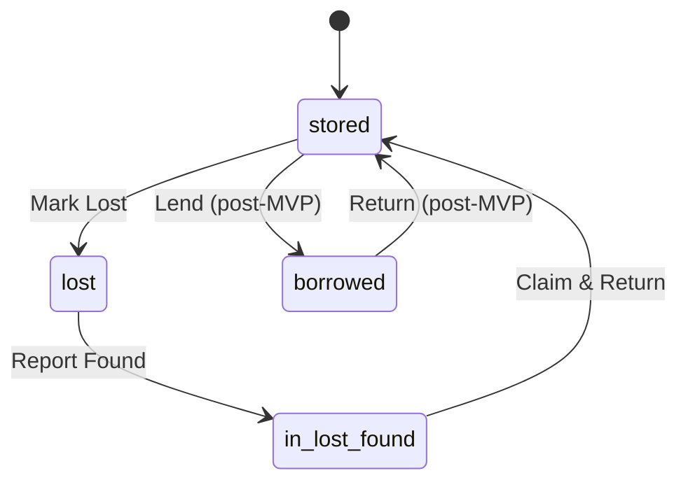

# Functional Specification Document (FSD)

**Product:** LeonoreVault
**Version:** 1.0 (MVP)
**Author:** Architecture Team + AI
**Date:** 2026-02-08
**Status:** Draft
**Reference:** [SRS v1.0](file:///d:/LeonoreKingdom/Project/Development/Web%20Development/LeonoreVault/.ai-docs/03-srs.md) · [PRD v1.0 Rev 3](file:///d:/LeonoreKingdom/Project/Development/Web%20Development/LeonoreVault/.ai-docs/02-prd.md)

---

## Table of Contents

0. [Assumptions & Scope](#0-assumptions--scope)
1. [System Architecture](#1-system-architecture)
2. [Module Breakdown](#2-module-breakdown)
3. [Detailed Functional Flows](#3-detailed-functional-flows)
4. [State Management](#4-state-management)
5. [Authentication & Authorization](#5-authentication--authorization)
6. [Error Handling Strategy](#6-error-handling-strategy)
7. [Integration Points](#7-integration-points)
8. [Business Rules](#8-business-rules)
9. [Non-Functional Requirements Mapping](#9-non-functional-requirements-mapping)
10. [Acceptance Criteria](#10-acceptance-criteria)

---

## 0. Assumptions & Scope

### 0.1 UI / UX Assumptions

No UI Spec document exists. The following assumptions are inferred from SRS screen definitions (UI-001 – UI-013) and functional requirements:

| ID   | Assumption                                                                                       | Basis                                                         |
| ---- | ------------------------------------------------------------------------------------------------ | ------------------------------------------------------------- |
| A-01 | **Bottom navigation bar** with 4 tabs: Home, Items, Scan, Settings                               | Standard mobile-first PWA pattern; matches UI-004/005/008/012 |
| A-02 | **Floating Action Button (FAB)** on Dashboard and Item List for quick "Add Item"                 | SRS UI-004 mentions FAB (+)                                   |
| A-03 | **Modal / bottom-sheet pattern** for quick-actions after QR scan                                 | SRS FR-015 "action sheet"; standard mobile UX                 |
| A-04 | **Stepper wizard (3 steps)** for onboarding: Create Household → Add Rooms → Add First Item       | SRS UI-003 explicitly states 3-step wizard                    |
| A-05 | **Toast notifications** for success / error feedback (snackbar style, 3 s auto-dismiss)          | Industry standard; SRS does not specify                       |
| A-06 | **Confirmation dialog** before destructive actions (delete item, remove member, leave household) | UX best practice; implied by FR-003 "confirmation"            |
| A-07 | **Skeleton loaders** for async content (item list, detail page, attachments)                     | Keeps LCP low per NFR-001                                     |
| A-08 | **Empty-state illustrations** when lists have no data (no items, no lost items, etc.)            | UX best practice                                              |
| A-09 | **Dark mode support** follows OS preference via `prefers-color-scheme`; no manual toggle in MVP  | Not specified; reasonable scope cut for MVP                   |
| A-10 | **Single household per user for MVP**; multi-household support deferred to post-MVP              | Simplifies navigation and state; SRS does not mandate multi   |

### 0.2 Role Assumptions

| Role       | Assumed Capabilities                                                                                                   |
| ---------- | ---------------------------------------------------------------------------------------------------------------------- |
| **Admin**  | All item CRUD + household management (invite, remove, role change) + Google Drive owner + category/location management |
| **Member** | Item CRUD + QR scan + lost & found actions. Cannot manage members or household settings                                |
| **Viewer** | Read-only: browse items, view details, search. No create/edit/delete, no QR quick-actions except "View Item"           |

### 0.3 In-Scope (MVP — P0)

- Item CMS (CRUD, search, soft-delete, list/grid view, detail page)
- Category & Location management (hierarchical, seeded defaults)
- QR code generation (single + batch PDF) and camera scanning
- Authentication (email/password + Google OAuth)
- Household creation, invite, join, role-based access
- Lost & Found workflow (mark lost → report found → claim)
- Offline-first PWA (app shell cache, IndexedDB, offline mutations, background sync)
- Google Drive attachment storage (upload, link, thumbnails, folder structure)
- PWA manifest and install prompt

### 0.4 Out-of-Scope (Post-MVP)

| Feature                  | Priority    | Notes                      |
| ------------------------ | ----------- | -------------------------- |
| Push notifications (FCM) | P1          | FR-036 – FR-039            |
| Real-time chat           | P2          | FR-047 – FR-048            |
| Borrow/return reminders  | P1          | FR-038                     |
| Multi-household per user | P2          | A-10 assumption            |
| Data export (CSV/JSON)   | P2          | SRS §4.3 mentions post-MVP |
| Full GDPR compliance     | Post-SaaS   | SRS §4.3 note              |
| i18n Bahasa Indonesia    | Best-effort | NFR-028: English primary   |

### 0.5 Open Questions

| #    | Question                                                                                                                                                | Impact                | Proposed Default                                                                                                                          |
| ---- | ------------------------------------------------------------------------------------------------------------------------------------------------------- | --------------------- | ----------------------------------------------------------------------------------------------------------------------------------------- |
| OQ-1 | Should the "Borrow" feature (US-005, `status: borrowed`) be included in MVP? SRS marks it P2 but the state machine (FR-029) includes `stored↔borrowed`. | State machine scope   | Include `borrowed` status in state machine but defer the Borrow UI flow to post-MVP. Admin/Member can still set status manually via edit. |
| OQ-2 | How should Google OAuth consent screen verification be handled during MVP? (Google limits testing mode to 100 users.)                                   | Deployment timeline   | Stay in testing mode for MVP; add team/family emails as test users. Plan verification submission post-MVP.                                |
| OQ-3 | Should the Landing Page (UI-001) be part of the Next.js app or a separate static site?                                                                  | Routing / deployment  | Part of the same Next.js app as a public route (`/`). Minimal marketing page.                                                             |
| OQ-4 | What happens when a Render free-tier instance cold-starts (~3 s)?                                                                                       | UX for first API call | Show a loading spinner on first API call. Optionally implement a warm-up ping on app load.                                                |

---

## 1. System Architecture

### 1.1 Architecture Pattern

**Modular Monolith (API) + Single-Page PWA (Client)**

| Decision                                | Justification                                                                                                                                                                                 |
| --------------------------------------- | --------------------------------------------------------------------------------------------------------------------------------------------------------------------------------------------- |
| **Modular Monolith** for Express.js API | Solo/small team; single deployable unit on Render free tier; modules separated by domain (items, auth, drive, sync) with clear interfaces; easy to extract into microservices later if needed |
| **Next.js PWA** for client              | Server-side rendering for SEO (landing page), client-side navigation for app pages, built-in API routes (unused — all logic in Express), Vercel deployment                                    |
| **NOT microservices**                   | Over-engineering for 1-2 devs, 1-week timeline, free-tier infrastructure                                                                                                                      |
| **NOT serverless-only**                 | Express.js needs long-lived Google Drive refresh tokens and stateful upload flows; Render gives a persistent process                                                                          |

### 1.2 Component Diagram

```
┌─────────────────────────────────────────────────────────────┐
│                    CLIENT (Next.js PWA)                      │
│  ┌──────────┐ ┌──────────┐ ┌──────────┐ ┌───────────────┐  │
│  │  Pages/   │ │  State   │ │  Service │ │  Offline      │  │
│  │  Routes   │ │  (Zustand│ │  Worker  │ │  Sync Queue   │  │
│  │          │ │  + React │ │  (Workbox│ │  (Dexie.js)   │  │
│  │          │ │  Query)  │ │  )       │ │               │  │
│  └────┬─────┘ └────┬─────┘ └────┬─────┘ └───────┬───────┘  │
│       └─────────────┴────────────┴───────────────┘          │
│                          │ HTTPS                             │
└──────────────────────────┼──────────────────────────────────┘
                           ▼
┌──────────────────────────────────────────────────────────────┐
│                  API (Express.js on Render)                   │
│  ┌──────────┐ ┌──────────┐ ┌──────────┐ ┌───────────────┐  │
│  │  Auth    │ │  Item    │ │  Drive   │ │  Sync         │  │
│  │  Module  │ │  Module  │ │  Module  │ │  Module       │  │
│  │          │ │          │ │          │ │               │  │
│  │ • JWT    │ │ • CRUD   │ │ • Upload │ │ • Queue       │  │
│  │ • OAuth  │ │ • Search │ │ • Link   │ │ • Conflict    │  │
│  │ • RBAC   │ │ • QR Gen │ │ • Folder │ │ • Replay      │  │
│  │ • Invite │ │ • L&F    │ │ • Thumb  │ │               │  │
│  └────┬─────┘ └────┬─────┘ └────┬─────┘ └───────┬───────┘  │
│       └─────────────┴────────────┴───────────────┘          │
│                          │                                    │
└──────────────────────────┼──────────────────────────────────┘
           ┌───────────────┼───────────────┐
           ▼               ▼               ▼
    ┌────────────┐  ┌────────────┐  ┌────────────┐
    │  Supabase  │  │  Supabase  │  │  Google    │
    │  Postgres  │  │  Auth      │  │  Drive API │
    │  (+ RLS)   │  │  (JWT)     │  │  v3        │
    └────────────┘  └────────────┘  └────────────┘
```

### 1.3 Data Flow Overview

#### Write Path (Item Creation)

```
User fills form → Client validates → POST /api/items (multipart)
→ Auth middleware (JWT verify via Supabase) → Input validation (Zod)
→ Upload photos to Google Drive (admin's refresh token) → Get Drive fileIds
→ INSERT item row in Supabase → INSERT attachment rows → INSERT activity log
→ Return { item, attachments } → Client updates React Query cache
→ If offline: store in Dexie.js sync queue → replay on reconnect
```

#### Read Path (Item List)

```
User opens /items → Client checks React Query cache
→ If stale: GET /api/items?page=1&search=&category= → Auth middleware
→ SELECT from Supabase (RLS filters by household_id) → Return paginated items
→ Client caches in React Query + mirrors to IndexedDB (Dexie.js)
→ If offline: serve directly from IndexedDB
```

### 1.4 Deployment & Configuration Strategy

| Environment     | Frontend                         | Backend                                                 | Database                               | Purpose             |
| --------------- | -------------------------------- | ------------------------------------------------------- | -------------------------------------- | ------------------- |
| **Development** | `localhost:3000`                 | `localhost:4000`                                        | Supabase local (Docker) or dev project | Active development  |
| **Staging**     | Vercel preview (PR branches)     | Render preview or same instance with `NODE_ENV=staging` | Supabase dev project                   | Pre-release testing |
| **Production**  | Vercel (main branch auto-deploy) | Render (main branch auto-deploy)                        | Supabase production project            | Live users          |

**Configuration strategy:** All environment-specific values via `.env` files locally and platform environment variables in Vercel/Render. Secret hierarchy:

| Variable                    | Location                      | Example                          |
| --------------------------- | ----------------------------- | -------------------------------- |
| `SUPABASE_URL`              | Vercel + Render env           | `https://xxx.supabase.co`        |
| `SUPABASE_ANON_KEY`         | Vercel env (client-safe)      | Public anon key                  |
| `SUPABASE_SERVICE_ROLE_KEY` | Render env only (server-only) | Service role key                 |
| `GOOGLE_CLIENT_ID`          | Vercel + Render env           | OAuth client ID                  |
| `GOOGLE_CLIENT_SECRET`      | Render env only               | OAuth client secret              |
| `DATABASE_URL`              | Render env only               | Postgres connection string       |
| `JWT_SECRET`                | Render env only               | For custom JWT signing if needed |

---

## 2. Module Breakdown

### 2.1 Client Modules

#### M-C01: Shell & Navigation

| Attribute            | Detail                                                               |
| -------------------- | -------------------------------------------------------------------- |
| **Responsibilities** | App layout, bottom nav, route guards, offline banner, theme provider |
| **Dependencies**     | Auth Module (session state)                                          |
| **Routes exposed**   | Layout wraps all `/app/*` routes                                     |
| **Key entities**     | None (presentational)                                                |

#### M-C02: Auth UI

| Attribute            | Detail                                                                           |
| -------------------- | -------------------------------------------------------------------------------- |
| **Responsibilities** | Login / Register forms, Google OAuth button, password reset, session persistence |
| **Dependencies**     | Supabase Auth SDK, Shell                                                         |
| **Routes exposed**   | `/login`, `/register`, `/forgot-password`, `/auth/callback`                      |
| **Key entities**     | `User` (read), `Session` (manage)                                                |

#### M-C03: Onboarding Wizard

| Attribute            | Detail                                                              |
| -------------------- | ------------------------------------------------------------------- |
| **Responsibilities** | 3-step guided setup (create household → add rooms → add first item) |
| **Dependencies**     | Auth UI, Item Module API, Household Module API                      |
| **Routes exposed**   | `/onboarding` (step 1/2/3 as internal state)                        |
| **Key entities**     | `Household`, `Location`, `Item` (creates)                           |

#### M-C04: Item Management UI

| Attribute            | Detail                                                                                  |
| -------------------- | --------------------------------------------------------------------------------------- |
| **Responsibilities** | Item list (grid/list), search + filters, item detail (tabs), add/edit form, soft-delete |
| **Dependencies**     | Drive Module (attachments), Category/Location pickers, QR Module                        |
| **Routes exposed**   | `/app/items`, `/app/items/[id]`, `/app/items/new`, `/app/items/[id]/edit`               |
| **Key entities**     | `Item`, `Attachment`, `ItemActivity` (read/write)                                       |

#### M-C05: QR Scanner & Generator UI

| Attribute            | Detail                                                                    |
| -------------------- | ------------------------------------------------------------------------- |
| **Responsibilities** | Camera viewfinder, QR decode, quick-action sheet, batch QR PDF generation |
| **Dependencies**     | Item Module (lookup), Camera API                                          |
| **Routes exposed**   | `/app/scan`, `/app/items/qr-labels`                                       |
| **Key entities**     | `Item` (read)                                                             |

#### M-C06: Lost & Found UI

| Attribute            | Detail                                                         |
| -------------------- | -------------------------------------------------------------- |
| **Responsibilities** | Lost & Found dashboard, mark lost, report found, claim actions |
| **Dependencies**     | Item Module API                                                |
| **Routes exposed**   | `/app/lost-found`                                              |
| **Key entities**     | `Item` (status mutations), `ItemActivity`                      |

#### M-C07: Household Settings UI

| Attribute            | Detail                                                                                                    |
| -------------------- | --------------------------------------------------------------------------------------------------------- |
| **Responsibilities** | Household name edit, member list, invite generation, role management, category/location CRUD              |
| **Dependencies**     | Auth (role checks), API modules                                                                           |
| **Routes exposed**   | `/app/settings/household`, `/app/settings/members`, `/app/settings/categories`, `/app/settings/locations` |
| **Key entities**     | `Household`, `Membership`, `Category`, `Location`                                                         |

#### M-C08: Offline & Sync Engine

| Attribute            | Detail                                                                                                                   |
| -------------------- | ------------------------------------------------------------------------------------------------------------------------ |
| **Responsibilities** | Service Worker registration, IndexedDB cache (Dexie.js), sync queue management, online/offline detection, sync status UI |
| **Dependencies**     | All data modules (mirrors their data)                                                                                    |
| **Routes exposed**   | None (background service)                                                                                                |
| **Key entities**     | All cached entities; `SyncQueue` (local-only)                                                                            |

### 2.2 Server Modules

#### M-S01: Auth & Session Module

| Attribute            | Detail                                                                                   |
| -------------------- | ---------------------------------------------------------------------------------------- |
| **Responsibilities** | JWT validation middleware, Google OAuth token exchange, role extraction, session refresh |
| **Dependencies**     | Supabase Auth                                                                            |
| **API routes**       | `POST /api/auth/google/callback`, `POST /api/auth/refresh`, `GET /api/auth/me`           |
| **Key entities**     | `User`, `Membership` (read for role)                                                     |

#### M-S02: Household Module

| Attribute            | Detail                                                                                                                                                                                                       |
| -------------------- | ------------------------------------------------------------------------------------------------------------------------------------------------------------------------------------------------------------ |
| **Responsibilities** | Household CRUD, invite generation/validation, member management, role changes                                                                                                                                |
| **Dependencies**     | Auth middleware, Category Module (seed defaults)                                                                                                                                                             |
| **API routes**       | `POST /api/households`, `GET /api/households/:id`, `POST /api/households/:id/invite`, `POST /api/households/join`, `PATCH /api/households/:id/members/:userId`, `DELETE /api/households/:id/members/:userId` |
| **Key entities**     | `Household`, `Membership`                                                                                                                                                                                    |

#### M-S03: Item Module

| Attribute            | Detail                                                                                                                                                                   |
| -------------------- | ------------------------------------------------------------------------------------------------------------------------------------------------------------------------ |
| **Responsibilities** | Item CRUD, search, pagination, soft-delete, status transitions, activity logging                                                                                         |
| **Dependencies**     | Auth middleware, Drive Module (attachments)                                                                                                                              |
| **API routes**       | `GET /api/items`, `GET /api/items/:id`, `POST /api/items`, `PATCH /api/items/:id`, `DELETE /api/items/:id`, `POST /api/items/:id/restore`, `PATCH /api/items/:id/status` |
| **Key entities**     | `Item`, `ItemActivity`                                                                                                                                                   |

#### M-S04: Category & Location Module

| Attribute            | Detail                                                                                    |
| -------------------- | ----------------------------------------------------------------------------------------- |
| **Responsibilities** | Category CRUD (hierarchical), Location CRUD (hierarchical), default seeding               |
| **Dependencies**     | Auth middleware                                                                           |
| **API routes**       | `GET/POST/PATCH/DELETE /api/categories/:id?`, `GET/POST/PATCH/DELETE /api/locations/:id?` |
| **Key entities**     | `Category`, `Location`                                                                    |

#### M-S05: Drive Module

| Attribute            | Detail                                                                                                          |
| -------------------- | --------------------------------------------------------------------------------------------------------------- |
| **Responsibilities** | Google Drive folder management, file upload, file linking, thumbnail retrieval, token refresh                   |
| **Dependencies**     | Auth middleware, Google Drive API v3                                                                            |
| **API routes**       | `POST /api/items/:id/attachments/upload`, `POST /api/items/:id/attachments/link`, `DELETE /api/attachments/:id` |
| **Key entities**     | `Attachment`, `Household` (Drive folder ID)                                                                     |

#### M-S06: Sync Module

| Attribute            | Detail                                                                                  |
| -------------------- | --------------------------------------------------------------------------------------- |
| **Responsibilities** | Accept batched offline mutations, apply last-write-wins resolution, return sync results |
| **Dependencies**     | Item Module, Drive Module, Auth middleware                                              |
| **API routes**       | `POST /api/sync`                                                                        |
| **Key entities**     | All mutable entities                                                                    |

#### M-S07: QR Module

| Attribute            | Detail                                                    |
| -------------------- | --------------------------------------------------------- |
| **Responsibilities** | QR code generation (single SVG/PNG), batch PDF generation |
| **Dependencies**     | Item Module (UUID lookup)                                 |
| **API routes**       | `GET /api/items/:id/qr`, `POST /api/items/qr-batch`       |
| **Key entities**     | `Item` (read UUID)                                        |

---

## 3. Detailed Functional Flows

### 3.1 Onboarding Flow (New User)

**Preconditions:** User has no account.

| Step | Actor           | Client Behavior                                                               | Server Behavior                                                                                      | Errors                                               |
| ---- | --------------- | ----------------------------------------------------------------------------- | ---------------------------------------------------------------------------------------------------- | ---------------------------------------------------- |
| 1    | User            | Opens `/register`. Fills email + password **OR** clicks "Sign in with Google" | —                                                                                                    | —                                                    |
| 2a   | System (email)  | Sends form to Supabase Auth `signUp()`                                        | Supabase creates unverified user, sends verification email                                           | `409 email exists` → show "Email already registered" |
| 2b   | System (Google) | Redirects to Google consent (`openid email profile drive.file`)               | Express `/api/auth/google/callback` exchanges code → creates user in Supabase → stores refresh token | OAuth error → show "Google sign-in failed"           |
| 3    | User            | After verification / OAuth success → redirect to `/onboarding`                | —                                                                                                    | —                                                    |
| 4    | User            | **Step 1:** Enter household name → `POST /api/households`                     | Create household → assign Admin role → seed 9 default categories → return household                  | Validation error → inline field error                |
| 5    | User            | **Step 2:** Add rooms/locations (or skip) → `POST /api/locations` per room    | Insert location rows for household                                                                   | —                                                    |
| 6    | User            | **Step 3:** Add first item (or skip) → `POST /api/items`                      | Insert item + auto-generate QR → log `created` activity                                              | —                                                    |
| 7    | System          | Redirect to `/app/dashboard`                                                  | —                                                                                                    | —                                                    |

**Postconditions:** User has account, household (admin role), default categories, optional locations/items.

### 3.2 Item CRUD Flow

#### Create Item

**Preconditions:** User authenticated, member of a household, role ≥ Member.

| Step | Behavior                                                     | Data Transformation                                                            | Error                                            |
| ---- | ------------------------------------------------------------ | ------------------------------------------------------------------------------ | ------------------------------------------------ |
| 1    | User opens `/app/items/new`, fills form                      | Raw input → validated via client-side Zod schema                               | Required field missing → inline error            |
| 2    | Client compresses photos (client-side, max 2 MB each)        | JPEG/PNG → compressed blob                                                     | File > 2 MB after compression → "File too large" |
| 3    | `POST /api/items` (multipart: JSON body + file blobs)        | —                                                                              | Network error → queue in Dexie.js sync queue     |
| 4    | Server validates input (Zod)                                 | Raw → sanitized (DOMPurify on text fields)                                     | 400 → return field-level errors                  |
| 5    | Server uploads photos to Google Drive                        | Blob → Drive `files.create` → returns `fileId`, `thumbnailLink`, `webViewLink` | Drive API error → return 502; client retries     |
| 6    | Server inserts `Item` row                                    | Validated input → DB row with generated UUID                                   | DB error → 500                                   |
| 7    | Server inserts `Attachment` rows (per file)                  | Drive metadata → attachment rows                                               | —                                                |
| 8    | Server inserts `ItemActivity` (`action: created`)            | —                                                                              | —                                                |
| 9    | Server returns `{ item, attachments, qrCodeUrl }`            | —                                                                              | —                                                |
| 10   | Client updates React Query cache, shows toast "Item created" | —                                                                              | —                                                |

**Postconditions:** Item exists in DB, photos on Drive, QR code available, activity logged.

#### Soft-Delete Item

| Step | Behavior                                                        |
| ---- | --------------------------------------------------------------- |
| 1    | User clicks "Delete" → confirmation dialog                      |
| 2    | `DELETE /api/items/:id` → server sets `deleted_at = NOW()`      |
| 3    | Item hidden from default queries, visible in "Recently Deleted" |
| 4    | After 30 days: scheduled job hard-deletes row + Drive files     |

### 3.3 QR Scan Flow

**Preconditions:** User authenticated, camera permission granted.

| Step | Behavior                                                                       | Error                                                        |
| ---- | ------------------------------------------------------------------------------ | ------------------------------------------------------------ |
| 1    | User opens `/app/scan` → camera viewfinder activates                           | Permission denied → show "Camera access required" with retry |
| 2    | `html5-qrcode` decodes QR → extracts UUID                                      | No QR found → keep scanning (continuous)                     |
| 3    | Client calls `GET /api/items/:uuid`                                            | 404 → prompt "Item not found. Create new?" (FR-017)          |
| 4    | Item found → display quick-action bottom sheet (Move, Mark Lost, View Details) | Network error (offline) → lookup in IndexedDB                |
| 5    | User selects action → execute corresponding API call                           | Action fails → toast error, allow retry                      |

### 3.4 Lost & Found Flow

**Preconditions:** Item exists with `status: stored`.



| Transition               | Actor       | API Call                                                                   | Activity Logged                                |
| ------------------------ | ----------- | -------------------------------------------------------------------------- | ---------------------------------------------- |
| `stored → lost`          | Any Member+ | `PATCH /api/items/:id/status` `{status:"lost", note}`                      | `status_changed {old:"stored", new:"lost"}`    |
| `lost → in_lost_found`   | Any Member+ | `PATCH /api/items/:id/status` `{status:"in_lost_found", location, photo?}` | `status_changed` + optional `attachment_added` |
| `in_lost_found → stored` | Any Member+ | `PATCH /api/items/:id/status` `{status:"stored", location_id}`             | `status_changed` + `moved`                     |

**Invalid transitions** (e.g., `stored → in_lost_found`) → `400 Bad Request: Invalid status transition`.

### 3.5 Offline Sync Flow

**Preconditions:** User goes offline while using the app.

| Step | Behavior                                                                                  |
| ---- | ----------------------------------------------------------------------------------------- |
| 1    | Service Worker detects `offline` → show offline banner with amber indicator               |
| 2    | User creates/edits items → mutations stored in Dexie.js `syncQueue` table with timestamps |
| 3    | UI shows items with "Pending sync" badge; sync counter increments                         |
| 4    | Network restored → Service Worker fires `sync` event                                      |
| 5    | Sync engine replays queue: `POST /api/sync` with batched mutations                        |
| 6    | Server applies last-write-wins: compare `updated_at` of local mutation vs server record   |
| 7    | If local wins → apply change. If server wins → log conflict, keep server version          |
| 8    | Server returns `{ applied: [...], conflicts: [...] }`                                     |
| 9    | Client clears applied items from queue, shows conflict log if any, clears sync badge      |

### 3.6 Google Drive Upload Flow

**Preconditions:** Household admin has connected Google account (refresh token stored encrypted).

| Step | Behavior                                                                            |
| ---- | ----------------------------------------------------------------------------------- |
| 1    | Client sends file(s) to `POST /api/items/:id/attachments/upload` (multipart)        |
| 2    | Server checks attachment count < 10 (FR-044)                                        |
| 3    | Server refreshes admin's access token using stored refresh token                    |
| 4    | Server ensures folder `LeonoreVault/{household}/items/{item_uuid}/` exists on Drive |
| 5    | Server uploads file via `drive.files.create` with folder as parent                  |
| 6    | Server retrieves `thumbnailLink`, `webViewLink` from Drive response                 |
| 7    | Server inserts `Attachment` row in Supabase                                         |
| 8    | Server returns attachment metadata to client                                        |

---

## 4. State Management

### 4.1 State Categories

| Category                                                 | Technology                                   | Scope                   | Persistence                                       |
| -------------------------------------------------------- | -------------------------------------------- | ----------------------- | ------------------------------------------------- |
| **Server cache** (items, categories, locations, members) | React Query (TanStack Query)                 | Per-query, auto-refetch | Memory + IndexedDB mirror                         |
| **Auth session**                                         | Zustand store + Supabase `onAuthStateChange` | Global singleton        | `localStorage` (JWT), `httpOnly` cookie (refresh) |
| **UI state** (modals, selected tab, view mode)           | React `useState` / Zustand                   | Component / page        | `localStorage` for persisted prefs (view mode)    |
| **Form state**                                           | React Hook Form + Zod validation             | Per-form lifecycle      | Not persisted (draft save deferred to post-MVP)   |
| **Offline sync queue**                                   | Dexie.js (IndexedDB)                         | Global, background      | IndexedDB (survives app close)                    |
| **Service Worker cache**                                 | Workbox (CacheStorage)                       | App shell + assets      | CacheStorage (browser-managed)                    |

### 4.2 Cache Invalidation Rules

| Event                       | Invalidation Action                                                          |
| --------------------------- | ---------------------------------------------------------------------------- |
| Item created/edited/deleted | Invalidate `['items']` query → refetch list; update `['items', id]` directly |
| Category/location changed   | Invalidate `['categories']` / `['locations']` queries                        |
| Membership changed          | Invalidate `['household', id, 'members']`                                    |
| Sync completed              | Invalidate all item queries; merge conflicts into UI                         |
| User logs out               | Clear all React Query cache, clear Zustand, clear Dexie.js                   |

### 4.3 Multi-Tab / Multi-Device

- **Multi-tab:** Supabase Realtime subscription broadcasts item changes → all tabs receive update → React Query cache updated via `queryClient.setQueryData`.
- **Multi-device:** Same mechanism via Supabase Realtime WebSocket subscription scoped to `household_id`.
- **Conflict:** Last-write-wins on `updated_at` timestamp (server-authoritative).

---

## 5. Authentication & Authorization

### 5.1 Auth Flows

#### Email/Password Registration

```
Client                          Supabase Auth                     Express API
  │ signUp(email, pw)              │                                │
  │──────────────────────────────►│                                │
  │  ◄─── verification email ─── │                                │
  │                                │                                │
  │  User clicks verify link       │                                │
  │──────────────────────────────►│                                │
  │  ◄─── session (JWT+refresh) ──│                                │
  │                                │                                │
  │  GET /api/auth/me  ──────────────────────────────────────────►│
  │  (Bearer JWT)                                                   │
  │  ◄─── user profile + role ──────────────────────────────────── │
```

#### Google OAuth

```
Client                          Google                  Express API           Supabase
  │ Redirect to Google consent    │                       │                     │
  │─────────────────────────────►│                       │                     │
  │ ◄── auth code ───────────── │                       │                     │
  │                               │                       │                     │
  │ POST /api/auth/google/callback (code) ──────────────►│                     │
  │                                                       │ exchange code       │
  │                                                       │──────────────────►│
  │                                                       │◄─ tokens ─────── │
  │                                                       │                     │
  │                                                       │ Encrypt & store     │
  │                                                       │ refresh_token (if   │
  │                                                       │ admin) in Supabase  │
  │                                                       │                     │
  │ ◄── session (JWT+refresh) ────────────────────────── │                     │
```

#### Session Refresh

- Access token (JWT): **1-hour** expiry.
- Refresh token: **30-day** expiry.
- Client-side: Supabase SDK auto-refreshes on API call if access token expired.
- API-side: Middleware validates JWT → if expired, return `401` → client refreshes via Supabase → retries.

#### Logout

- Client calls `supabase.auth.signOut()` → clears local session.
- Clear React Query cache, Zustand store, Dexie.js data.
- Redirect to `/login`.

### 5.2 Permission Matrix

| Capability                       | Admin      | Member                               | Viewer    |
| -------------------------------- | ---------- | ------------------------------------ | --------- |
| View items / search / detail     | ✅         | ✅                                   | ✅        |
| Create item                      | ✅         | ✅                                   | ❌        |
| Edit item                        | ✅         | ✅                                   | ❌        |
| Delete item (soft)               | ✅         | ✅ (own items only — **Assumption**) | ❌        |
| Restore deleted item             | ✅         | ✅ (own items only)                  | ❌        |
| Scan QR + quick actions          | ✅         | ✅                                   | View only |
| Mark lost / report found / claim | ✅         | ✅                                   | ❌        |
| Upload / link attachments        | ✅         | ✅                                   | ❌        |
| Manage categories / locations    | ✅         | ❌                                   | ❌        |
| Invite members                   | ✅         | ❌                                   | ❌        |
| Change member roles              | ✅         | ❌                                   | ❌        |
| Remove members                   | ✅         | ❌                                   | ❌        |
| Edit household name              | ✅         | ❌                                   | ❌        |
| Connect Google Drive             | ✅ (owner) | ❌                                   | ❌        |
| Generate batch QR PDF            | ✅         | ✅                                   | ❌        |

### 5.3 Security Controls

| Control                    | Implementation                                                                                  |
| -------------------------- | ----------------------------------------------------------------------------------------------- |
| **Password rules**         | Min 8 chars, ≥ 1 number, ≥ 1 special character (Supabase Auth config)                           |
| **Brute-force protection** | 10 failed attempts → 15 min lockout (Express rate limiter on `/api/auth/*`)                     |
| **Rate limiting**          | 100 req/min per user (global), 20 uploads/min per user (Drive endpoint)                         |
| **Token storage**          | JWT in memory (Zustand) + `localStorage` fallback; refresh token as `httpOnly` cookie           |
| **CORS**                   | Allowed origins: Vercel production domain + staging domain                                      |
| **CSRF**                   | SameSite cookie + Origin header validation                                                      |
| **RLS**                    | All Supabase tables have RLS policies checking `auth.uid()` membership in target `household_id` |

---

## 6. Error Handling Strategy

### 6.1 Error Categories

| Category           | HTTP Status       | Client Handling                                              | Example                                   |
| ------------------ | ----------------- | ------------------------------------------------------------ | ----------------------------------------- |
| **Validation**     | `400`             | Inline field errors (React Hook Form `setError`)             | "Name is required", "File must be < 2 MB" |
| **Authentication** | `401`             | Auto-refresh token → retry. If still 401 → redirect `/login` | Expired JWT                               |
| **Authorization**  | `403`             | Toast: "You don't have permission to do this"                | Viewer tries to edit                      |
| **Not Found**      | `404`             | Contextual: "Item not found" page / prompt to create         | QR scan → unknown UUID                    |
| **Conflict**       | `409`             | Toast: "This email is already registered"                    | Duplicate signup                          |
| **Rate Limit**     | `429`             | Toast: "Too many requests. Please wait." + disable button    | Rapid uploads                             |
| **Server Error**   | `500`             | Toast: "Something went wrong. Please try again." + log       | DB failure                                |
| **Network Error**  | `0` (no response) | Queue offline OR toast "No internet connection"              | Offline                                   |
| **Third-party**    | `502`             | Toast: "Google Drive temporarily unavailable. File queued."  | Drive API down                            |

### 6.2 User-Facing Error Principles

1. **No technical jargon** — never show stack traces, SQL errors, or HTTP codes to users.
2. **Actionable** — tell the user what to do: "Try again", "Check your connection", "Contact admin".
3. **Contextual** — show errors near the relevant input or action, not only as global toasts.
4. **Non-blocking where possible** — queue, retry, or degrade gracefully instead of blocking the user.

### 6.3 Logging & Telemetry

| What              | Where                                                | Details                                                                           |
| ----------------- | ---------------------------------------------------- | --------------------------------------------------------------------------------- |
| API request logs  | Render stdout (structured JSON)                      | Method, path, user_id (hashed), household_id, status, duration_ms, correlation_id |
| Error logs        | Render stdout + optional Sentry (post-MVP)           | Error stack, correlation_id, request body (PII redacted)                          |
| Client errors     | `window.onerror` + `console.error` → optional Sentry | Component, action, error message                                                  |
| Sync audit        | Supabase `sync_log` table (post-MVP)                 | Mutation type, conflict resolution result, timestamps                             |
| **PII redaction** | All logs                                             | Never log: email, password, tokens, file content. Hash user_id in logs.           |

### 6.4 Recovery Procedures

| Scenario                 | Recovery                                                                                 |
| ------------------------ | ---------------------------------------------------------------------------------------- |
| API call fails (network) | Auto-retry 3x with exponential backoff (1 s, 2 s, 4 s). If still failing → queue offline |
| Drive upload fails       | Return 502 to client → client queues file in IndexedDB → retry on next sync              |
| Supabase down            | Offline mode automatically activates → read from IndexedDB → queue writes                |
| Token refresh fails      | Redirect to login; preserve in-progress form data in `sessionStorage`                    |
| Sync conflict            | Last-write-wins (automatic). Log conflict with both versions for admin review (post-MVP) |

---

## 7. Integration Points

### 7.1 Supabase

| Aspect           | Detail                                                                                                        |
| ---------------- | ------------------------------------------------------------------------------------------------------------- |
| **Purpose**      | Database (Postgres), Auth (JWT + OAuth), Realtime (WebSocket)                                                 |
| **Direction**    | Bidirectional (read/write from API; realtime push to client)                                                  |
| **Auth**         | Service role key (server-side, full access bypassing RLS for admin ops), anon key (client-side, RLS enforced) |
| **Failure mode** | API returns `503`; client falls back to IndexedDB cache                                                       |
| **Retry**        | 3x with backoff for transient errors; circuit breaker for sustained outage                                    |

### 7.2 Google Drive API v3

| Aspect           | Detail                                                                                  |
| ---------------- | --------------------------------------------------------------------------------------- |
| **Purpose**      | File upload, folder management, thumbnail retrieval, file linking                       |
| **Direction**    | Server → Google (outbound only)                                                         |
| **Auth**         | OAuth 2.0 refresh token (admin's, encrypted in DB) → access token refreshed server-side |
| **Rate limit**   | 12,000 req/15 min per user. Implement client-side throttling in Drive Module            |
| **Failure mode** | `502` to client; file queued for retry                                                  |
| **Retry**        | 3x with exponential backoff. If `403 rateLimitExceeded` → backoff 60 s                  |

### 7.3 Google OAuth 2.0

| Aspect           | Detail                                                                     |
| ---------------- | -------------------------------------------------------------------------- |
| **Purpose**      | Social login + Drive authorization                                         |
| **Direction**    | Client → Google → Express API (authorization code flow)                    |
| **Auth**         | PKCE (client-initiated), authorization code exchange (server-side)         |
| **Scopes**       | `openid`, `email`, `profile`, `https://www.googleapis.com/auth/drive.file` |
| **Failure mode** | Show "Google sign-in failed. Try again or use email."                      |

### 7.4 Firebase FCM (Post-MVP, P1)

| Aspect           | Detail                                                                      |
| ---------------- | --------------------------------------------------------------------------- |
| **Purpose**      | Push notifications for lost/found/borrow events                             |
| **Direction**    | Server → FCM → client device                                                |
| **Auth**         | Firebase Admin SDK (service account JSON, Render env)                       |
| **Failure mode** | Log failure; notification visible in in-app notification center as fallback |

---

## 8. Business Rules

### 8.1 Validation Rules

| Entity          | Field         | Rules                                                   |
| --------------- | ------------- | ------------------------------------------------------- |
| **Item**        | `name`        | Required, 1–200 chars, trimmed, sanitized (DOMPurify)   |
| **Item**        | `description` | Optional, max 2000 chars, sanitized                     |
| **Item**        | `quantity`    | Integer ≥ 1, default 1                                  |
| **Item**        | `tags`        | Array of strings, max 20 tags, each ≤ 50 chars          |
| **Item**        | `status`      | Enum: `stored`, `borrowed`, `lost`, `in_lost_found`     |
| **Category**    | `name`        | Required, 1–100 chars, unique within household + parent |
| **Category**    | nesting       | Max depth 3 (root → child → grandchild)                 |
| **Location**    | `name`        | Required, 1–100 chars, unique within household + parent |
| **Location**    | nesting       | Max depth 3                                             |
| **Attachment**  | file size     | Max 2 MB per file (after client compression)            |
| **Attachment**  | file type     | JPEG, PNG, PDF, DOCX only                               |
| **Attachment**  | count         | Max 10 per item                                         |
| **Household**   | `name`        | Required, 1–100 chars                                   |
| **Invite code** | format        | 6-character alphanumeric, uppercase                     |
| **Invite code** | expiry        | 7 days from generation                                  |
| **Password**    | strength      | Min 8 chars, ≥ 1 number, ≥ 1 special character          |
| **Email**       | format        | Valid email format (RFC 5322 subset)                    |

### 8.2 Status Transition Rules (State Machine)

| Current Status  | Allowed Transitions               | Required Role |
| --------------- | --------------------------------- | ------------- |
| `stored`        | → `lost`, → `borrowed` (post-MVP) | Member+       |
| `lost`          | → `in_lost_found`                 | Member+       |
| `in_lost_found` | → `stored` (claim)                | Member+       |
| `borrowed`      | → `stored` (return, post-MVP)     | Member+       |

Any other transition → `400 Invalid status transition`.

### 8.3 Data Retention Rules

| Rule                                    | Implementation                                                                                                       |
| --------------------------------------- | -------------------------------------------------------------------------------------------------------------------- |
| Soft-deleted items purged after 30 days | Supabase Edge Function (cron, daily at 02:00 UTC): `DELETE FROM items WHERE deleted_at < NOW() - INTERVAL '30 days'` |
| Expired invite codes cleanup            | Same cron: `UPDATE households SET invite_code = NULL WHERE invite_expires_at < NOW()`                                |
| Orphaned Drive files                    | On hard-delete: also call `drive.files.delete(fileId)` for each attachment                                           |

### 8.4 Derived / Computed Values

| Value                         | Derivation                                                                            |
| ----------------------------- | ------------------------------------------------------------------------------------- |
| Item QR code URL              | `{APP_URL}/app/scan?item={item.id}` encoded as QR                                     |
| Household stats (dashboard)   | Aggregated queries: `COUNT(*)` items, `COUNT(*) WHERE status='lost'`, recent activity |
| Attachment thumbnail fallback | If `thumbnailLink` is null → use generic icon based on `mime_type`                    |
| Category/location breadcrumb  | Recursive parent lookup: `Shelf → Closet → Bedroom`                                   |

---

## 9. Non-Functional Requirements Mapping

### 9.1 Performance

| Target                   | Architecture Support                                                                   |
| ------------------------ | -------------------------------------------------------------------------------------- |
| FCP < 1.5 s, LCP < 2.5 s | Next.js SSR for landing page; app routes use skeleton loaders + Service Worker cache   |
| Search < 500 ms          | Supabase `ilike` with DB index on `items.name`; consider `tsvector` index if needed    |
| QR decode < 1 s          | Client-side only (`html5-qrcode`), no network dependency                               |
| API p95 < 300 ms         | Lean Express handlers; Supabase SDK (not raw SQL for most queries); connection pooling |
| Drive upload < 5 s       | Server-side upload on Render (same continent as Supabase); compress images client-side |

### 9.2 Availability & Backup

| Target               | Mechanism                                                                              |
| -------------------- | -------------------------------------------------------------------------------------- |
| 99.5% uptime         | Supabase SLA (99.9% on Pro); Render auto-restart on crash; Vercel CDN (99.99%)         |
| Offline availability | Service Worker + IndexedDB → app usable without network                                |
| Data backup          | Supabase daily backups (7-day retention free tier); Google Drive = Google's redundancy |
| Disaster recovery    | RPO 24 h / RTO 4 h → export schema + seed data; re-deploy from Git                     |

### 9.3 Accessibility

| Requirement              | Implementation                                                               |
| ------------------------ | ---------------------------------------------------------------------------- |
| WCAG 2.1 AA              | `axe-core` integrated in CI; manual screen reader testing (NVDA / VoiceOver) |
| Keyboard navigation      | All interactive elements focusable; logical tab order; skip-to-content link  |
| Color contrast ≥ 4.5:1   | Enforce in design tokens; automated check in CI                              |
| Touch targets ≥ 44×44 px | CSS minimum sizing for buttons, links, tap areas                             |
| ARIA labels              | On all icons, buttons without text, form inputs                              |

---

## 10. Acceptance Criteria

### 10.1 Item Management

| ID    | Criterion                                                                                                                                         |
| ----- | ------------------------------------------------------------------------------------------------------------------------------------------------- |
| AC-01 | **Given** a logged-in Member, **when** they fill the item form and submit, **then** the item appears in the item list and a QR code is generated. |
| AC-02 | **Given** an existing item, **when** a Member edits any field and saves, **then** the changes are persisted and `updated_at` is refreshed.        |
| AC-03 | **Given** an item, **when** a Member deletes it, **then** it is hidden from default views but visible in "Recently Deleted" for 30 days.          |
| AC-04 | **Given** a search query, **when** applied, **then** matching items are returned with thumbnails in < 500 ms.                                     |
| AC-05 | **Given** 50+ items, **when** scrolling the list, **then** items load incrementally (20 per page) without full page reload.                       |

### 10.2 Categories & Locations

| ID    | Criterion                                                                                                                                                        |
| ----- | ---------------------------------------------------------------------------------------------------------------------------------------------------------------- |
| AC-06 | **Given** a new household, **when** created, **then** 9 default categories are seeded automatically.                                                             |
| AC-07 | **Given** a category tree, **when** nesting exceeds 3 levels, **then** the system rejects with "Maximum nesting depth reached".                                  |
| AC-08 | **Given** an item moved to a new location, **when** the history tab is viewed, **then** the move is logged with user, old location, new location, and timestamp. |

### 10.3 QR Codes

| ID    | Criterion                                                                                                                 |
| ----- | ------------------------------------------------------------------------------------------------------------------------- |
| AC-09 | **Given** an item, **when** QR code is generated, **then** it encodes the item UUID and is downloadable as PNG.           |
| AC-10 | **Given** selected items, **when** batch QR is requested, **then** a downloadable A4 PDF with QR labels is produced.      |
| AC-11 | **Given** a QR code on screen, **when** scanned, **then** the item detail loads within 1 second with a quick-action menu. |
| AC-12 | **Given** an unrecognized QR code, **when** scanned, **then** the user is prompted to create a new item.                  |

### 10.4 Authentication & Households

| ID    | Criterion                                                                                                                                |
| ----- | ---------------------------------------------------------------------------------------------------------------------------------------- |
| AC-13 | **Given** valid credentials, **when** a user registers, **then** a verification email is sent and login is blocked until verified.       |
| AC-14 | **Given** a Google account, **when** OAuth is completed, **then** the user is authenticated and Drive access is authorized (for admins). |
| AC-15 | **Given** an Admin, **when** they generate an invite code, **then** a 6-char code valid for 7 days is created and shareable.             |
| AC-16 | **Given** a Viewer role, **when** they attempt to create an item, **then** the API returns `403 Forbidden`.                              |

### 10.5 Lost & Found

| ID    | Criterion                                                                                                                          |
| ----- | ---------------------------------------------------------------------------------------------------------------------------------- |
| AC-17 | **Given** a stored item, **when** marked lost, **then** its status changes to `lost` and it appears on the Lost & Found dashboard. |
| AC-18 | **Given** a lost item, **when** reported found, **then** its status changes to `in_lost_found` and the finder's info is logged.    |
| AC-19 | **Given** a found item, **when** claimed, **then** its status returns to `stored` with the new location.                           |
| AC-20 | **Given** a stored item, **when** transitioning directly to `in_lost_found`, **then** the system rejects the invalid transition.   |

### 10.6 Offline Mode

| ID    | Criterion                                                                                                                                  |
| ----- | ------------------------------------------------------------------------------------------------------------------------------------------ |
| AC-21 | **Given** the app is installed, **when** network is lost, **then** the app shell loads from cache in < 1 s with an offline indicator.      |
| AC-22 | **Given** offline mode, **when** the user creates an item, **then** it is stored locally with a "Pending sync" badge.                      |
| AC-23 | **Given** pending offline changes, **when** connectivity resumes, **then** changes sync automatically within 30 seconds with no data loss. |

### 10.7 Google Drive Storage

| ID    | Criterion                                                                                                                                     |
| ----- | --------------------------------------------------------------------------------------------------------------------------------------------- |
| AC-24 | **Given** a file upload, **when** processed, **then** the file appears in `LeonoreVault/{household}/items/{uuid}/` on admin's Drive.          |
| AC-25 | **Given** 10 attachments on an item, **when** an 11th upload is attempted, **then** the system rejects with "Maximum 10 attachments reached". |
| AC-26 | **Given** an attachment thumbnail, **when** viewed offline, **then** the cached thumbnail is displayed.                                       |

---

**Changelog:**

- 2026-02-08: Initial FSD draft — 10 sections covering architecture, module breakdown (8 client + 7 server modules), 6 detailed functional flows, state management strategy, auth & RBAC, error handling, 4 integration points, business rules with state machine, NFR mapping, and 26 acceptance criteria. All assumptions documented due to absent UI Spec.
