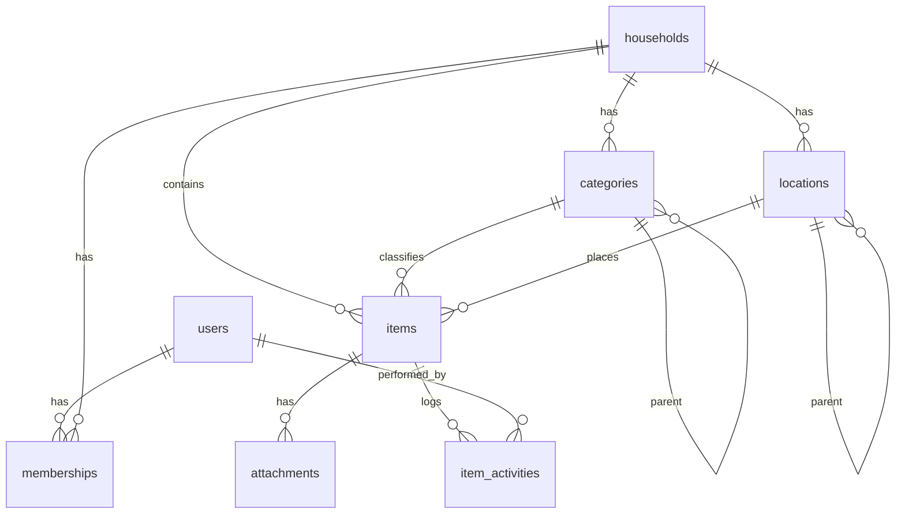
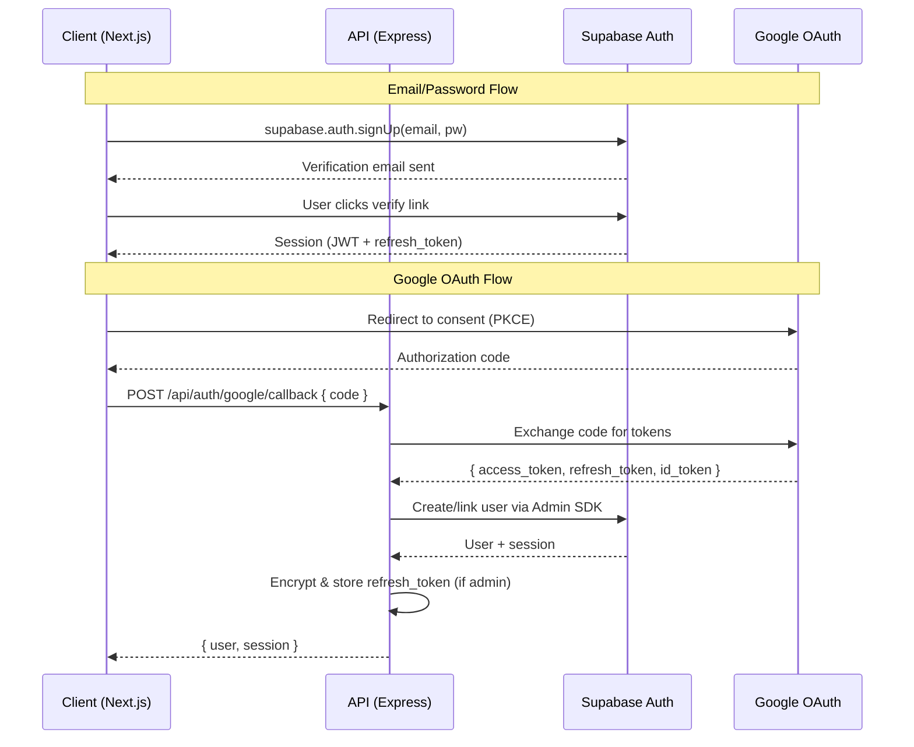
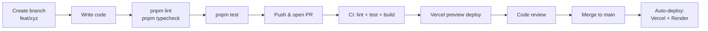

# Technical Specification Document (TSD)

**Product:** LeonoreVault
**Version:** 1.0 (MVP)
**Author:** Engineering Team + AI
**Date:** 2026-02-08
**Status:** Draft
**Reference:** [FSD v1.0](file:///d:/LeonoreKingdom/Project/Development/Web%20Development/LeonoreVault/.ai-docs/04-fsd.md) · [SRS v1.0](file:///d:/LeonoreKingdom/Project/Development/Web%20Development/LeonoreVault/.ai-docs/03-srs.md)

---

## Table of Contents

1. [Technology Stack](#1-technology-stack)
2. [Project Structure](#2-project-structure)
3. [Database Schema](#3-database-schema)
4. [API Specification](#4-api-specification)
5. [Authentication Implementation](#5-authentication-implementation)
6. [Frontend Architecture](#6-frontend-architecture)
7. [Backend Architecture](#7-backend-architecture)
8. [Third-Party Integrations](#8-third-party-integrations)
9. [Environment Configuration](#9-environment-configuration)
10. [Development Setup](#10-development-setup)

---

## 1. Technology Stack

### 1.1 Final Stack Decision

| Layer            | Technology                    | Version   | Justification                                                                                                     |
| ---------------- | ----------------------------- | --------- | ----------------------------------------------------------------------------------------------------------------- |
| **Frontend**     | Next.js (App Router)          | 15.x      | SSR for SEO landing page, file-based routing, React Server Components, Vercel-native deployment                   |
| **UI Framework** | React                         | 19.x      | Component model, hooks, ecosystem maturity; ships with Next.js 15                                                 |
| **Styling**      | Tailwind CSS                  | 4.x       | Utility-first, responsive design, dark mode via `prefers-color-scheme`, small bundle via purge                    |
| **State**        | Zustand + TanStack Query      | 5.x / 5.x | Zustand: lightweight global state (auth, UI). TanStack Query: server-state caching, auto-refetch, offline support |
| **Forms**        | React Hook Form + Zod         | 7.x / 3.x | Performant uncontrolled forms; Zod provides shared validation schemas (client + server)                           |
| **PWA**          | Workbox (next-pwa wrapper)    | 7.x       | Service Worker precaching, runtime caching strategies, background sync                                            |
| **Offline DB**   | Dexie.js                      | 4.x       | Fluent IndexedDB wrapper; reactive queries; sync-friendly                                                         |
| **QR**           | html5-qrcode + qrcode         | 2.x / 1.x | `html5-qrcode` for camera scanning; `qrcode` (npm) for generation as SVG/PNG                                      |
| **PDF**          | jsPDF + html2canvas           | 2.x / 1.x | Batch QR label PDF generation (A4 grid layout)                                                                    |
| **i18n**         | next-intl                     | 4.x       | Next.js App Router integration; message-based translations; English primary                                       |
| **Backend**      | Express.js                    | 5.x       | Minimal, flexible; modular routing; middleware ecosystem; long-lived process on Render                            |
| **Validation**   | Zod                           | 3.x       | Shared schemas between client and server; TypeScript-first                                                        |
| **ORM / Client** | Supabase JS SDK               | 2.x       | Auto-generated REST client for Postgres; built-in auth helpers; realtime subscriptions                            |
| **Database**     | Supabase (PostgreSQL 15)      | —         | Managed Postgres with RLS, Auth, Realtime, Edge Functions; generous free tier                                     |
| **Auth**         | Supabase Auth                 | —         | Email/password + Google OAuth; JWT issuance; PKCE flow; built-in email verification                               |
| **File Storage** | Google Drive API v3           | v3        | Admin's 2 TB Google One; zero Supabase Storage cost; server-side upload via Express                               |
| **Hosting (FE)** | Vercel                        | —         | Next.js native; auto-deploy from `main`; preview deploys on PRs; CDN edge                                         |
| **Hosting (BE)** | Render                        | —         | Free-tier web service; persistent process; auto-deploy from `main`; 750 h/mo                                      |
| **CI/CD**        | GitHub Actions                | —         | Lint → test → build → deploy pipeline; matrix for Node 20; Vercel/Render deploy hooks                             |
| **Language**     | TypeScript (strict mode)      | 5.x       | Type safety across full stack; shared types via monorepo packages                                                 |
| **Linting**      | ESLint + Prettier             | 9.x / 3.x | Consistent code style; `@typescript-eslint`; Conventional Commits enforced via commitlint                         |
| **Testing**      | Vitest + Playwright           | 2.x / 1.x | Vitest for unit/integration (fast, Vite-native); Playwright for E2E browser tests                                 |
| **Monorepo**     | pnpm workspaces               | 9.x       | Fast installs; strict dependency resolution; shared `packages/` for types and validation                          |
| **Encryption**   | pgcrypto (Supabase extension) | —         | Encrypt admin's Google refresh token at rest in Postgres                                                          |

### 1.2 Version Pinning Strategy

- All dependencies pinned to exact minor versions in `package.json` (e.g., `"next": "15.1.x"`).
- `pnpm-lock.yaml` committed.
- Renovate bot configured for weekly dependency PRs on non-breaking updates.

---

## 2. Project Structure

### 2.1 Monorepo Layout

```
leonore-vault/
├── .github/
│   └── workflows/
│       ├── ci.yml                    # Lint → Test → Build
│       └── deploy.yml                # Deploy to Vercel + Render
├── packages/
│   └── shared/                       # Shared code between FE & BE
│       ├── src/
│       │   ├── types/                # Shared TypeScript interfaces
│       │   │   ├── item.ts
│       │   │   ├── household.ts
│       │   │   ├── user.ts
│       │   │   ├── category.ts
│       │   │   ├── location.ts
│       │   │   ├── attachment.ts
│       │   │   ├── activity.ts
│       │   │   └── api.ts            # API request/response types
│       │   ├── validators/           # Zod schemas (used on both sides)
│       │   │   ├── item.schema.ts
│       │   │   ├── household.schema.ts
│       │   │   ├── category.schema.ts
│       │   │   ├── location.schema.ts
│       │   │   └── auth.schema.ts
│       │   ├── constants/            # Shared constants
│       │   │   ├── roles.ts
│       │   │   ├── item-status.ts
│       │   │   └── defaults.ts       # Default categories, etc.
│       │   └── index.ts
│       ├── package.json
│       └── tsconfig.json
├── apps/
│   ├── web/                          # Next.js PWA (Frontend)
│   │   ├── public/
│   │   │   ├── icons/                # PWA icons (192, 512)
│   │   │   ├── manifest.json
│   │   │   └── sw.js                 # Generated by next-pwa
│   │   ├── src/
│   │   │   ├── app/                  # Next.js App Router
│   │   │   │   ├── (auth)/           # Route group: public auth pages
│   │   │   │   │   ├── login/page.tsx
│   │   │   │   │   ├── register/page.tsx
│   │   │   │   │   ├── forgot-password/page.tsx
│   │   │   │   │   └── layout.tsx
│   │   │   │   ├── (marketing)/      # Route group: public landing
│   │   │   │   │   ├── page.tsx      # Landing page (/)
│   │   │   │   │   └── layout.tsx
│   │   │   │   ├── app/              # Protected app routes
│   │   │   │   │   ├── layout.tsx    # App shell + bottom nav
│   │   │   │   │   ├── dashboard/page.tsx
│   │   │   │   │   ├── items/
│   │   │   │   │   │   ├── page.tsx          # Item list
│   │   │   │   │   │   ├── new/page.tsx      # Create item
│   │   │   │   │   │   ├── [id]/page.tsx     # Item detail
│   │   │   │   │   │   ├── [id]/edit/page.tsx
│   │   │   │   │   │   └── qr-labels/page.tsx
│   │   │   │   │   ├── scan/page.tsx
│   │   │   │   │   ├── lost-found/page.tsx
│   │   │   │   │   └── settings/
│   │   │   │   │       ├── page.tsx          # Profile
│   │   │   │   │       ├── household/page.tsx
│   │   │   │   │       ├── members/page.tsx
│   │   │   │   │       ├── categories/page.tsx
│   │   │   │   │       └── locations/page.tsx
│   │   │   │   ├── onboarding/page.tsx
│   │   │   │   ├── auth/callback/route.ts    # OAuth callback handler
│   │   │   │   ├── layout.tsx                # Root layout
│   │   │   │   └── globals.css
│   │   │   ├── components/
│   │   │   │   ├── ui/               # Reusable primitives
│   │   │   │   │   ├── Button.tsx
│   │   │   │   │   ├── Input.tsx
│   │   │   │   │   ├── Modal.tsx
│   │   │   │   │   ├── Toast.tsx
│   │   │   │   │   ├── Skeleton.tsx
│   │   │   │   │   ├── BottomSheet.tsx
│   │   │   │   │   ├── EmptyState.tsx
│   │   │   │   │   └── Badge.tsx
│   │   │   │   ├── items/            # Item feature components
│   │   │   │   │   ├── ItemCard.tsx
│   │   │   │   │   ├── ItemForm.tsx
│   │   │   │   │   ├── ItemDetail.tsx
│   │   │   │   │   ├── ItemList.tsx
│   │   │   │   │   └── SearchBar.tsx
│   │   │   │   ├── qr/
│   │   │   │   │   ├── QrScanner.tsx
│   │   │   │   │   ├── QrGenerator.tsx
│   │   │   │   │   └── QuickActions.tsx
│   │   │   │   ├── household/
│   │   │   │   │   ├── MemberList.tsx
│   │   │   │   │   ├── InviteModal.tsx
│   │   │   │   │   └── RoleSelector.tsx
│   │   │   │   ├── layout/
│   │   │   │   │   ├── BottomNav.tsx
│   │   │   │   │   ├── AppHeader.tsx
│   │   │   │   │   ├── OfflineBanner.tsx
│   │   │   │   │   └── SyncIndicator.tsx
│   │   │   │   └── auth/
│   │   │   │       ├── LoginForm.tsx
│   │   │   │       ├── RegisterForm.tsx
│   │   │   │       └── GoogleButton.tsx
│   │   │   ├── hooks/
│   │   │   │   ├── useAuth.ts
│   │   │   │   ├── useItems.ts
│   │   │   │   ├── useHousehold.ts
│   │   │   │   ├── useCategories.ts
│   │   │   │   ├── useLocations.ts
│   │   │   │   ├── useSync.ts
│   │   │   │   ├── useOnlineStatus.ts
│   │   │   │   └── useQrScanner.ts
│   │   │   ├── lib/
│   │   │   │   ├── supabase/
│   │   │   │   │   ├── client.ts     # Browser Supabase client
│   │   │   │   │   └── server.ts     # Server-component client
│   │   │   │   ├── api.ts            # Axios/fetch wrapper for Express API
│   │   │   │   ├── db.ts             # Dexie.js database definition
│   │   │   │   ├── sync.ts           # Offline sync engine
│   │   │   │   └── utils.ts
│   │   │   ├── stores/
│   │   │   │   ├── auth.store.ts
│   │   │   │   ├── ui.store.ts
│   │   │   │   └── sync.store.ts
│   │   │   └── providers/
│   │   │       ├── QueryProvider.tsx
│   │   │       ├── AuthProvider.tsx
│   │   │       └── ThemeProvider.tsx
│   │   ├── next.config.ts
│   │   ├── tailwind.config.ts
│   │   ├── tsconfig.json
│   │   └── package.json
│   └── api/                          # Express.js API (Backend)
│       ├── src/
│       │   ├── index.ts              # Entry point: Express app bootstrap
│       │   ├── config/
│       │   │   ├── env.ts            # Environment variable loader (Zod-validated)
│       │   │   ├── supabase.ts       # Supabase admin client
│       │   │   ├── google.ts         # Google OAuth + Drive config
│       │   │   └── cors.ts
│       │   ├── middleware/
│       │   │   ├── auth.ts           # JWT validation + role extraction
│       │   │   ├── rbac.ts           # Role-based access guard
│       │   │   ├── validate.ts       # Zod request validation
│       │   │   ├── rateLimiter.ts    # express-rate-limit config
│       │   │   ├── errorHandler.ts   # Global error handler
│       │   │   └── logger.ts         # Request logging (pino)
│       │   ├── modules/
│       │   │   ├── auth/
│       │   │   │   ├── auth.routes.ts
│       │   │   │   ├── auth.controller.ts
│       │   │   │   └── auth.service.ts
│       │   │   ├── households/
│       │   │   │   ├── household.routes.ts
│       │   │   │   ├── household.controller.ts
│       │   │   │   └── household.service.ts
│       │   │   ├── items/
│       │   │   │   ├── item.routes.ts
│       │   │   │   ├── item.controller.ts
│       │   │   │   └── item.service.ts
│       │   │   ├── categories/
│       │   │   │   ├── category.routes.ts
│       │   │   │   ├── category.controller.ts
│       │   │   │   └── category.service.ts
│       │   │   ├── locations/
│       │   │   │   ├── location.routes.ts
│       │   │   │   ├── location.controller.ts
│       │   │   │   └── location.service.ts
│       │   │   ├── drive/
│       │   │   │   ├── drive.routes.ts
│       │   │   │   ├── drive.controller.ts
│       │   │   │   └── drive.service.ts
│       │   │   ├── sync/
│       │   │   │   ├── sync.routes.ts
│       │   │   │   ├── sync.controller.ts
│       │   │   │   └── sync.service.ts
│       │   │   └── qr/
│       │   │       ├── qr.routes.ts
│       │   │       ├── qr.controller.ts
│       │   │       └── qr.service.ts
│       │   ├── utils/
│       │   │   ├── errors.ts         # Custom error classes
│       │   │   ├── crypto.ts         # Token encryption helpers
│       │   │   └── response.ts       # Standardized API response wrapper
│       │   └── types/
│       │       └── express.d.ts      # Express Request augmentation
│       ├── tsconfig.json
│       └── package.json
├── supabase/
│   ├── migrations/                   # SQL migration files
│   │   ├── 00001_initial_schema.sql
│   │   ├── 00002_rls_policies.sql
│   │   ├── 00003_indexes.sql
│   │   └── 00004_seed_functions.sql
│   ├── seed.sql                      # Development seed data
│   └── config.toml                   # Supabase local config
├── .env.example
├── pnpm-workspace.yaml
├── package.json                      # Root workspace config
├── tsconfig.base.json
├── .eslintrc.cjs
├── .prettierrc
├── commitlint.config.ts
└── README.md
```

### 2.2 Naming Conventions

| Item             | Convention                      | Example                       |
| ---------------- | ------------------------------- | ----------------------------- |
| React components | PascalCase, `.tsx`              | `ItemCard.tsx`                |
| Hooks            | camelCase, `use` prefix, `.ts`  | `useItems.ts`                 |
| Stores           | camelCase, `.store.ts`          | `auth.store.ts`               |
| API routes (BE)  | kebab-case plural, `.routes.ts` | `item.routes.ts`              |
| Zod schemas      | camelCase, `.schema.ts`         | `item.schema.ts`              |
| DB columns       | snake_case                      | `household_id`, `created_at`  |
| DB tables        | snake_case plural               | `items`, `memberships`        |
| Env variables    | UPPER_SNAKE_CASE                | `SUPABASE_URL`                |
| CSS classes      | Tailwind utilities              | `bg-primary-600 text-white`   |
| Git branches     | `type/short-description`        | `feat/item-crud`              |
| Commits          | Conventional Commits            | `feat(items): add search API` |
| TypeScript types | PascalCase, `I` prefix omitted  | `Item`, `CreateItemRequest`   |

---

## 3. Database Schema

### 3.1 Entity Relationship Diagram



### 3.2 Table Definitions

#### `users`

| Column                 | Type          | Nullable | Default      | Notes                                      |
| ---------------------- | ------------- | -------- | ------------ | ------------------------------------------ |
| `id`                   | `uuid`        | NO       | `auth.uid()` | PK — matches Supabase Auth `auth.users.id` |
| `email`                | `text`        | NO       | —            | Unique                                     |
| `display_name`         | `text`        | YES      | —            | From Google profile or user input          |
| `avatar_url`           | `text`        | YES      | —            | Google profile picture URL                 |
| `google_refresh_token` | `text`        | YES      | —            | Encrypted via `pgcrypto`; admin only       |
| `created_at`           | `timestamptz` | NO       | `now()`      |                                            |
| `updated_at`           | `timestamptz` | NO       | `now()`      | Auto-updated via trigger                   |

**Indexes:** `UNIQUE(email)`
**RLS:** Users can read/update only their own row.

#### `households`

| Column              | Type          | Nullable | Default             | Notes                                          |
| ------------------- | ------------- | -------- | ------------------- | ---------------------------------------------- |
| `id`                | `uuid`        | NO       | `gen_random_uuid()` | PK                                             |
| `name`              | `text`        | NO       | —                   | 1–100 chars                                    |
| `created_by`        | `uuid`        | NO       | —                   | FK → `users.id`                                |
| `invite_code`       | `text`        | YES      | —                   | 6-char alphanumeric uppercase; unique          |
| `invite_expires_at` | `timestamptz` | YES      | —                   | `NULL` if no active invite                     |
| `drive_folder_id`   | `text`        | YES      | —                   | Google Drive root folder ID for this household |
| `created_at`        | `timestamptz` | NO       | `now()`             |                                                |

**Indexes:** `UNIQUE(invite_code) WHERE invite_code IS NOT NULL`
**RLS:** Read/update only by members of the household.

#### `memberships`

| Column         | Type          | Nullable | Default             | Notes                                        |
| -------------- | ------------- | -------- | ------------------- | -------------------------------------------- |
| `id`           | `uuid`        | NO       | `gen_random_uuid()` | PK                                           |
| `user_id`      | `uuid`        | NO       | —                   | FK → `users.id` ON DELETE CASCADE            |
| `household_id` | `uuid`        | NO       | —                   | FK → `households.id` ON DELETE CASCADE       |
| `role`         | `text`        | NO       | `'member'`          | CHECK: `role IN ('admin','member','viewer')` |
| `joined_at`    | `timestamptz` | NO       | `now()`             |                                              |

**Indexes:** `UNIQUE(user_id, household_id)`, `INDEX(household_id)`
**RLS:** Users can read memberships for their own households.

#### `categories`

| Column         | Type   | Nullable | Default             | Notes                                        |
| -------------- | ------ | -------- | ------------------- | -------------------------------------------- |
| `id`           | `uuid` | NO       | `gen_random_uuid()` | PK                                           |
| `household_id` | `uuid` | NO       | —                   | FK → `households.id` ON DELETE CASCADE       |
| `name`         | `text` | NO       | —                   | 1–100 chars                                  |
| `parent_id`    | `uuid` | YES      | —                   | FK → `categories.id` (self-ref); max depth 3 |
| `icon`         | `text` | YES      | —                   | Emoji or icon name                           |
| `color`        | `text` | YES      | —                   | Hex color code                               |
| `sort_order`   | `int4` | NO       | `0`                 |                                              |

**Indexes:** `UNIQUE(household_id, name, parent_id)`, `INDEX(household_id)`
**Constraints:** Check function to enforce max depth ≤ 3.

#### `locations`

| Column         | Type   | Nullable | Default             | Notes                                       |
| -------------- | ------ | -------- | ------------------- | ------------------------------------------- |
| `id`           | `uuid` | NO       | `gen_random_uuid()` | PK                                          |
| `household_id` | `uuid` | NO       | —                   | FK → `households.id` ON DELETE CASCADE      |
| `name`         | `text` | NO       | —                   | 1–100 chars                                 |
| `parent_id`    | `uuid` | YES      | —                   | FK → `locations.id` (self-ref); max depth 3 |
| `description`  | `text` | YES      | —                   |                                             |
| `sort_order`   | `int4` | NO       | `0`                 |                                             |

**Indexes:** `UNIQUE(household_id, name, parent_id)`, `INDEX(household_id)`

#### `items`

| Column            | Type          | Nullable | Default             | Notes                                                    |
| ----------------- | ------------- | -------- | ------------------- | -------------------------------------------------------- |
| `id`              | `uuid`        | NO       | `gen_random_uuid()` | PK                                                       |
| `household_id`    | `uuid`        | NO       | —                   | FK → `households.id` ON DELETE CASCADE                   |
| `name`            | `text`        | NO       | —                   | 1–200 chars                                              |
| `description`     | `text`        | YES      | —                   | Max 2000 chars                                           |
| `category_id`     | `uuid`        | YES      | —                   | FK → `categories.id` ON DELETE SET NULL                  |
| `location_id`     | `uuid`        | YES      | —                   | FK → `locations.id` ON DELETE SET NULL                   |
| `quantity`        | `int4`        | NO       | `1`                 | ≥ 1                                                      |
| `tags`            | `text[]`      | YES      | `'{}'`              | Max 20 tags, each ≤ 50 chars                             |
| `status`          | `text`        | NO       | `'stored'`          | CHECK: `IN ('stored','borrowed','lost','in_lost_found')` |
| `created_by`      | `uuid`        | NO       | —                   | FK → `users.id`                                          |
| `borrowed_by`     | `uuid`        | YES      | —                   | FK → `users.id`; NULL unless borrowed                    |
| `borrow_due_date` | `timestamptz` | YES      | —                   |                                                          |
| `created_at`      | `timestamptz` | NO       | `now()`             |                                                          |
| `updated_at`      | `timestamptz` | NO       | `now()`             | Auto-updated via trigger                                 |
| `deleted_at`      | `timestamptz` | YES      | —                   | Soft-delete marker                                       |

**Indexes:** `INDEX(household_id)`, `INDEX(household_id, status)`, `INDEX(name) using GIN (to_tsvector('english', name))` (full-text), `INDEX(deleted_at) WHERE deleted_at IS NOT NULL`
**RLS:** Scoped by household membership; default queries filter `deleted_at IS NULL`.

#### `attachments`

| Column          | Type          | Nullable | Default             | Notes                                 |
| --------------- | ------------- | -------- | ------------------- | ------------------------------------- |
| `id`            | `uuid`        | NO       | `gen_random_uuid()` | PK                                    |
| `item_id`       | `uuid`        | NO       | —                   | FK → `items.id` ON DELETE CASCADE     |
| `drive_file_id` | `text`        | NO       | —                   | Google Drive file ID                  |
| `file_name`     | `text`        | NO       | —                   |                                       |
| `mime_type`     | `text`        | NO       | —                   | `image/jpeg`, `application/pdf`, etc. |
| `thumbnail_url` | `text`        | YES      | —                   | Drive thumbnail link                  |
| `web_view_link` | `text`        | YES      | —                   | Drive web view URL                    |
| `created_by`    | `uuid`        | NO       | —                   | FK → `users.id`                       |
| `created_at`    | `timestamptz` | NO       | `now()`             |                                       |

**Indexes:** `INDEX(item_id)`
**Constraints:** Application-level max 10 per item.

#### `item_activities`

| Column       | Type          | Nullable | Default             | Notes                                                                                              |
| ------------ | ------------- | -------- | ------------------- | -------------------------------------------------------------------------------------------------- |
| `id`         | `uuid`        | NO       | `gen_random_uuid()` | PK                                                                                                 |
| `item_id`    | `uuid`        | NO       | —                   | FK → `items.id` ON DELETE CASCADE                                                                  |
| `user_id`    | `uuid`        | NO       | —                   | FK → `users.id`                                                                                    |
| `action`     | `text`        | NO       | —                   | CHECK: `IN ('created','updated','moved','status_changed','attachment_added','attachment_removed')` |
| `details`    | `jsonb`       | YES      | —                   | `{"old_location":"...","new_location":"..."}` etc.                                                 |
| `created_at` | `timestamptz` | NO       | `now()`             |                                                                                                    |

**Indexes:** `INDEX(item_id, created_at DESC)`

### 3.3 Database Functions & Triggers

```sql
-- Auto-update updated_at on row change
CREATE OR REPLACE FUNCTION update_updated_at()
RETURNS TRIGGER AS $$
BEGIN
  NEW.updated_at = now();
  RETURN NEW;
END;
$$ LANGUAGE plpgsql;

CREATE TRIGGER set_updated_at
  BEFORE UPDATE ON items
  FOR EACH ROW EXECUTE FUNCTION update_updated_at();

CREATE TRIGGER set_updated_at_users
  BEFORE UPDATE ON users
  FOR EACH ROW EXECUTE FUNCTION update_updated_at();

-- Enforce category/location max depth = 3
CREATE OR REPLACE FUNCTION check_max_depth()
RETURNS TRIGGER AS $$
DECLARE
  depth int := 0;
  current_parent uuid := NEW.parent_id;
BEGIN
  WHILE current_parent IS NOT NULL LOOP
    depth := depth + 1;
    IF depth > 2 THEN  -- depth 3 means grandchild (0-indexed: 0,1,2)
      RAISE EXCEPTION 'Maximum nesting depth of 3 exceeded';
    END IF;
    SELECT parent_id INTO current_parent
      FROM categories WHERE id = current_parent;
  END LOOP;
  RETURN NEW;
END;
$$ LANGUAGE plpgsql;

CREATE TRIGGER check_category_depth
  BEFORE INSERT OR UPDATE ON categories
  FOR EACH ROW EXECUTE FUNCTION check_max_depth();

-- Same trigger for locations (uses locations table)
CREATE OR REPLACE FUNCTION check_location_max_depth()
RETURNS TRIGGER AS $$
DECLARE
  depth int := 0;
  current_parent uuid := NEW.parent_id;
BEGIN
  WHILE current_parent IS NOT NULL LOOP
    depth := depth + 1;
    IF depth > 2 THEN
      RAISE EXCEPTION 'Maximum nesting depth of 3 exceeded';
    END IF;
    SELECT parent_id INTO current_parent
      FROM locations WHERE id = current_parent;
  END LOOP;
  RETURN NEW;
END;
$$ LANGUAGE plpgsql;

CREATE TRIGGER check_location_depth
  BEFORE INSERT OR UPDATE ON locations
  FOR EACH ROW EXECUTE FUNCTION check_location_max_depth();

-- Purge soft-deleted items older than 30 days (called via cron)
CREATE OR REPLACE FUNCTION purge_deleted_items()
RETURNS void AS $$
BEGIN
  DELETE FROM items WHERE deleted_at < now() - INTERVAL '30 days';
END;
$$ LANGUAGE plpgsql;

-- Clean expired invite codes (called via cron)
CREATE OR REPLACE FUNCTION cleanup_expired_invites()
RETURNS void AS $$
BEGIN
  UPDATE households
    SET invite_code = NULL, invite_expires_at = NULL
    WHERE invite_expires_at < now();
END;
$$ LANGUAGE plpgsql;
```

### 3.4 Row-Level Security Policies

```sql
-- Enable RLS on all tables
ALTER TABLE users ENABLE ROW LEVEL SECURITY;
ALTER TABLE households ENABLE ROW LEVEL SECURITY;
ALTER TABLE memberships ENABLE ROW LEVEL SECURITY;
ALTER TABLE items ENABLE ROW LEVEL SECURITY;
ALTER TABLE categories ENABLE ROW LEVEL SECURITY;
ALTER TABLE locations ENABLE ROW LEVEL SECURITY;
ALTER TABLE attachments ENABLE ROW LEVEL SECURITY;
ALTER TABLE item_activities ENABLE ROW LEVEL SECURITY;

-- Helper: check if user is member of household
CREATE OR REPLACE FUNCTION is_household_member(h_id uuid)
RETURNS boolean AS $$
  SELECT EXISTS (
    SELECT 1 FROM memberships
    WHERE user_id = auth.uid() AND household_id = h_id
  );
$$ LANGUAGE sql SECURITY DEFINER;

-- Helper: get user's role in household
CREATE OR REPLACE FUNCTION get_household_role(h_id uuid)
RETURNS text AS $$
  SELECT role FROM memberships
  WHERE user_id = auth.uid() AND household_id = h_id
  LIMIT 1;
$$ LANGUAGE sql SECURITY DEFINER;

-- Users: own row only
CREATE POLICY users_select ON users FOR SELECT USING (id = auth.uid());
CREATE POLICY users_update ON users FOR UPDATE USING (id = auth.uid());

-- Households: members can read
CREATE POLICY households_select ON households FOR SELECT
  USING (is_household_member(id));
CREATE POLICY households_insert ON households FOR INSERT
  WITH CHECK (created_by = auth.uid());
CREATE POLICY households_update ON households FOR UPDATE
  USING (get_household_role(id) = 'admin');

-- Memberships
CREATE POLICY memberships_select ON memberships FOR SELECT
  USING (is_household_member(household_id));
CREATE POLICY memberships_insert ON memberships FOR INSERT
  WITH CHECK (
    user_id = auth.uid() OR get_household_role(household_id) = 'admin'
  );
CREATE POLICY memberships_delete ON memberships FOR DELETE
  USING (get_household_role(household_id) = 'admin');

-- Items: household members can read; member+ can write
CREATE POLICY items_select ON items FOR SELECT
  USING (is_household_member(household_id) AND deleted_at IS NULL);
CREATE POLICY items_insert ON items FOR INSERT
  WITH CHECK (
    is_household_member(household_id)
    AND get_household_role(household_id) IN ('admin','member')
  );
CREATE POLICY items_update ON items FOR UPDATE
  USING (
    is_household_member(household_id)
    AND get_household_role(household_id) IN ('admin','member')
  );
CREATE POLICY items_delete ON items FOR DELETE
  USING (get_household_role(household_id) = 'admin');

-- Categories, Locations: household members read; admin writes
CREATE POLICY categories_select ON categories FOR SELECT
  USING (is_household_member(household_id));
CREATE POLICY categories_modify ON categories FOR ALL
  USING (get_household_role(household_id) = 'admin');

-- Attachments, Activities: inherit from item's household
CREATE POLICY attachments_select ON attachments FOR SELECT
  USING (EXISTS (
    SELECT 1 FROM items WHERE items.id = attachments.item_id
    AND is_household_member(items.household_id)
  ));
CREATE POLICY activities_select ON item_activities FOR SELECT
  USING (EXISTS (
    SELECT 1 FROM items WHERE items.id = item_activities.item_id
    AND is_household_member(items.household_id)
  ));
```

---

## 4. API Specification

### 4.1 Base Configuration

- **Base URL:** `https://api.leonorevault.com/api` (production), `http://localhost:4000/api` (local)
- **Content-Type:** `application/json` (unless multipart for file uploads)
- **Auth Header:** `Authorization: Bearer <supabase_jwt>`
- **Standard Response Envelope:**

```typescript
// Success response
interface ApiResponse<T> {
  success: true;
  data: T;
  meta?: {
    page: number;
    pageSize: number;
    total: number;
    totalPages: number;
  };
}

// Error response
interface ApiError {
  success: false;
  error: {
    code: string; // e.g., "VALIDATION_ERROR"
    message: string; // User-friendly message
    details?: Record<string, string>; // Field-level errors
  };
}
```

### 4.2 Shared Types

```typescript
// packages/shared/src/types/item.ts
interface Item {
  id: string;
  householdId: string;
  name: string;
  description: string | null;
  categoryId: string | null;
  locationId: string | null;
  quantity: number;
  tags: string[];
  status: 'stored' | 'borrowed' | 'lost' | 'in_lost_found';
  createdBy: string;
  borrowedBy: string | null;
  borrowDueDate: string | null;
  createdAt: string;
  updatedAt: string;
  deletedAt: string | null;
  // Joined fields (optional)
  category?: Category;
  location?: Location;
  attachments?: Attachment[];
}

interface CreateItemRequest {
  name: string;
  description?: string;
  categoryId?: string;
  locationId?: string;
  quantity?: number;
  tags?: string[];
}

interface UpdateItemRequest extends Partial<CreateItemRequest> {}

interface UpdateItemStatusRequest {
  status: 'stored' | 'lost' | 'in_lost_found';
  note?: string;
  locationId?: string;
}

// packages/shared/src/types/household.ts
interface Household {
  id: string;
  name: string;
  createdBy: string;
  inviteCode: string | null;
  inviteExpiresAt: string | null;
  driveFolderId: string | null;
  createdAt: string;
}

interface Membership {
  id: string;
  userId: string;
  householdId: string;
  role: 'admin' | 'member' | 'viewer';
  joinedAt: string;
  user?: { displayName: string; email: string; avatarUrl: string | null };
}

// packages/shared/src/types/category.ts
interface Category {
  id: string;
  householdId: string;
  name: string;
  parentId: string | null;
  icon: string | null;
  color: string | null;
  sortOrder: number;
  children?: Category[];
}

// packages/shared/src/types/location.ts
interface Location {
  id: string;
  householdId: string;
  name: string;
  parentId: string | null;
  description: string | null;
  sortOrder: number;
  children?: Location[];
}

// packages/shared/src/types/attachment.ts
interface Attachment {
  id: string;
  itemId: string;
  driveFileId: string;
  fileName: string;
  mimeType: string;
  thumbnailUrl: string | null;
  webViewLink: string | null;
  createdBy: string;
  createdAt: string;
}

// packages/shared/src/types/activity.ts
interface ItemActivity {
  id: string;
  itemId: string;
  userId: string;
  action: 'created' | 'updated' | 'moved' | 'status_changed' | 'attachment_added' | 'attachment_removed';
  details: Record<string, unknown> | null;
  createdAt: string;
  user?: { displayName: string; avatarUrl: string | null };
}
```

### 4.3 Endpoint Reference

#### Auth Module

| Method | Route                   | Auth | Role | Description                           |
| ------ | ----------------------- | ---- | ---- | ------------------------------------- |
| POST   | `/auth/google/callback` | No   | —    | Exchange Google auth code for session |
| POST   | `/auth/refresh`         | Yes  | Any  | Refresh access token                  |
| GET    | `/auth/me`              | Yes  | Any  | Get current user profile + role       |

**`POST /auth/google/callback`**

```typescript
// Request
{ code: string; redirectUri: string }

// Response 200
{ success: true, data: { user: User, session: { accessToken: string, refreshToken: string, expiresAt: number } } }

// Errors: 400 (invalid code), 500 (exchange failed)
```

**`GET /auth/me`**

```typescript
// Response 200
{ success: true, data: { user: User, membership: Membership } }

// Errors: 401 (not authenticated)
```

---

#### Household Module

| Method | Route                             | Auth | Role  | Description           |
| ------ | --------------------------------- | ---- | ----- | --------------------- |
| POST   | `/households`                     | Yes  | Any   | Create household      |
| GET    | `/households/:id`                 | Yes  | Any\* | Get household details |
| POST   | `/households/:id/invite`          | Yes  | Admin | Generate invite code  |
| POST   | `/households/join`                | Yes  | Any   | Join via invite code  |
| PATCH  | `/households/:id/members/:userId` | Yes  | Admin | Change member role    |
| DELETE | `/households/:id/members/:userId` | Yes  | Admin | Remove member         |

**`POST /households`**

```typescript
// Request
{ name: string }

// Response 201
{ success: true, data: { household: Household, membership: Membership } }
```

**`POST /households/:id/invite`**

```typescript
// Response 200
{ success: true, data: { inviteCode: string, expiresAt: string } }
```

**`POST /households/join`**

```typescript
// Request
{ inviteCode: string }

// Response 200
{ success: true, data: { household: Household, membership: Membership } }

// Errors: 400 (invalid/expired code), 409 (already member)
```

---

#### Item Module

| Method | Route                | Auth | Role    | Description            |
| ------ | -------------------- | ---- | ------- | ---------------------- |
| GET    | `/items`             | Yes  | Any     | List items (paginated) |
| GET    | `/items/:id`         | Yes  | Any     | Get item detail        |
| POST   | `/items`             | Yes  | Member+ | Create item            |
| PATCH  | `/items/:id`         | Yes  | Member+ | Update item            |
| DELETE | `/items/:id`         | Yes  | Member+ | Soft-delete item       |
| POST   | `/items/:id/restore` | Yes  | Member+ | Restore soft-deleted   |
| PATCH  | `/items/:id/status`  | Yes  | Member+ | Change item status     |

**`GET /items`**

```typescript
// Query params
{ page?: number; pageSize?: number; search?: string; categoryId?: string; locationId?: string; status?: string }

// Response 200
{ success: true, data: Item[], meta: { page: 1, pageSize: 20, total: 142, totalPages: 8 } }
```

**`POST /items`** (multipart/form-data)

```typescript
// Body fields: "data" (JSON string of CreateItemRequest), "files" (File[])

// Response 201
{ success: true, data: { item: Item, attachments: Attachment[], qrCodeUrl: string } }

// Errors: 400 (validation), 413 (file too large)
```

**`PATCH /items/:id/status`**

```typescript
// Request
{ status: 'lost' | 'in_lost_found' | 'stored'; note?: string; locationId?: string }

// Response 200
{ success: true, data: Item }

// Errors: 400 (invalid transition), 403 (viewer)
```

---

#### Category & Location Module

| Method | Route             | Auth | Role  | Description     |
| ------ | ----------------- | ---- | ----- | --------------- |
| GET    | `/categories`     | Yes  | Any   | List as tree    |
| POST   | `/categories`     | Yes  | Admin | Create category |
| PATCH  | `/categories/:id` | Yes  | Admin | Update category |
| DELETE | `/categories/:id` | Yes  | Admin | Delete category |
| GET    | `/locations`      | Yes  | Any   | List as tree    |
| POST   | `/locations`      | Yes  | Admin | Create location |
| PATCH  | `/locations/:id`  | Yes  | Admin | Update location |
| DELETE | `/locations/:id`  | Yes  | Admin | Delete location |

**`POST /categories`**

```typescript
// Request
{ name: string; parentId?: string; icon?: string; color?: string }

// Response 201
{ success: true, data: Category }

// Errors: 400 (max depth), 409 (duplicate name)
```

---

#### Drive Module

| Method | Route                           | Auth | Role    | Description       |
| ------ | ------------------------------- | ---- | ------- | ----------------- |
| POST   | `/items/:id/attachments/upload` | Yes  | Member+ | Upload file(s)    |
| POST   | `/items/:id/attachments/link`   | Yes  | Member+ | Link external URL |
| DELETE | `/attachments/:id`              | Yes  | Member+ | Remove attachment |

**`POST /items/:id/attachments/upload`** (multipart/form-data)

```typescript
// Body: "files" (File[]) — max 2 MB each, JPEG/PNG/PDF/DOCX

// Response 201
{ success: true, data: Attachment[] }

// Errors: 400 (max 10 reached, invalid type), 413 (file too large), 502 (Drive error)
```

---

#### Sync Module

| Method | Route   | Auth | Role    | Description        |
| ------ | ------- | ---- | ------- | ------------------ |
| POST   | `/sync` | Yes  | Member+ | Sync offline queue |

**`POST /sync`**

```typescript
// Request
interface SyncRequest {
  mutations: Array<{
    id: string; // Client-generated UUID
    type: 'create' | 'update' | 'delete';
    entity: 'item' | 'category' | 'location';
    data: Record<string, unknown>;
    timestamp: string; // ISO 8601
  }>;
}

// Response 200
interface SyncResponse {
  applied: string[]; // Mutation IDs applied
  conflicts: Array<{
    mutationId: string;
    reason: string;
    serverVersion: Record<string, unknown>;
  }>;
}
```

---

#### QR Module

| Method | Route             | Auth | Role    | Description       |
| ------ | ----------------- | ---- | ------- | ----------------- |
| GET    | `/items/:id/qr`   | Yes  | Any     | Get QR as PNG/SVG |
| POST   | `/items/qr-batch` | Yes  | Member+ | Batch QR PDF      |

**`GET /items/:id/qr`**

```typescript
// Query: { format?: 'png' | 'svg' }  default: 'png'

// Response 200: Binary image (Content-Type: image/png or image/svg+xml)
```

**`POST /items/qr-batch`**

```typescript
// Request
{ itemIds: string[] }  // Max 50

// Response 200: Binary PDF (Content-Type: application/pdf)
```

---

## 5. Authentication Implementation

### 5.1 Auth Architecture



### 5.2 JWT Token Structure

Supabase issues JWTs with the following claims:

```typescript
interface SupabaseJWT {
  sub: string; // User UUID (auth.uid())
  email: string;
  aud: string; // "authenticated"
  role: string; // "authenticated" (Supabase role, not app role)
  iss: string; // Supabase project URL
  iat: number; // Issued at
  exp: number; // Expiry (1 hour)
  session_id: string;
  // Custom claims (set via Supabase hook or app_metadata):
  app_metadata: {
    provider: string; // "email" | "google"
  };
  user_metadata: {
    display_name?: string;
    avatar_url?: string;
  };
}
```

> [!NOTE]
> Application-level roles (admin/member/viewer) are **NOT** in the JWT. They are resolved per-request by querying the `memberships` table in the auth middleware.

### 5.3 Auth Middleware Implementation

```typescript
// apps/api/src/middleware/auth.ts
import { createClient } from '@supabase/supabase-js';

export async function authMiddleware(req: Request, res: Response, next: NextFunction) {
  const token = req.headers.authorization?.replace('Bearer ', '');
  if (!token) return res.status(401).json({ success: false, error: { code: 'UNAUTHORIZED', message: 'Missing token' } });

  const supabase = createClient(env.SUPABASE_URL, env.SUPABASE_SERVICE_ROLE_KEY);
  const {
    data: { user },
    error,
  } = await supabase.auth.getUser(token);

  if (error || !user) return res.status(401).json({ success: false, error: { code: 'UNAUTHORIZED', message: 'Invalid or expired token' } });

  // Resolve household membership + role
  const { data: membership } = await supabase.from('memberships').select('household_id, role').eq('user_id', user.id).single();

  req.user = { id: user.id, email: user.email!, householdId: membership?.household_id, role: membership?.role };
  next();
}
```

### 5.4 RBAC Middleware

```typescript
// apps/api/src/middleware/rbac.ts
type Role = 'admin' | 'member' | 'viewer';
const ROLE_HIERARCHY: Record<Role, number> = { admin: 3, member: 2, viewer: 1 };

export function requireRole(minimumRole: Role) {
  return (req: Request, res: Response, next: NextFunction) => {
    const userRole = req.user?.role as Role;
    if (!userRole || ROLE_HIERARCHY[userRole] < ROLE_HIERARCHY[minimumRole]) {
      return res.status(403).json({
        success: false,
        error: { code: 'FORBIDDEN', message: 'Insufficient permissions' },
      });
    }
    next();
  };
}

// Usage in routes:
// router.post('/items', authMiddleware, requireRole('member'), itemController.create);
```

### 5.5 Session Management

| Aspect                   | Implementation                                                                |
| ------------------------ | ----------------------------------------------------------------------------- |
| **Access token expiry**  | 1 hour (Supabase default)                                                     |
| **Refresh token expiry** | 30 days                                                                       |
| **Client storage**       | JWT in Zustand (memory) + `localStorage` fallback; refresh via Supabase SDK   |
| **Auto-refresh**         | Supabase SDK `onAuthStateChange` fires before expiry; retries failed requests |
| **Logout**               | `supabase.auth.signOut()` → clear Zustand, React Query cache, Dexie.js data   |
| **Multi-tab sync**       | `storage` event listener syncs auth state across tabs                         |

### 5.6 Security Measures

| Measure                    | Detail                                                                               |
| -------------------------- | ------------------------------------------------------------------------------------ |
| **PKCE**                   | Used for Google OAuth flow (code_verifier + code_challenge in browser)               |
| **Password policy**        | Min 8 chars, 1+ number, 1+ special (configured in Supabase Auth dashboard)           |
| **Brute-force protection** | `express-rate-limit`: 10 attempts/15 min on `/api/auth/*`                            |
| **Global rate limiting**   | 100 req/min per user IP; 20 uploads/min per user on Drive endpoints                  |
| **CORS**                   | `origin: [process.env.CLIENT_URL]`; `credentials: true`                              |
| **CSRF**                   | `SameSite=Lax` on cookies; `Origin` header validated in middleware                   |
| **HTTPS**                  | Enforced by Vercel/Render; HSTS enabled                                              |
| **Token encryption**       | Google refresh tokens encrypted via `pgcrypto.pgp_sym_encrypt()` before DB storage   |
| **RLS**                    | All Supabase tables; service role key used only in Express (never exposed to client) |
| **Input sanitization**     | `DOMPurify.sanitize()` on all user-generated text fields server-side                 |

---

## 6. Frontend Architecture

### 6.1 Component Hierarchy

```
RootLayout (globals.css, fonts, metadata)
├── ThemeProvider (OS dark mode)
├── QueryProvider (TanStack Query client)
├── AuthProvider (Supabase onAuthStateChange listener)
│
├── (marketing)/Layout
│   └── LandingPage
│
├── (auth)/Layout (centered card, no nav)
│   ├── LoginPage → LoginForm, GoogleButton
│   ├── RegisterPage → RegisterForm, GoogleButton
│   └── ForgotPasswordPage
│
├── OnboardingPage (stepper wizard)
│   ├── Step1: HouseholdForm
│   ├── Step2: LocationsForm
│   └── Step3: FirstItemForm
│
└── app/Layout (AppHeader, BottomNav, OfflineBanner, SyncIndicator)
    ├── DashboardPage → StatsCards, RecentActivity, QuickActions
    ├── items/
    │   ├── ItemListPage → SearchBar, ViewToggle, ItemList/ItemGrid, ItemCard
    │   ├── ItemDetailPage → TabView(Info, History, Attachments)
    │   ├── NewItemPage → ItemForm
    │   ├── EditItemPage → ItemForm (prefilled)
    │   └── QrLabelsPage → ItemSelector, BatchQrPreview
    ├── scan/ScanPage → QrScanner, QuickActions (BottomSheet)
    ├── lost-found/LostFoundPage → LostItemList, StatusActions
    └── settings/
        ├── ProfilePage → AvatarUpload, NameEdit
        ├── HouseholdPage → HouseholdForm
        ├── MembersPage → MemberList, InviteModal, RoleSelector
        ├── CategoriesPage → CategoryTree (CRUD)
        └── LocationsPage → LocationTree (CRUD)
```

### 6.2 Routing & Guards

```typescript
// Route protection via middleware.ts (Next.js)
import { createServerClient } from '@supabase/ssr';
import { NextResponse, type NextRequest } from 'next/server';

export async function middleware(req: NextRequest) {
  const res = NextResponse.next();
  const supabase = createServerClient(/* cookies config */);
  const {
    data: { session },
  } = await supabase.auth.getSession();

  const isAuthPage = req.nextUrl.pathname.startsWith('/login') || req.nextUrl.pathname.startsWith('/register');
  const isAppPage = req.nextUrl.pathname.startsWith('/app');

  if (isAppPage && !session) return NextResponse.redirect(new URL('/login', req.url));
  if (isAuthPage && session) return NextResponse.redirect(new URL('/app/dashboard', req.url));

  return res;
}

export const config = { matcher: ['/app/:path*', '/login', '/register', '/onboarding'] };
```

### 6.3 Data Fetching Strategy

| Data Type         | Strategy               | Hook Example              | Cache Time |
| ----------------- | ---------------------- | ------------------------- | ---------- |
| Item list         | TanStack Query + Dexie | `useItems(filters)`       | 5 min      |
| Item detail       | TanStack Query + Dexie | `useItem(id)`             | 5 min      |
| Categories tree   | TanStack Query + Dexie | `useCategories()`         | 30 min     |
| Locations tree    | TanStack Query + Dexie | `useLocations()`          | 30 min     |
| Household members | TanStack Query         | `useMembers(householdId)` | 5 min      |
| Auth session      | Zustand + Supabase SDK | `useAuth()`               | Real-time  |
| UI preferences    | Zustand (localStorage) | `useUIStore()`            | Persistent |
| Sync queue        | Dexie.js               | `useSyncQueue()`          | Persistent |

```typescript
// Example: useItems hook
export function useItems(filters: ItemFilters) {
  return useQuery({
    queryKey: ['items', filters],
    queryFn: () => api.get<Item[]>('/items', { params: filters }),
    staleTime: 5 * 60 * 1000,
    placeholderData: () => localDb.items.toArray(), // Dexie fallback
  });
}
```

### 6.4 Offline Database (Dexie.js)

```typescript
// apps/web/src/lib/db.ts
import Dexie, { type Table } from 'dexie';

export class LeonoreVaultDB extends Dexie {
  items!: Table<Item>;
  categories!: Table<Category>;
  locations!: Table<Location>;
  syncQueue!: Table<SyncMutation>;

  constructor() {
    super('leonore-vault');
    this.version(1).stores({
      items: 'id, householdId, status, categoryId, locationId, [householdId+status]',
      categories: 'id, householdId, parentId',
      locations: 'id, householdId, parentId',
      syncQueue: '++localId, type, entity, timestamp',
    });
  }
}

export const localDb = new LeonoreVaultDB();

interface SyncMutation {
  localId?: number;
  id: string;
  type: 'create' | 'update' | 'delete';
  entity: 'item' | 'category' | 'location';
  data: Record<string, unknown>;
  timestamp: string;
}
```

### 6.5 Service Worker Strategy

```typescript
// next.config.ts (with next-pwa)
const withPWA = require('next-pwa')({
  dest: 'public',
  disable: process.env.NODE_ENV === 'development',
  runtimeCaching: [
    { urlPattern: /^https:\/\/api\./, handler: 'NetworkFirst', options: { cacheName: 'api-cache', expiration: { maxEntries: 200, maxAgeSeconds: 300 } } },
    { urlPattern: /\.(?:png|jpg|jpeg|svg|webp)$/, handler: 'CacheFirst', options: { cacheName: 'image-cache', expiration: { maxEntries: 100, maxAgeSeconds: 604800 } } },
  ],
});
```

---

## 7. Backend Architecture

### 7.1 Application Bootstrap

```typescript
// apps/api/src/index.ts
import express from 'express';
import cors from 'cors';
import helmet from 'helmet';
import pino from 'pino-http';
import { corsConfig } from './config/cors';
import { errorHandler } from './middleware/errorHandler';
import { rateLimiter } from './middleware/rateLimiter';
import { authRoutes } from './modules/auth/auth.routes';
import { householdRoutes } from './modules/households/household.routes';
import { itemRoutes } from './modules/items/item.routes';
import { categoryRoutes } from './modules/categories/category.routes';
import { locationRoutes } from './modules/locations/location.routes';
import { driveRoutes } from './modules/drive/drive.routes';
import { syncRoutes } from './modules/sync/sync.routes';
import { qrRoutes } from './modules/qr/qr.routes';
import { env } from './config/env';

const app = express();

// Global middleware
app.use(helmet());
app.use(cors(corsConfig));
app.use(pino());
app.use(express.json({ limit: '5mb' }));
app.use(rateLimiter);

// Health check
app.get('/health', (_, res) => res.json({ status: 'ok', timestamp: new Date().toISOString() }));

// Module routes
app.use('/api/auth', authRoutes);
app.use('/api/households', householdRoutes);
app.use('/api/items', itemRoutes);
app.use('/api/categories', categoryRoutes);
app.use('/api/locations', locationRoutes);
app.use('/api/items', driveRoutes); // /api/items/:id/attachments/*
app.use('/api/sync', syncRoutes);
app.use('/api/items', qrRoutes); // /api/items/:id/qr, /api/items/qr-batch

// Global error handler (must be last)
app.use(errorHandler);

app.listen(env.PORT, () => console.log(`API listening on port ${env.PORT}`));
```

### 7.2 Controller → Service Pattern

```typescript
// Controller: handles HTTP request/response
// apps/api/src/modules/items/item.controller.ts
export class ItemController {
  constructor(private itemService: ItemService) {}

  create = async (req: Request, res: Response, next: NextFunction) => {
    try {
      const data = createItemSchema.parse(JSON.parse(req.body.data));
      const files = req.files as Express.Multer.File[];
      const result = await this.itemService.createItem(req.user!, data, files);
      res.status(201).json({ success: true, data: result });
    } catch (err) {
      next(err);
    }
  };

  list = async (req: Request, res: Response, next: NextFunction) => {
    try {
      const filters = listItemsQuerySchema.parse(req.query);
      const result = await this.itemService.listItems(req.user!.householdId!, filters);
      res.json({ success: true, data: result.items, meta: result.meta });
    } catch (err) {
      next(err);
    }
  };
}

// Service: business logic, DB interaction
// apps/api/src/modules/items/item.service.ts
export class ItemService {
  constructor(
    private supabase: SupabaseClient,
    private driveService: DriveService,
  ) {}

  async createItem(user: AuthUser, data: CreateItemRequest, files: Express.Multer.File[]) {
    // 1. Insert item
    const { data: item, error } = await this.supabase
      .from('items')
      .insert({ ...data, household_id: user.householdId, created_by: user.id })
      .select()
      .single();
    if (error) throw new DatabaseError(error.message);

    // 2. Upload attachments to Drive
    const attachments = files.length > 0 ? await this.driveService.uploadFiles(user.householdId!, item.id, files) : [];

    // 3. Log activity
    await this.logActivity(item.id, user.id, 'created');

    // 4. Generate QR code URL
    const qrCodeUrl = `${env.CLIENT_URL}/app/scan?item=${item.id}`;

    return { item: mapItemToResponse(item), attachments, qrCodeUrl };
  }
}
```

### 7.3 Middleware Stack (request pipeline)

```
Request → helmet → cors → pino (logger) → express.json → rateLimiter
→ [route match] → auth → rbac → validate(schema) → controller → service
→ response
→ [on error] → errorHandler → response
```

### 7.4 Validation Middleware

```typescript
// apps/api/src/middleware/validate.ts
import { ZodSchema, ZodError } from 'zod';

export function validate(schema: ZodSchema, source: 'body' | 'query' | 'params' = 'body') {
  return (req: Request, res: Response, next: NextFunction) => {
    try {
      req[source] = schema.parse(req[source]);
      next();
    } catch (err) {
      if (err instanceof ZodError) {
        const details: Record<string, string> = {};
        err.errors.forEach((e) => {
          details[e.path.join('.')] = e.message;
        });
        return res.status(400).json({
          success: false,
          error: { code: 'VALIDATION_ERROR', message: 'Invalid input', details },
        });
      }
      next(err);
    }
  };
}

// Usage: router.post('/', authMiddleware, requireRole('member'), validate(createItemSchema), controller.create);
```

### 7.5 Error Handler

```typescript
// apps/api/src/middleware/errorHandler.ts
import { ZodError } from 'zod';

export class AppError extends Error {
  constructor(
    public statusCode: number,
    public code: string,
    message: string,
  ) {
    super(message);
  }
}
export class NotFoundError extends AppError {
  constructor(entity: string) {
    super(404, 'NOT_FOUND', `${entity} not found`);
  }
}
export class ForbiddenError extends AppError {
  constructor() {
    super(403, 'FORBIDDEN', 'Insufficient permissions');
  }
}
export class ConflictError extends AppError {
  constructor(message: string) {
    super(409, 'CONFLICT', message);
  }
}
export class DatabaseError extends AppError {
  constructor(message: string) {
    super(500, 'DATABASE_ERROR', message);
  }
}

export function errorHandler(err: Error, req: Request, res: Response, _next: NextFunction) {
  if (err instanceof AppError) {
    return res.status(err.statusCode).json({
      success: false,
      error: { code: err.code, message: err.message },
    });
  }
  if (err instanceof ZodError) {
    const details: Record<string, string> = {};
    err.errors.forEach((e) => {
      details[e.path.join('.')] = e.message;
    });
    return res.status(400).json({
      success: false,
      error: { code: 'VALIDATION_ERROR', message: 'Invalid input', details },
    });
  }
  // Unexpected error
  console.error('[UNHANDLED]', err);
  res.status(500).json({
    success: false,
    error: { code: 'INTERNAL_ERROR', message: 'Something went wrong. Please try again.' },
  });
}
```

### 7.6 Environment Validation

```typescript
// apps/api/src/config/env.ts
import { z } from 'zod';

const envSchema = z.object({
  PORT: z.coerce.number().default(4000),
  NODE_ENV: z.enum(['development', 'staging', 'production']).default('development'),
  CLIENT_URL: z.string().url(),
  SUPABASE_URL: z.string().url(),
  SUPABASE_ANON_KEY: z.string().min(1),
  SUPABASE_SERVICE_ROLE_KEY: z.string().min(1),
  GOOGLE_CLIENT_ID: z.string().min(1),
  GOOGLE_CLIENT_SECRET: z.string().min(1),
  GOOGLE_REDIRECT_URI: z.string().url(),
  ENCRYPTION_KEY: z.string().min(32),
});

export const env = envSchema.parse(process.env);
```

---

## 8. Third-Party Integrations

### 8.1 Supabase

| Aspect          | Detail                                                      |
| --------------- | ----------------------------------------------------------- |
| **Purpose**     | PostgreSQL database, Auth (JWT + OAuth), Realtime WebSocket |
| **SDK**         | `@supabase/supabase-js` v2                                  |
| **Client-side** | Browser client with anon key (RLS enforced)                 |
| **Server-side** | Service role key (bypasses RLS for admin operations)        |

```typescript
// apps/api/src/config/supabase.ts
import { createClient } from '@supabase/supabase-js';
import { env } from './env';

export const supabaseAdmin = createClient(env.SUPABASE_URL, env.SUPABASE_SERVICE_ROLE_KEY, {
  auth: { autoRefreshToken: false, persistSession: false },
});
```

**Environment variables:**

- `SUPABASE_URL` — Project URL
- `SUPABASE_ANON_KEY` — Public anonymous key (client-safe)
- `SUPABASE_SERVICE_ROLE_KEY` — Service role key (server-only, bypasses RLS)

### 8.2 Google Drive API v3

| Aspect               | Detail                                                            |
| -------------------- | ----------------------------------------------------------------- |
| **Purpose**          | File upload, folder management, thumbnail retrieval, file linking |
| **SDK**              | `googleapis` npm package (`google.drive('v3')`)                   |
| **Auth**             | OAuth 2.0 refresh token (admin's, encrypted in DB)                |
| **Folder structure** | `LeonoreVault/{household_name}/items/{item_uuid}/`                |

```typescript
// apps/api/src/modules/drive/drive.service.ts
import { google } from 'googleapis';

export class DriveService {
  private async getAuthClient(householdId: string) {
    // 1. Fetch encrypted refresh token from households table
    const { data } = await supabaseAdmin.from('users').select('google_refresh_token').eq('id' /* admin user id */).single();
    // 2. Decrypt using pgcrypto
    const refreshToken = await decrypt(data.google_refresh_token);
    // 3. Create OAuth2 client
    const oauth2Client = new google.auth.OAuth2(env.GOOGLE_CLIENT_ID, env.GOOGLE_CLIENT_SECRET);
    oauth2Client.setCredentials({ refresh_token: refreshToken });
    return oauth2Client;
  }

  async uploadFiles(householdId: string, itemId: string, files: Express.Multer.File[]) {
    const auth = await this.getAuthClient(householdId);
    const drive = google.drive({ version: 'v3', auth });
    // Ensure folder exists, upload files, return metadata
    // ...
  }
}
```

**Environment variables:**

- `GOOGLE_CLIENT_ID` — OAuth 2.0 client ID
- `GOOGLE_CLIENT_SECRET` — OAuth 2.0 client secret
- `GOOGLE_REDIRECT_URI` — OAuth callback URL

### 8.3 Google OAuth 2.0

| Aspect             | Detail                                                            |
| ------------------ | ----------------------------------------------------------------- |
| **Purpose**        | Social login + Drive authorization consent                        |
| **Flow**           | Authorization Code with PKCE (browser-initiated)                  |
| **Scopes**         | `openid email profile https://www.googleapis.com/auth/drive.file` |
| **Consent screen** | Testing mode (≤100 users for MVP); plan verification post-MVP     |

**Implementation:**

1. Client redirects to Google consent URL with `code_challenge` (PKCE)
2. Google redirects back with `authorization_code`
3. Client sends code to `POST /api/auth/google/callback`
4. Server exchanges code for tokens via `googleapis`
5. Server creates/links user in Supabase via Admin SDK
6. Server encrypts and stores `refresh_token` (if user is household admin)
7. Server returns Supabase session to client

### 8.4 Firebase FCM (Post-MVP, P1)

| Aspect       | Detail                                                         |
| ------------ | -------------------------------------------------------------- |
| **Purpose**  | Push notifications (lost/found events, borrow reminders)       |
| **SDK**      | `firebase-admin` (server-side)                                 |
| **Auth**     | Service account JSON (stored in Render env as base64)          |
| **Deferred** | Not implemented in MVP; in-app notification center as fallback |

**Environment variables (post-MVP):**

- `FIREBASE_SERVICE_ACCOUNT` — Base64-encoded service account JSON

---

## 9. Environment Configuration

### 9.1 Environment Variable Map

| Variable                        | Required | Frontend | Backend | Local Default                         | Notes                                    |
| ------------------------------- | -------- | -------- | ------- | ------------------------------------- | ---------------------------------------- |
| `NODE_ENV`                      | Yes      | ✓        | ✓       | `development`                         | `development` / `staging` / `production` |
| `PORT`                          | No       | —        | ✓       | `4000`                                | Express listen port                      |
| `CLIENT_URL`                    | Yes      | —        | ✓       | `http://localhost:3000`               | Used for CORS, redirects                 |
| `API_URL`                       | Yes      | ✓        | —       | `http://localhost:4000`               | Express API base URL                     |
| `NEXT_PUBLIC_SUPABASE_URL`      | Yes      | ✓        | —       | `http://localhost:54321`              | Browser-safe Supabase URL                |
| `NEXT_PUBLIC_SUPABASE_ANON_KEY` | Yes      | ✓        | —       | (from `supabase status`)              | Browser-safe anon key                    |
| `SUPABASE_URL`                  | Yes      | —        | ✓       | `http://localhost:54321`              | Server-side Supabase URL                 |
| `SUPABASE_ANON_KEY`             | Yes      | —        | ✓       | (from `supabase status`)              | Server-side anon key                     |
| `SUPABASE_SERVICE_ROLE_KEY`     | Yes      | —        | ✓       | (from `supabase status`)              | **Server-only**, bypasses RLS            |
| `GOOGLE_CLIENT_ID`              | Yes      | ✓        | ✓       | (from GCP Console)                    | OAuth 2.0 client                         |
| `GOOGLE_CLIENT_SECRET`          | Yes      | —        | ✓       | (from GCP Console)                    | **Server-only**                          |
| `GOOGLE_REDIRECT_URI`           | Yes      | —        | ✓       | `http://localhost:3000/auth/callback` | OAuth callback URL                       |
| `ENCRYPTION_KEY`                | Yes      | —        | ✓       | (32+ char random string)              | For pgcrypto token encryption            |

### 9.2 `.env.example` File

```bash
# ─── General ───────────────────────────────────────
NODE_ENV=development
PORT=4000
CLIENT_URL=http://localhost:3000
API_URL=http://localhost:4000

# ─── Supabase (Client) ────────────────────────────
NEXT_PUBLIC_SUPABASE_URL=http://localhost:54321
NEXT_PUBLIC_SUPABASE_ANON_KEY=your-anon-key

# ─── Supabase (Server) ────────────────────────────
SUPABASE_URL=http://localhost:54321
SUPABASE_ANON_KEY=your-anon-key
SUPABASE_SERVICE_ROLE_KEY=your-service-role-key

# ─── Google OAuth / Drive ──────────────────────────
GOOGLE_CLIENT_ID=your-google-client-id
GOOGLE_CLIENT_SECRET=your-google-client-secret
GOOGLE_REDIRECT_URI=http://localhost:3000/auth/callback

# ─── Encryption ───────────────────────────────────
ENCRYPTION_KEY=your-32-char-minimum-encryption-key
```

### 9.3 Platform-Specific Configuration

| Platform   | Config Method                        | Notes                                                                   |
| ---------- | ------------------------------------ | ----------------------------------------------------------------------- |
| **Vercel** | Settings → Environment Variables     | Set per-branch (Production / Preview); prefix `NEXT_PUBLIC_` for client |
| **Render** | Dashboard → Environment → Env Groups | Secret files for multi-line values (e.g., service account JSON)         |
| **GitHub** | Settings → Secrets → Actions         | Used in CI/CD for `VERCEL_TOKEN`, `RENDER_DEPLOY_HOOK`                  |

---

## 10. Development Setup

### 10.1 Prerequisites

| Tool         | Version | Install Command                                       |
| ------------ | ------- | ----------------------------------------------------- |
| Node.js      | ≥ 20.x  | [nodejs.org](https://nodejs.org/) or `nvm use 20`     |
| pnpm         | ≥ 9.x   | `corepack enable && corepack prepare pnpm@latest`     |
| Supabase CLI | ≥ 2.x   | `pnpm add -g supabase`                                |
| Docker       | ≥ 24.x  | [docker.com](https://docker.com) (for local Supabase) |
| Git          | ≥ 2.40  | Pre-installed / [git-scm.com](https://git-scm.com)    |

### 10.2 First-Time Setup

```bash
# 1. Clone and install
git clone https://github.com/LeonoreKingdom/leonore-vault.git
cd leonore-vault
pnpm install

# 2. Environment files
cp .env.example apps/web/.env.local
cp .env.example apps/api/.env

# 3. Start Supabase local
supabase start              # Docker containers: Postgres, Auth, Studio
supabase db reset           # Apply migrations + seed data
supabase status             # Copy anon key + service role key → .env files

# 4. Start development servers
pnpm dev                    # Runs both frontend + backend concurrently
                            # web: http://localhost:3000
                            # api: http://localhost:4000
                            # supabase studio: http://localhost:54323
```

### 10.3 `package.json` Scripts (Root)

```json
{
  "scripts": {
    "dev": "concurrently \"pnpm --filter web dev\" \"pnpm --filter api dev\"",
    "build": "pnpm -r build",
    "lint": "pnpm -r lint",
    "test": "pnpm -r test",
    "test:e2e": "pnpm --filter web test:e2e",
    "db:migrate": "supabase db push",
    "db:reset": "supabase db reset",
    "db:seed": "supabase db reset --seed-only",
    "typecheck": "pnpm -r typecheck",
    "clean": "pnpm -r exec -- rm -rf node_modules dist .next .turbo"
  }
}
```

### 10.4 Development Workflow



### 10.5 Testing Strategy

| Layer       | Tool       | Location                    | Command                  |
| ----------- | ---------- | --------------------------- | ------------------------ |
| Unit tests  | Vitest     | `**/*.test.ts`              | `pnpm test`              |
| Integration | Vitest     | `**/*.integration.test.ts`  | `pnpm test`              |
| E2E         | Playwright | `apps/web/e2e/**/*.spec.ts` | `pnpm test:e2e`          |
| API tests   | Vitest     | `apps/api/src/**/*.test.ts` | `pnpm --filter api test` |

### 10.6 Database Migration Workflow

```bash
# Create a new migration
supabase migration new <migration_name>
# → Creates supabase/migrations/<timestamp>_<migration_name>.sql

# Write SQL in the new migration file

# Apply locally
supabase db reset         # Drops + recreates with all migrations

# Deploy to staging/production
supabase db push --db-url <DATABASE_URL>
```

---

_End of Technical Specification Document_
