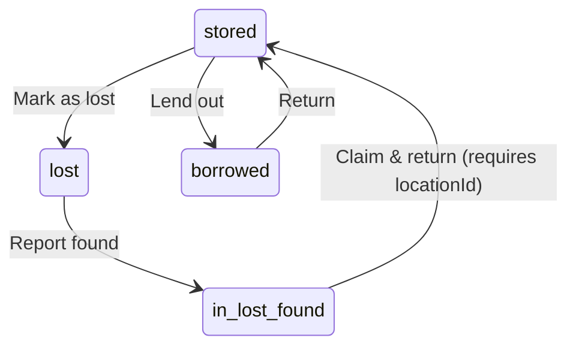

# API Specification — LeonoreVault

**Version:** 1.0 (MVP)
**Base URL:** `https://api.leonorevault.com/api` (production) · `http://localhost:4000/api` (local)
**Date:** 2026-02-08
**Reference:** [TSD §4](file:///d:/LeonoreKingdom/Project/Development/Web%20Development/LeonoreVault/.ai-docs/05-tsd.md)

---

## Conventions

### Authentication

All protected endpoints require:

```
Authorization: Bearer <supabase_jwt>
```

### Content Types

| Scenario      | Content-Type                   |
| ------------- | ------------------------------ |
| JSON requests | `application/json`             |
| File uploads  | `multipart/form-data`          |
| QR image      | `image/png` or `image/svg+xml` |
| QR batch PDF  | `application/pdf`              |

### Standard Response Envelope

```typescript
// Success
interface ApiResponse<T> {
  success: true;
  data: T;
  meta?: PaginationMeta;
}

interface PaginationMeta {
  page: number;
  pageSize: number;
  total: number;
  totalPages: number;
}

// Error
interface ApiError {
  success: false;
  error: {
    code: string;
    message: string;
    details?: Record<string, string>;
  };
}
```

### Common Error Codes

| HTTP | Code                | When                                    |
| ---- | ------------------- | --------------------------------------- |
| 400  | `VALIDATION_ERROR`  | Zod validation failure                  |
| 401  | `UNAUTHORIZED`      | Missing or invalid JWT                  |
| 403  | `FORBIDDEN`         | Insufficient role                       |
| 404  | `NOT_FOUND`         | Resource doesn't exist or not in scope  |
| 409  | `CONFLICT`          | Duplicate or state conflict             |
| 413  | `PAYLOAD_TOO_LARGE` | File exceeds 2 MB limit                 |
| 429  | `RATE_LIMITED`      | Too many requests                       |
| 500  | `INTERNAL_ERROR`    | Unhandled server error                  |
| 502  | `UPSTREAM_ERROR`    | Google Drive / external service failure |

### Role Hierarchy

```
admin (3) > member (2) > viewer (1)
```

`Member+` = `member` or `admin`.

---

## 1. Auth Module

### 1.1 `POST /auth/google/callback`

Exchange a Google OAuth authorization code for a Supabase session.

| Property       | Value                  |
| -------------- | ---------------------- |
| Authentication | None                   |
| Rate limit     | 10 req / 15 min per IP |

**Request**

| Parameter     | In   | Type   | Required | Description                    |
| ------------- | ---- | ------ | -------- | ------------------------------ |
| `code`        | body | string | Yes      | Google authorization code      |
| `redirectUri` | body | string | Yes      | Must match registered redirect |

```typescript
interface GoogleCallbackRequest {
  code: string;
  redirectUri: string;
}
```

**Response `200 OK`**

```typescript
interface GoogleCallbackResponse {
  user: User;
  session: {
    accessToken: string;
    refreshToken: string;
    expiresAt: number; // Unix timestamp (seconds)
  };
}
```

**Error Responses**

| Status | Code               | Condition                         |
| ------ | ------------------ | --------------------------------- |
| 400    | `VALIDATION_ERROR` | Missing/invalid `code`            |
| 400    | `INVALID_GRANT`    | Code already used or expired      |
| 500    | `INTERNAL_ERROR`   | Token exchange with Google failed |

**Example**

```bash
curl -X POST http://localhost:4000/api/auth/google/callback \
  -H "Content-Type: application/json" \
  -d '{
    "code": "4/0AeaYSHB...xyz",
    "redirectUri": "http://localhost:3000/auth/callback"
  }'
```

```json
{
  "success": true,
  "data": {
    "user": {
      "id": "a1b2c3d4-e5f6-7890-abcd-ef1234567890",
      "email": "leonore@gmail.com",
      "displayName": "Leonore",
      "avatarUrl": "https://lh3.googleusercontent.com/a/photo",
      "createdAt": "2026-02-08T10:00:00.000Z",
      "updatedAt": "2026-02-08T10:00:00.000Z"
    },
    "session": {
      "accessToken": "eyJhbGciOiJIUzI1NiIs...",
      "refreshToken": "v1.MjQ1Njc4OTAx...",
      "expiresAt": 1738944000
    }
  }
}
```

---

### 1.2 `POST /auth/refresh`

Refresh an expired access token using a valid refresh token.

| Property       | Value                   |
| -------------- | ----------------------- |
| Authentication | Bearer JWT (expired OK) |
| Rate limit     | 30 req / 15 min         |

**Request**

| Parameter      | In   | Type   | Required | Description           |
| -------------- | ---- | ------ | -------- | --------------------- |
| `refreshToken` | body | string | Yes      | Current refresh token |

```typescript
interface RefreshRequest {
  refreshToken: string;
}
```

**Response `200 OK`**

```typescript
interface RefreshResponse {
  session: {
    accessToken: string;
    refreshToken: string;
    expiresAt: number;
  };
}
```

**Error Responses**

| Status | Code            | Condition                       |
| ------ | --------------- | ------------------------------- |
| 400    | `INVALID_TOKEN` | Refresh token malformed         |
| 401    | `TOKEN_EXPIRED` | Refresh token expired (30 days) |

**Example**

```bash
curl -X POST http://localhost:4000/api/auth/refresh \
  -H "Content-Type: application/json" \
  -H "Authorization: Bearer eyJhbGciOi..." \
  -d '{ "refreshToken": "v1.MjQ1Njc4OTAx..." }'
```

```json
{
  "success": true,
  "data": {
    "session": {
      "accessToken": "eyJhbGciOiJIUzI1NiIs...(new)",
      "refreshToken": "v1.OTg3NjU0MzIx...(rotated)",
      "expiresAt": 1738947600
    }
  }
}
```

---

### 1.3 `GET /auth/me`

Get the current authenticated user's profile and household membership.

| Property       | Value      |
| -------------- | ---------- |
| Authentication | Bearer JWT |
| Role           | Any        |

**Request**

No body or query parameters.

**Response `200 OK`**

```typescript
interface MeResponse {
  user: User;
  membership: Membership | null; // null if not in a household yet
}
```

**Error Responses**

| Status | Code           | Condition             |
| ------ | -------------- | --------------------- |
| 401    | `UNAUTHORIZED` | Invalid/missing token |

**Example**

```bash
curl http://localhost:4000/api/auth/me \
  -H "Authorization: Bearer eyJhbGciOi..."
```

```json
{
  "success": true,
  "data": {
    "user": {
      "id": "a1b2c3d4-e5f6-7890-abcd-ef1234567890",
      "email": "leonore@gmail.com",
      "displayName": "Leonore",
      "avatarUrl": "https://lh3.googleusercontent.com/a/photo",
      "createdAt": "2026-02-08T10:00:00.000Z",
      "updatedAt": "2026-02-08T10:00:00.000Z"
    },
    "membership": {
      "id": "m1m2m3m4-m5m6-7890-abcd-ef1234567890",
      "userId": "a1b2c3d4-e5f6-7890-abcd-ef1234567890",
      "householdId": "h1h2h3h4-h5h6-7890-abcd-ef1234567890",
      "role": "admin",
      "joinedAt": "2026-02-08T10:00:00.000Z"
    }
  }
}
```

---

## 2. Household Module

### 2.1 `POST /households`

Create a new household. The authenticated user becomes admin.

| Property       | Value      |
| -------------- | ---------- |
| Authentication | Bearer JWT |
| Role           | Any        |

**Request**

| Parameter | In   | Type   | Required | Constraints | Description    |
| --------- | ---- | ------ | -------- | ----------- | -------------- |
| `name`    | body | string | Yes      | 1–100 chars | Household name |

```typescript
interface CreateHouseholdRequest {
  name: string;
}
```

**Response `201 Created`**

```typescript
interface CreateHouseholdResponse {
  household: Household;
  membership: Membership; // role = "admin"
}
```

**Error Responses**

| Status | Code               | Condition                   |
| ------ | ------------------ | --------------------------- |
| 400    | `VALIDATION_ERROR` | Name empty or > 100 chars   |
| 409    | `CONFLICT`         | User already in a household |

**Example**

```bash
curl -X POST http://localhost:4000/api/households \
  -H "Authorization: Bearer eyJhbGciOi..." \
  -H "Content-Type: application/json" \
  -d '{ "name": "Casa Leonore" }'
```

```json
{
  "success": true,
  "data": {
    "household": {
      "id": "h1h2h3h4-h5h6-7890-abcd-ef1234567890",
      "name": "Casa Leonore",
      "createdBy": "a1b2c3d4-e5f6-7890-abcd-ef1234567890",
      "inviteCode": null,
      "inviteExpiresAt": null,
      "driveFolderId": null,
      "createdAt": "2026-02-08T10:05:00.000Z"
    },
    "membership": {
      "id": "m1m2m3m4-m5m6-7890-abcd-ef1234567890",
      "userId": "a1b2c3d4-e5f6-7890-abcd-ef1234567890",
      "householdId": "h1h2h3h4-h5h6-7890-abcd-ef1234567890",
      "role": "admin",
      "joinedAt": "2026-02-08T10:05:00.000Z"
    }
  }
}
```

---

### 2.2 `GET /households/:id`

Get household details including member count.

| Property       | Value                  |
| -------------- | ---------------------- |
| Authentication | Bearer JWT             |
| Role           | Any (must be a member) |

**Request**

| Parameter | In   | Type | Required | Description  |
| --------- | ---- | ---- | -------- | ------------ |
| `id`      | path | uuid | Yes      | Household ID |

**Response `200 OK`**

```typescript
interface HouseholdDetailResponse {
  household: Household;
  members: Membership[]; // includes user join (displayName, email, avatarUrl)
  memberCount: number;
}
```

**Error Responses**

| Status | Code        | Condition                              |
| ------ | ----------- | -------------------------------------- |
| 403    | `FORBIDDEN` | User is not a member of this household |
| 404    | `NOT_FOUND` | Household does not exist               |

**Example**

```bash
curl http://localhost:4000/api/households/h1h2h3h4-h5h6-7890-abcd-ef1234567890 \
  -H "Authorization: Bearer eyJhbGciOi..."
```

```json
{
  "success": true,
  "data": {
    "household": {
      "id": "h1h2h3h4-h5h6-7890-abcd-ef1234567890",
      "name": "Casa Leonore",
      "createdBy": "a1b2c3d4-e5f6-7890-abcd-ef1234567890",
      "inviteCode": "ABC123",
      "inviteExpiresAt": "2026-02-15T10:05:00.000Z",
      "driveFolderId": "1a2B3c4D5e6F7g8H9i0J",
      "createdAt": "2026-02-08T10:05:00.000Z"
    },
    "members": [
      {
        "id": "m1m2m3m4-m5m6-7890-abcd-ef1234567890",
        "userId": "a1b2c3d4-e5f6-7890-abcd-ef1234567890",
        "householdId": "h1h2h3h4-h5h6-7890-abcd-ef1234567890",
        "role": "admin",
        "joinedAt": "2026-02-08T10:05:00.000Z",
        "user": {
          "displayName": "Leonore",
          "email": "leonore@gmail.com",
          "avatarUrl": "https://lh3.googleusercontent.com/a/photo"
        }
      }
    ],
    "memberCount": 1
  }
}
```

---

### 2.3 `POST /households/:id/invite`

Generate a 6-character invite code valid for 7 days. Replaces any existing active invite.

| Property       | Value      |
| -------------- | ---------- |
| Authentication | Bearer JWT |
| Role           | Admin      |

**Request**

| Parameter | In   | Type | Required | Description  |
| --------- | ---- | ---- | -------- | ------------ |
| `id`      | path | uuid | Yes      | Household ID |

No request body.

**Response `200 OK`**

```typescript
interface InviteResponse {
  inviteCode: string; // 6-char uppercase alphanumeric
  expiresAt: string; // ISO 8601
}
```

**Error Responses**

| Status | Code        | Condition           |
| ------ | ----------- | ------------------- |
| 403    | `FORBIDDEN` | Not admin           |
| 404    | `NOT_FOUND` | Household not found |

**Example**

```bash
curl -X POST http://localhost:4000/api/households/h1h2h3h4-h5h6-7890-abcd-ef1234567890/invite \
  -H "Authorization: Bearer eyJhbGciOi..."
```

```json
{
  "success": true,
  "data": {
    "inviteCode": "XK9M2P",
    "expiresAt": "2026-02-15T10:05:00.000Z"
  }
}
```

---

### 2.4 `POST /households/join`

Join a household using an invite code.

| Property       | Value      |
| -------------- | ---------- |
| Authentication | Bearer JWT |
| Role           | Any        |

**Request**

| Parameter    | In   | Type   | Required | Constraints         | Description |
| ------------ | ---- | ------ | -------- | ------------------- | ----------- |
| `inviteCode` | body | string | Yes      | 6-char alphanumeric | Invite code |

```typescript
interface JoinHouseholdRequest {
  inviteCode: string;
}
```

**Response `200 OK`**

```typescript
interface JoinHouseholdResponse {
  household: Household;
  membership: Membership; // role = "member"
}
```

**Error Responses**

| Status | Code             | Condition                   |
| ------ | ---------------- | --------------------------- |
| 400    | `INVALID_CODE`   | Code doesn't exist          |
| 400    | `CODE_EXPIRED`   | Invite has expired          |
| 409    | `ALREADY_MEMBER` | User already in a household |

**Example**

```bash
curl -X POST http://localhost:4000/api/households/join \
  -H "Authorization: Bearer eyJhbGciOi..." \
  -H "Content-Type: application/json" \
  -d '{ "inviteCode": "XK9M2P" }'
```

```json
{
  "success": true,
  "data": {
    "household": {
      "id": "h1h2h3h4-h5h6-7890-abcd-ef1234567890",
      "name": "Casa Leonore",
      "createdBy": "a1b2c3d4-e5f6-7890-abcd-ef1234567890",
      "inviteCode": "XK9M2P",
      "inviteExpiresAt": "2026-02-15T10:05:00.000Z",
      "driveFolderId": "1a2B3c4D5e6F7g8H9i0J",
      "createdAt": "2026-02-08T10:05:00.000Z"
    },
    "membership": {
      "id": "n2n3n4n5-n6n7-8901-bcde-f12345678901",
      "userId": "b2c3d4e5-f6a7-8901-bcde-f12345678901",
      "householdId": "h1h2h3h4-h5h6-7890-abcd-ef1234567890",
      "role": "member",
      "joinedAt": "2026-02-08T11:30:00.000Z"
    }
  }
}
```

---

### 2.5 `PATCH /households/:id/members/:userId`

Change a household member's role.

| Property       | Value      |
| -------------- | ---------- |
| Authentication | Bearer JWT |
| Role           | Admin      |

**Request**

| Parameter | In   | Type   | Required | Constraints                     | Description    |
| --------- | ---- | ------ | -------- | ------------------------------- | -------------- |
| `id`      | path | uuid   | Yes      |                                 | Household ID   |
| `userId`  | path | uuid   | Yes      |                                 | Target user ID |
| `role`    | body | string | Yes      | `"admin"` `"member"` `"viewer"` | New role       |

```typescript
interface ChangeRoleRequest {
  role: 'admin' | 'member' | 'viewer';
}
```

**Response `200 OK`**

```typescript
interface ChangeRoleResponse {
  membership: Membership;
}
```

**Error Responses**

| Status | Code               | Condition                              |
| ------ | ------------------ | -------------------------------------- |
| 400    | `VALIDATION_ERROR` | Invalid role value                     |
| 403    | `FORBIDDEN`        | Not admin, or demoting the last admin  |
| 404    | `NOT_FOUND`        | User is not a member of this household |

**Example**

```bash
curl -X PATCH http://localhost:4000/api/households/h1h2h3h4-.../members/b2c3d4e5-... \
  -H "Authorization: Bearer eyJhbGciOi..." \
  -H "Content-Type: application/json" \
  -d '{ "role": "viewer" }'
```

```json
{
  "success": true,
  "data": {
    "membership": {
      "id": "n2n3n4n5-n6n7-8901-bcde-f12345678901",
      "userId": "b2c3d4e5-f6a7-8901-bcde-f12345678901",
      "householdId": "h1h2h3h4-h5h6-7890-abcd-ef1234567890",
      "role": "viewer",
      "joinedAt": "2026-02-08T11:30:00.000Z"
    }
  }
}
```

---

### 2.6 `DELETE /households/:id/members/:userId`

Remove a member from the household.

| Property       | Value      |
| -------------- | ---------- |
| Authentication | Bearer JWT |
| Role           | Admin      |

**Request**

| Parameter | In   | Type | Required | Description    |
| --------- | ---- | ---- | -------- | -------------- |
| `id`      | path | uuid | Yes      | Household ID   |
| `userId`  | path | uuid | Yes      | User to remove |

No request body.

**Response `200 OK`**

```typescript
interface RemoveMemberResponse {
  removed: true;
  userId: string;
}
```

**Error Responses**

| Status | Code        | Condition                                         |
| ------ | ----------- | ------------------------------------------------- |
| 403    | `FORBIDDEN` | Not admin, or trying to remove self as last admin |
| 404    | `NOT_FOUND` | User is not in this household                     |

**Example**

```bash
curl -X DELETE http://localhost:4000/api/households/h1h2h3h4-.../members/b2c3d4e5-... \
  -H "Authorization: Bearer eyJhbGciOi..."
```

```json
{
  "success": true,
  "data": {
    "removed": true,
    "userId": "b2c3d4e5-f6a7-8901-bcde-f12345678901"
  }
}
```

---

## 3. Item Module

### 3.1 `GET /items`

List items in the user's household with pagination, search, and filters.

| Property       | Value      |
| -------------- | ---------- |
| Authentication | Bearer JWT |
| Role           | Any        |

**Request**

| Parameter    | In    | Type   | Required | Default | Constraints                                | Description           |
| ------------ | ----- | ------ | -------- | ------- | ------------------------------------------ | --------------------- |
| `page`       | query | number | No       | `1`     | ≥ 1                                        | Page number           |
| `pageSize`   | query | number | No       | `20`    | 1–100                                      | Items per page        |
| `search`     | query | string | No       | —       | ≤ 200 chars                                | Full-text name search |
| `categoryId` | query | uuid   | No       | —       |                                            | Filter by category    |
| `locationId` | query | uuid   | No       | —       |                                            | Filter by location    |
| `status`     | query | string | No       | —       | `stored` `borrowed` `lost` `in_lost_found` | Filter by status      |
| `sortBy`     | query | string | No       | `name`  | `name` `createdAt` `updatedAt`             | Sort field            |
| `sortDir`    | query | string | No       | `asc`   | `asc` `desc`                               | Sort direction        |

```typescript
interface ListItemsQuery {
  page?: number;
  pageSize?: number;
  search?: string;
  categoryId?: string;
  locationId?: string;
  status?: 'stored' | 'borrowed' | 'lost' | 'in_lost_found';
  sortBy?: 'name' | 'createdAt' | 'updatedAt';
  sortDir?: 'asc' | 'desc';
}
```

**Response `200 OK`**

```typescript
// data: Item[] (with joined category, location names)
// meta: PaginationMeta
```

**Example**

```bash
curl "http://localhost:4000/api/items?page=1&pageSize=10&search=passport&status=stored" \
  -H "Authorization: Bearer eyJhbGciOi..."
```

```json
{
  "success": true,
  "data": [
    {
      "id": "i1i2i3i4-i5i6-7890-abcd-ef1234567890",
      "householdId": "h1h2h3h4-h5h6-7890-abcd-ef1234567890",
      "name": "Passport (Leonore)",
      "description": "Philippine passport, expires 2030",
      "categoryId": "c1c2c3c4-c5c6-7890-abcd-ef1234567890",
      "locationId": "l1l2l3l4-l5l6-7890-abcd-ef1234567890",
      "quantity": 1,
      "tags": ["important", "travel"],
      "status": "stored",
      "createdBy": "a1b2c3d4-e5f6-7890-abcd-ef1234567890",
      "borrowedBy": null,
      "borrowDueDate": null,
      "createdAt": "2026-02-08T10:10:00.000Z",
      "updatedAt": "2026-02-08T10:10:00.000Z",
      "deletedAt": null,
      "category": { "id": "c1c2...", "name": "Documents" },
      "location": { "id": "l1l2...", "name": "Master Bedroom > Safe" }
    }
  ],
  "meta": {
    "page": 1,
    "pageSize": 10,
    "total": 1,
    "totalPages": 1
  }
}
```

---

### 3.2 `GET /items/:id`

Get full item detail including attachments and recent activity.

| Property       | Value      |
| -------------- | ---------- |
| Authentication | Bearer JWT |
| Role           | Any        |

**Request**

| Parameter | In   | Type | Required | Description |
| --------- | ---- | ---- | -------- | ----------- |
| `id`      | path | uuid | Yes      | Item ID     |

**Response `200 OK`**

```typescript
interface ItemDetailResponse {
  item: Item; // with category, location joined
  attachments: Attachment[];
  recentActivity: ItemActivity[]; // last 20, with user info
}
```

**Error Responses**

| Status | Code        | Condition                              |
| ------ | ----------- | -------------------------------------- |
| 404    | `NOT_FOUND` | Item doesn't exist or was hard-deleted |

**Example**

```bash
curl http://localhost:4000/api/items/i1i2i3i4-i5i6-7890-abcd-ef1234567890 \
  -H "Authorization: Bearer eyJhbGciOi..."
```

```json
{
  "success": true,
  "data": {
    "item": {
      "id": "i1i2i3i4-i5i6-7890-abcd-ef1234567890",
      "name": "Passport (Leonore)",
      "description": "Philippine passport, expires 2030",
      "status": "stored",
      "quantity": 1,
      "tags": ["important", "travel"],
      "category": { "id": "c1c2...", "name": "Documents", "icon": "📄", "color": "#4A90D9" },
      "location": { "id": "l1l2...", "name": "Safe", "description": "Fireproof safe in master bedroom" },
      "createdBy": "a1b2c3d4-e5f6-7890-abcd-ef1234567890",
      "createdAt": "2026-02-08T10:10:00.000Z",
      "updatedAt": "2026-02-08T10:10:00.000Z"
    },
    "attachments": [
      {
        "id": "at1at2at3-at4at5-7890-abcd-ef1234567890",
        "itemId": "i1i2i3i4-i5i6-7890-abcd-ef1234567890",
        "driveFileId": "1a2B3c4D5e6F7g8H9i0J",
        "fileName": "passport-scan.jpg",
        "mimeType": "image/jpeg",
        "thumbnailUrl": "https://drive.google.com/thumbnail?id=1a2B3c&sz=w200",
        "webViewLink": "https://drive.google.com/file/d/1a2B3c/view",
        "createdBy": "a1b2c3d4-e5f6-7890-abcd-ef1234567890",
        "createdAt": "2026-02-08T10:10:00.000Z"
      }
    ],
    "recentActivity": [
      {
        "id": "act1act2-act3act4-7890-abcd-ef1234567890",
        "itemId": "i1i2i3i4-i5i6-7890-abcd-ef1234567890",
        "userId": "a1b2c3d4-e5f6-7890-abcd-ef1234567890",
        "action": "created",
        "details": null,
        "createdAt": "2026-02-08T10:10:00.000Z",
        "user": { "displayName": "Leonore", "avatarUrl": "https://..." }
      }
    ]
  }
}
```

---

### 3.3 `POST /items`

Create a new item with optional file attachments.

| Property       | Value                 |
| -------------- | --------------------- |
| Authentication | Bearer JWT            |
| Role           | Member+               |
| Content-Type   | `multipart/form-data` |

**Request**

| Parameter | In   | Type   | Required | Constraints                 | Description              |
| --------- | ---- | ------ | -------- | --------------------------- | ------------------------ |
| `data`    | body | string | Yes      | JSON of `CreateItemRequest` | Item data as JSON string |
| `files`   | body | File[] | No       | Max 5 files, 2 MB each      | Photo attachments        |

```typescript
interface CreateItemRequest {
  name: string; // 1–200 chars
  description?: string; // max 2000 chars
  categoryId?: string; // valid category UUID
  locationId?: string; // valid location UUID
  quantity?: number; // ≥ 1, default 1
  tags?: string[]; // max 20 tags, each ≤ 50 chars
}
```

**Response `201 Created`**

```typescript
interface CreateItemResponse {
  item: Item;
  attachments: Attachment[];
  qrCodeUrl: string; // URL to scan this item
}
```

**Error Responses**

| Status | Code                | Condition                          |
| ------ | ------------------- | ---------------------------------- |
| 400    | `VALIDATION_ERROR`  | Invalid name, quantity, tags, etc. |
| 403    | `FORBIDDEN`         | Viewer role                        |
| 413    | `PAYLOAD_TOO_LARGE` | File exceeds 2 MB                  |
| 502    | `UPSTREAM_ERROR`    | Google Drive upload failed         |

**Example**

```bash
curl -X POST http://localhost:4000/api/items \
  -H "Authorization: Bearer eyJhbGciOi..." \
  -F 'data={"name":"Laptop Charger","description":"USB-C 65W","categoryId":"c1c2...","locationId":"l1l2...","tags":["electronics"]}' \
  -F "files=@charger-photo.jpg"
```

```json
{
  "success": true,
  "data": {
    "item": {
      "id": "i9i8i7i6-i5i4-3210-dcba-098765432100",
      "name": "Laptop Charger",
      "description": "USB-C 65W",
      "categoryId": "c1c2c3c4-c5c6-7890-abcd-ef1234567890",
      "locationId": "l1l2l3l4-l5l6-7890-abcd-ef1234567890",
      "quantity": 1,
      "tags": ["electronics"],
      "status": "stored",
      "createdAt": "2026-02-08T11:00:00.000Z",
      "updatedAt": "2026-02-08T11:00:00.000Z"
    },
    "attachments": [
      {
        "id": "at9at8at7-at6at5-3210-dcba-098765432100",
        "fileName": "charger-photo.jpg",
        "mimeType": "image/jpeg",
        "thumbnailUrl": "https://drive.google.com/thumbnail?id=xyz&sz=w200",
        "webViewLink": "https://drive.google.com/file/d/xyz/view"
      }
    ],
    "qrCodeUrl": "https://leonorevault.com/app/scan?item=i9i8i7i6-i5i4-3210-dcba-098765432100"
  }
}
```

---

### 3.4 `PATCH /items/:id`

Update an existing item's metadata.

| Property       | Value      |
| -------------- | ---------- |
| Authentication | Bearer JWT |
| Role           | Member+    |

**Request**

| Parameter | In   | Type | Required | Description |
| --------- | ---- | ---- | -------- | ----------- |
| `id`      | path | uuid | Yes      | Item ID     |

```typescript
interface UpdateItemRequest {
  name?: string; // 1–200 chars
  description?: string; // max 2000 chars
  categoryId?: string | null;
  locationId?: string | null;
  quantity?: number; // ≥ 1
  tags?: string[];
}
```

**Response `200 OK`**

```typescript
// data: Item (updated)
```

**Error Responses**

| Status | Code               | Condition                 |
| ------ | ------------------ | ------------------------- |
| 400    | `VALIDATION_ERROR` | Invalid field values      |
| 403    | `FORBIDDEN`        | Viewer role               |
| 404    | `NOT_FOUND`        | Item not found or deleted |

**Example**

```bash
curl -X PATCH http://localhost:4000/api/items/i9i8i7i6-... \
  -H "Authorization: Bearer eyJhbGciOi..." \
  -H "Content-Type: application/json" \
  -d '{ "name": "USB-C Laptop Charger (65W)", "tags": ["electronics", "office"] }'
```

```json
{
  "success": true,
  "data": {
    "id": "i9i8i7i6-i5i4-3210-dcba-098765432100",
    "name": "USB-C Laptop Charger (65W)",
    "tags": ["electronics", "office"],
    "updatedAt": "2026-02-08T11:15:00.000Z"
  }
}
```

---

### 3.5 `DELETE /items/:id`

Soft-delete an item (sets `deleted_at`, recoverable for 30 days).

| Property       | Value      |
| -------------- | ---------- |
| Authentication | Bearer JWT |
| Role           | Member+    |

**Request**

| Parameter | In   | Type | Required | Description |
| --------- | ---- | ---- | -------- | ----------- |
| `id`      | path | uuid | Yes      | Item ID     |

No request body.

**Response `200 OK`**

```typescript
interface DeleteItemResponse {
  deleted: true;
  deletedAt: string; // ISO 8601
  permanentDeleteAt: string; // 30 days from now
}
```

**Error Responses**

| Status | Code        | Condition                         |
| ------ | ----------- | --------------------------------- |
| 403    | `FORBIDDEN` | Viewer role                       |
| 404    | `NOT_FOUND` | Item not found or already deleted |

**Example**

```bash
curl -X DELETE http://localhost:4000/api/items/i9i8i7i6-... \
  -H "Authorization: Bearer eyJhbGciOi..."
```

```json
{
  "success": true,
  "data": {
    "deleted": true,
    "deletedAt": "2026-02-08T11:20:00.000Z",
    "permanentDeleteAt": "2026-03-10T11:20:00.000Z"
  }
}
```

---

### 3.6 `POST /items/:id/restore`

Restore a soft-deleted item within the 30-day window.

| Property       | Value      |
| -------------- | ---------- |
| Authentication | Bearer JWT |
| Role           | Member+    |

**Request**

| Parameter | In   | Type | Required | Description |
| --------- | ---- | ---- | -------- | ----------- |
| `id`      | path | uuid | Yes      | Item ID     |

No request body.

**Response `200 OK`**

```typescript
interface RestoreItemResponse {
  item: Item; // deletedAt = null, status = 'stored'
}
```

**Error Responses**

| Status | Code        | Condition                                     |
| ------ | ----------- | --------------------------------------------- |
| 404    | `NOT_FOUND` | Item not found or already permanently deleted |
| 409    | `CONFLICT`  | Item is not currently soft-deleted            |

**Example**

```bash
curl -X POST http://localhost:4000/api/items/i9i8i7i6-.../restore \
  -H "Authorization: Bearer eyJhbGciOi..."
```

```json
{
  "success": true,
  "data": {
    "item": {
      "id": "i9i8i7i6-i5i4-3210-dcba-098765432100",
      "name": "USB-C Laptop Charger (65W)",
      "status": "stored",
      "deletedAt": null,
      "updatedAt": "2026-02-08T11:25:00.000Z"
    }
  }
}
```

---

### 3.7 `PATCH /items/:id/status`

Change an item's status (stored ↔ lost ↔ in_lost_found).

| Property       | Value      |
| -------------- | ---------- |
| Authentication | Bearer JWT |
| Role           | Member+    |

**Request**

| Parameter    | In   | Type   | Required | Constraints                        | Description       |
| ------------ | ---- | ------ | -------- | ---------------------------------- | ----------------- |
| `id`         | path | uuid   | Yes      |                                    | Item ID           |
| `status`     | body | string | Yes      | `stored` `lost` `in_lost_found`    | New status        |
| `note`       | body | string | No       | ≤ 500 chars                        | Activity note     |
| `locationId` | body | uuid   | No       | Required when changing to `stored` | Where item is now |

```typescript
interface UpdateItemStatusRequest {
  status: 'stored' | 'lost' | 'in_lost_found';
  note?: string;
  locationId?: string;
}
```

**Valid Transitions**



**Response `200 OK`**

```typescript
// data: Item (with updated status)
```

**Error Responses**

| Status | Code                 | Condition                            |
| ------ | -------------------- | ------------------------------------ |
| 400    | `INVALID_TRANSITION` | e.g., `stored` → `in_lost_found`     |
| 400    | `VALIDATION_ERROR`   | Missing `locationId` when → `stored` |
| 403    | `FORBIDDEN`          | Viewer role                          |
| 404    | `NOT_FOUND`          | Item not found                       |

**Example**

```bash
curl -X PATCH http://localhost:4000/api/items/i1i2i3i4-.../status \
  -H "Authorization: Bearer eyJhbGciOi..." \
  -H "Content-Type: application/json" \
  -d '{ "status": "lost", "note": "Last seen in the living room" }'
```

```json
{
  "success": true,
  "data": {
    "id": "i1i2i3i4-i5i6-7890-abcd-ef1234567890",
    "name": "Passport (Leonore)",
    "status": "lost",
    "updatedAt": "2026-02-08T12:00:00.000Z"
  }
}
```

---

## 4. Category & Location Module

> Categories and Locations share an identical API shape (CRUD + hierarchical tree). Both are documented together; replace `categories` with `locations` and `Category` with `Location` for the location endpoints.

### 4.1 `GET /categories`

List all categories for the user's household as a nested tree.

| Property       | Value      |
| -------------- | ---------- |
| Authentication | Bearer JWT |
| Role           | Any        |

**Request**

No parameters.

**Response `200 OK`**

```typescript
// data: Category[] — top-level categories with nested children[]
```

**Example**

```bash
curl http://localhost:4000/api/categories \
  -H "Authorization: Bearer eyJhbGciOi..."
```

```json
{
  "success": true,
  "data": [
    {
      "id": "c1c2c3c4-c5c6-7890-abcd-ef1234567890",
      "householdId": "h1h2h3h4-h5h6-7890-abcd-ef1234567890",
      "name": "Documents",
      "parentId": null,
      "icon": "📄",
      "color": "#4A90D9",
      "sortOrder": 0,
      "children": [
        {
          "id": "c9c8c7c6-c5c4-3210-dcba-098765432100",
          "householdId": "h1h2h3h4-h5h6-7890-abcd-ef1234567890",
          "name": "IDs & Passports",
          "parentId": "c1c2c3c4-c5c6-7890-abcd-ef1234567890",
          "icon": "🛂",
          "color": "#4A90D9",
          "sortOrder": 0,
          "children": []
        }
      ]
    },
    {
      "id": "c3c4c5c6-c7c8-1234-abcd-ef5678901234",
      "householdId": "h1h2h3h4-h5h6-7890-abcd-ef1234567890",
      "name": "Electronics",
      "parentId": null,
      "icon": "💻",
      "color": "#E74C3C",
      "sortOrder": 1,
      "children": []
    }
  ]
}
```

---

### 4.2 `POST /categories`

Create a new category.

| Property       | Value      |
| -------------- | ---------- |
| Authentication | Bearer JWT |
| Role           | Admin      |

**Request**

| Parameter  | In   | Type   | Required | Constraints           | Description     |
| ---------- | ---- | ------ | -------- | --------------------- | --------------- |
| `name`     | body | string | Yes      | 1–100 chars           | Category name   |
| `parentId` | body | uuid   | No       | Must exist; depth ≤ 3 | Parent category |
| `icon`     | body | string | No       | Emoji or icon name    | Display icon    |
| `color`    | body | string | No       | Hex color `#RRGGBB`   | Display color   |

```typescript
interface CreateCategoryRequest {
  name: string;
  parentId?: string;
  icon?: string;
  color?: string;
}
```

**Response `201 Created`**

```typescript
// data: Category
```

**Error Responses**

| Status | Code               | Condition                        |
| ------ | ------------------ | -------------------------------- |
| 400    | `VALIDATION_ERROR` | Name empty or > 100 chars        |
| 400    | `MAX_DEPTH`        | Would exceed 3 levels of nesting |
| 403    | `FORBIDDEN`        | Not admin                        |
| 404    | `NOT_FOUND`        | Parent category doesn't exist    |
| 409    | `CONFLICT`         | Duplicate name under same parent |

**Example**

```bash
curl -X POST http://localhost:4000/api/categories \
  -H "Authorization: Bearer eyJhbGciOi..." \
  -H "Content-Type: application/json" \
  -d '{
    "name": "Kitchen Appliances",
    "parentId": "c3c4c5c6-c7c8-1234-abcd-ef5678901234",
    "icon": "🍳",
    "color": "#E74C3C"
  }'
```

```json
{
  "success": true,
  "data": {
    "id": "ca1ca2ca-ca3ca4-5678-abcd-ef9012345678",
    "householdId": "h1h2h3h4-h5h6-7890-abcd-ef1234567890",
    "name": "Kitchen Appliances",
    "parentId": "c3c4c5c6-c7c8-1234-abcd-ef5678901234",
    "icon": "🍳",
    "color": "#E74C3C",
    "sortOrder": 0
  }
}
```

---

### 4.3 `PATCH /categories/:id`

Update a category's name, icon, color, or parent.

| Property       | Value      |
| -------------- | ---------- |
| Authentication | Bearer JWT |
| Role           | Admin      |

**Request**

| Parameter   | In   | Type         | Required | Description                      |
| ----------- | ---- | ------------ | -------- | -------------------------------- |
| `id`        | path | uuid         | Yes      | Category ID                      |
| `name`      | body | string       | No       | 1–100 chars                      |
| `parentId`  | body | uuid \| null | No       | Move to different parent or root |
| `icon`      | body | string       | No       | Emoji or icon name               |
| `color`     | body | string       | No       | Hex color                        |
| `sortOrder` | body | number       | No       | Display order                    |

```typescript
interface UpdateCategoryRequest {
  name?: string;
  parentId?: string | null;
  icon?: string;
  color?: string;
  sortOrder?: number;
}
```

**Response `200 OK`**

```typescript
// data: Category (updated)
```

**Error Responses**

| Status | Code           | Condition                          |
| ------ | -------------- | ---------------------------------- |
| 400    | `MAX_DEPTH`    | Move would exceed depth 3          |
| 400    | `CIRCULAR_REF` | Would create circular parent chain |
| 403    | `FORBIDDEN`    | Not admin                          |
| 404    | `NOT_FOUND`    | Category not found                 |
| 409    | `CONFLICT`     | Name duplicate under new parent    |

**Example**

```bash
curl -X PATCH http://localhost:4000/api/categories/ca1ca2ca-... \
  -H "Authorization: Bearer eyJhbGciOi..." \
  -H "Content-Type: application/json" \
  -d '{ "name": "Small Kitchen Appliances", "icon": "🔌" }'
```

```json
{
  "success": true,
  "data": {
    "id": "ca1ca2ca-ca3ca4-5678-abcd-ef9012345678",
    "name": "Small Kitchen Appliances",
    "icon": "🔌",
    "color": "#E74C3C",
    "sortOrder": 0
  }
}
```

---

### 4.4 `DELETE /categories/:id`

Delete a category. Items using this category will have `category_id` set to `NULL`.

| Property       | Value      |
| -------------- | ---------- |
| Authentication | Bearer JWT |
| Role           | Admin      |

**Request**

| Parameter | In   | Type | Required | Description |
| --------- | ---- | ---- | -------- | ----------- |
| `id`      | path | uuid | Yes      | Category ID |

No request body.

**Response `200 OK`**

```typescript
interface DeleteCategoryResponse {
  deleted: true;
  affectedItems: number; // items that had categoryId set to null
  childrenDeleted: number; // subcategories cascade-deleted
}
```

**Error Responses**

| Status | Code        | Condition          |
| ------ | ----------- | ------------------ |
| 403    | `FORBIDDEN` | Not admin          |
| 404    | `NOT_FOUND` | Category not found |

**Example**

```bash
curl -X DELETE http://localhost:4000/api/categories/ca1ca2ca-... \
  -H "Authorization: Bearer eyJhbGciOi..."
```

```json
{
  "success": true,
  "data": {
    "deleted": true,
    "affectedItems": 3,
    "childrenDeleted": 0
  }
}
```

---

### 4.5 `GET /locations`

List all locations as a nested tree. Identical shape to `GET /categories`.

### 4.6 `POST /locations`

Create a new location.

| Parameter     | In   | Type   | Required | Constraints           | Description     |
| ------------- | ---- | ------ | -------- | --------------------- | --------------- |
| `name`        | body | string | Yes      | 1–100 chars           | Location name   |
| `parentId`    | body | uuid   | No       | Must exist; depth ≤ 3 | Parent location |
| `description` | body | string | No       | ≤ 500 chars           | Location notes  |

```typescript
interface CreateLocationRequest {
  name: string;
  parentId?: string;
  description?: string;
}
```

**Example**

```bash
curl -X POST http://localhost:4000/api/locations \
  -H "Authorization: Bearer eyJhbGciOi..." \
  -H "Content-Type: application/json" \
  -d '{
    "name": "Top Drawer",
    "parentId": "l1l2l3l4-l5l6-7890-abcd-ef1234567890",
    "description": "First drawer in the bedside table"
  }'
```

```json
{
  "success": true,
  "data": {
    "id": "lo1lo2lo-lo3lo4-5678-abcd-ef9012345678",
    "householdId": "h1h2h3h4-h5h6-7890-abcd-ef1234567890",
    "name": "Top Drawer",
    "parentId": "l1l2l3l4-l5l6-7890-abcd-ef1234567890",
    "description": "First drawer in the bedside table",
    "sortOrder": 0
  }
}
```

### 4.7 `PATCH /locations/:id`

Update a location. Same error behavior as `PATCH /categories/:id`.

### 4.8 `DELETE /locations/:id`

Delete a location. Items using this location will have `location_id` set to `NULL`. Same response shape as `DELETE /categories/:id`.

---

## 5. Drive Module

### 5.1 `POST /items/:id/attachments/upload`

Upload one or more files to Google Drive and attach them to an item.

| Property       | Value                 |
| -------------- | --------------------- |
| Authentication | Bearer JWT            |
| Role           | Member+               |
| Content-Type   | `multipart/form-data` |
| Max files      | 5 per request         |
| Max file size  | 2 MB each             |

**Request**

| Parameter | In   | Type   | Required | Constraints                             | Description     |
| --------- | ---- | ------ | -------- | --------------------------------------- | --------------- |
| `id`      | path | uuid   | Yes      |                                         | Item ID         |
| `files`   | body | File[] | Yes      | 1–5 files; JPEG, PNG, PDF, DOCX; ≤ 2 MB | Files to upload |

**Accepted MIME types:**

| Type                                                                      | Extension |
| ------------------------------------------------------------------------- | --------- |
| `image/jpeg`                                                              | .jpg      |
| `image/png`                                                               | .png      |
| `application/pdf`                                                         | .pdf      |
| `application/vnd.openxmlformats-officedocument.wordprocessingml.document` | .docx     |

**Response `201 Created`**

```typescript
// data: Attachment[]
```

**Error Responses**

| Status | Code                | Condition                       |
| ------ | ------------------- | ------------------------------- |
| 400    | `MAX_ATTACHMENTS`   | Item already has 10 attachments |
| 400    | `INVALID_FILE_TYPE` | Unsupported MIME type           |
| 403    | `FORBIDDEN`         | Viewer role                     |
| 404    | `NOT_FOUND`         | Item not found                  |
| 413    | `PAYLOAD_TOO_LARGE` | File exceeds 2 MB               |
| 502    | `UPSTREAM_ERROR`    | Google Drive API failure        |

**Example**

```bash
curl -X POST http://localhost:4000/api/items/i1i2i3i4-.../attachments/upload \
  -H "Authorization: Bearer eyJhbGciOi..." \
  -F "files=@receipt.pdf" \
  -F "files=@photo.jpg"
```

```json
{
  "success": true,
  "data": [
    {
      "id": "at1at2at3-at4at5-7890-abcd-ef1234567890",
      "itemId": "i1i2i3i4-i5i6-7890-abcd-ef1234567890",
      "driveFileId": "1a2B3c4D5e6F7g8H9i0J",
      "fileName": "receipt.pdf",
      "mimeType": "application/pdf",
      "thumbnailUrl": null,
      "webViewLink": "https://drive.google.com/file/d/1a2B3c/view",
      "createdBy": "a1b2c3d4-e5f6-7890-abcd-ef1234567890",
      "createdAt": "2026-02-08T13:00:00.000Z"
    },
    {
      "id": "at6at7at8-at9at0-1234-abcd-ef5678901234",
      "itemId": "i1i2i3i4-i5i6-7890-abcd-ef1234567890",
      "driveFileId": "9z8Y7x6W5v4U3t2S1r0Q",
      "fileName": "photo.jpg",
      "mimeType": "image/jpeg",
      "thumbnailUrl": "https://drive.google.com/thumbnail?id=9z8Y7x&sz=w200",
      "webViewLink": "https://drive.google.com/file/d/9z8Y7x/view",
      "createdBy": "a1b2c3d4-e5f6-7890-abcd-ef1234567890",
      "createdAt": "2026-02-08T13:00:00.000Z"
    }
  ]
}
```

---

### 5.2 `POST /items/:id/attachments/link`

Link an external URL as an attachment (no file upload).

| Property       | Value      |
| -------------- | ---------- |
| Authentication | Bearer JWT |
| Role           | Member+    |

**Request**

| Parameter  | In   | Type   | Required | Constraints | Description               |
| ---------- | ---- | ------ | -------- | ----------- | ------------------------- |
| `id`       | path | uuid   | Yes      |             | Item ID                   |
| `url`      | body | string | Yes      | Valid URL   | External resource URL     |
| `fileName` | body | string | Yes      | 1–255 chars | Display name for the link |
| `mimeType` | body | string | No       |             | MIME type hint            |

```typescript
interface LinkAttachmentRequest {
  url: string;
  fileName: string;
  mimeType?: string;
}
```

**Response `201 Created`**

```typescript
// data: Attachment (driveFileId = external URL in this case)
```

**Error Responses**

| Status | Code              | Condition                       |
| ------ | ----------------- | ------------------------------- |
| 400    | `MAX_ATTACHMENTS` | Item already has 10 attachments |
| 400    | `INVALID_URL`     | URL is malformed                |
| 403    | `FORBIDDEN`       | Viewer role                     |
| 404    | `NOT_FOUND`       | Item not found                  |

**Example**

```bash
curl -X POST http://localhost:4000/api/items/i1i2i3i4-.../attachments/link \
  -H "Authorization: Bearer eyJhbGciOi..." \
  -H "Content-Type: application/json" \
  -d '{
    "url": "https://docs.google.com/document/d/abc123/edit",
    "fileName": "Warranty Document",
    "mimeType": "application/vnd.google-apps.document"
  }'
```

```json
{
  "success": true,
  "data": {
    "id": "at-link-1234-5678-abcd-ef9012345678",
    "itemId": "i1i2i3i4-i5i6-7890-abcd-ef1234567890",
    "driveFileId": "abc123",
    "fileName": "Warranty Document",
    "mimeType": "application/vnd.google-apps.document",
    "thumbnailUrl": null,
    "webViewLink": "https://docs.google.com/document/d/abc123/edit",
    "createdBy": "a1b2c3d4-e5f6-7890-abcd-ef1234567890",
    "createdAt": "2026-02-08T13:05:00.000Z"
  }
}
```

---

### 5.3 `DELETE /attachments/:id`

Remove an attachment. Deletes the file from Google Drive and the DB record.

| Property       | Value      |
| -------------- | ---------- |
| Authentication | Bearer JWT |
| Role           | Member+    |

**Request**

| Parameter | In   | Type | Required | Description   |
| --------- | ---- | ---- | -------- | ------------- |
| `id`      | path | uuid | Yes      | Attachment ID |

No request body.

**Response `200 OK`**

```typescript
interface DeleteAttachmentResponse {
  deleted: true;
  driveFileDeleted: boolean; // false if Drive deletion failed (non-blocking)
}
```

**Error Responses**

| Status | Code        | Condition            |
| ------ | ----------- | -------------------- |
| 403    | `FORBIDDEN` | Viewer role          |
| 404    | `NOT_FOUND` | Attachment not found |

**Example**

```bash
curl -X DELETE http://localhost:4000/api/attachments/at1at2at3-... \
  -H "Authorization: Bearer eyJhbGciOi..."
```

```json
{
  "success": true,
  "data": {
    "deleted": true,
    "driveFileDeleted": true
  }
}
```

---

## 6. Sync Module

### 6.1 `POST /sync`

Submit batched offline mutations for server-side application. Uses **last-write-wins** conflict resolution based on `timestamp`.

| Property       | Value        |
| -------------- | ------------ |
| Authentication | Bearer JWT   |
| Role           | Member+      |
| Rate limit     | 10 req / min |

**Request**

```typescript
interface SyncRequest {
  mutations: SyncMutation[]; // max 100 per batch
}

interface SyncMutation {
  id: string; // Client-generated UUID (for dedup)
  type: 'create' | 'update' | 'delete';
  entity: 'item' | 'category' | 'location';
  data: Record<string, unknown>;
  timestamp: string; // ISO 8601 — when mutation happened on client
}
```

**Response `200 OK`**

```typescript
interface SyncResponse {
  applied: string[]; // Mutation IDs successfully applied
  conflicts: SyncConflict[]; // Mutations that conflicted
  serverTime: string; // Current server time (ISO 8601)
}

interface SyncConflict {
  mutationId: string;
  reason: 'NEWER_VERSION' | 'ENTITY_DELETED' | 'ENTITY_NOT_FOUND';
  serverVersion: Record<string, unknown> | null; // Current server state (null if deleted)
}
```

**Error Responses**

| Status | Code               | Condition               |
| ------ | ------------------ | ----------------------- |
| 400    | `VALIDATION_ERROR` | Invalid mutation shape  |
| 400    | `BATCH_TOO_LARGE`  | More than 100 mutations |
| 403    | `FORBIDDEN`        | Viewer role             |

**Conflict Resolution Logic**

```
For each mutation:
  1. Fetch server entity with same ID
  2. If server.updated_at > mutation.timestamp → CONFLICT (NEWER_VERSION)
  3. If server entity deleted → CONFLICT (ENTITY_DELETED)
  4. If server entity not found (for update/delete) → CONFLICT (ENTITY_NOT_FOUND)
  5. Otherwise → APPLY mutation, update server timestamp
```

**Example**

```bash
curl -X POST http://localhost:4000/api/sync \
  -H "Authorization: Bearer eyJhbGciOi..." \
  -H "Content-Type: application/json" \
  -d '{
    "mutations": [
      {
        "id": "mut-001-uuid",
        "type": "create",
        "entity": "item",
        "data": { "name": "New Book", "categoryId": "c1c2..." },
        "timestamp": "2026-02-08T12:00:00.000Z"
      },
      {
        "id": "mut-002-uuid",
        "type": "update",
        "entity": "item",
        "data": { "id": "i1i2...", "name": "Updated Name" },
        "timestamp": "2026-02-08T11:55:00.000Z"
      }
    ]
  }'
```

```json
{
  "success": true,
  "data": {
    "applied": ["mut-001-uuid"],
    "conflicts": [
      {
        "mutationId": "mut-002-uuid",
        "reason": "NEWER_VERSION",
        "serverVersion": {
          "id": "i1i2...",
          "name": "Server Updated Name",
          "updatedAt": "2026-02-08T11:58:00.000Z"
        }
      }
    ],
    "serverTime": "2026-02-08T12:01:00.000Z"
  }
}
```

---

## 7. QR Module

### 7.1 `GET /items/:id/qr`

Generate a QR code image for an item's unique identifier.

| Property       | Value        |
| -------------- | ------------ |
| Authentication | Bearer JWT   |
| Role           | Any          |
| Response type  | Binary image |

**Request**

| Parameter | In    | Type   | Required | Default | Constraints    | Description      |
| --------- | ----- | ------ | -------- | ------- | -------------- | ---------------- |
| `id`      | path  | uuid   | Yes      |         |                | Item ID          |
| `format`  | query | string | No       | `png`   | `png` or `svg` | Output format    |
| `size`    | query | number | No       | `256`   | 64–1024        | Image width (px) |

**Response `200 OK`**

- **Content-Type:** `image/png` or `image/svg+xml`
- **Body:** Binary image data

The QR code encodes the URL: `https://leonorevault.com/app/scan?item={item_uuid}`

**Error Responses**

| Status | Code        | Condition      |
| ------ | ----------- | -------------- |
| 404    | `NOT_FOUND` | Item not found |

**Example**

```bash
# Download as PNG
curl http://localhost:4000/api/items/i1i2i3i4-.../qr?format=png&size=512 \
  -H "Authorization: Bearer eyJhbGciOi..." \
  -o item-qr.png

# Download as SVG
curl http://localhost:4000/api/items/i1i2i3i4-.../qr?format=svg \
  -H "Authorization: Bearer eyJhbGciOi..." \
  -o item-qr.svg
```

---

### 7.2 `POST /items/qr-batch`

Generate a printable A4 PDF with QR code labels for multiple items.

| Property       | Value      |
| -------------- | ---------- |
| Authentication | Bearer JWT |
| Role           | Member+    |
| Response type  | Binary PDF |

**Request**

| Parameter | In   | Type     | Required | Constraints               | Description      |
| --------- | ---- | -------- | -------- | ------------------------- | ---------------- |
| `itemIds` | body | string[] | Yes      | 1–50 UUIDs                | Items to include |
| `layout`  | body | string   | No       | `"grid-8"` or `"grid-24"` | Labels per page  |

```typescript
interface QrBatchRequest {
  itemIds: string[];
  layout?: 'grid-8' | 'grid-24'; // default: 'grid-8' (8 per A4 page)
}
```

**PDF Layout Options**

| Layout    | Labels/Page | Label Size  | Includes        |
| --------- | ----------- | ----------- | --------------- |
| `grid-8`  | 8 (2×4)     | 90mm × 62mm | QR + name + ID  |
| `grid-24` | 24 (4×6)    | 45mm × 38mm | QR + short name |

**Response `200 OK`**

- **Content-Type:** `application/pdf`
- **Content-Disposition:** `attachment; filename="qr-labels-2026-02-08.pdf"`
- **Body:** Binary PDF data

**Error Responses**

| Status | Code               | Condition                   |
| ------ | ------------------ | --------------------------- |
| 400    | `VALIDATION_ERROR` | Empty array or > 50 items   |
| 403    | `FORBIDDEN`        | Viewer role                 |
| 404    | `NOT_FOUND`        | One or more items not found |

**Example**

```bash
curl -X POST http://localhost:4000/api/items/qr-batch \
  -H "Authorization: Bearer eyJhbGciOi..." \
  -H "Content-Type: application/json" \
  -d '{
    "itemIds": [
      "i1i2i3i4-i5i6-7890-abcd-ef1234567890",
      "i9i8i7i6-i5i4-3210-dcba-098765432100"
    ],
    "layout": "grid-8"
  }' \
  -o qr-labels.pdf
```

---

_End of API Specification_
