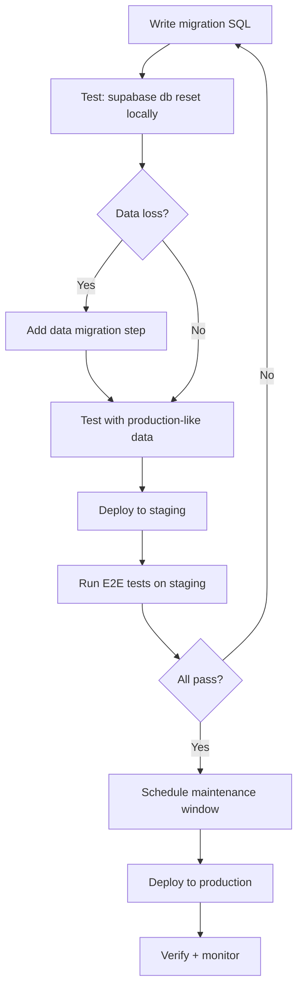

# Database Schema — LeonoreVault

**Database:** Supabase (PostgreSQL 15)
**Date:** 2026-02-08
**Reference:** [TSD §3](file:///d:/LeonoreKingdom/Project/Development/Web%20Development/LeonoreVault/.ai-docs/05-tsd.md)

---

## Table of Contents

1. [Extensions & Prerequisites](#1-extensions--prerequisites)
2. [Schema Definition (DDL)](#2-schema-definition-ddl)
3. [Functions & Triggers](#3-functions--triggers)
4. [Row-Level Security](#4-row-level-security)
5. [Seed Data](#5-seed-data)
6. [Migration Strategy](#6-migration-strategy)

---

## 1. Extensions & Prerequisites

```sql
-- ============================================================
-- 00_extensions.sql
-- Required PostgreSQL extensions for LeonoreVault
-- ============================================================

-- UUID generation (v4)
CREATE EXTENSION IF NOT EXISTS "pgcrypto";

-- Full-text search (built-in, but ensure pg_trgm for fuzzy)
CREATE EXTENSION IF NOT EXISTS "pg_trgm";

-- Scheduled jobs for cleanup tasks
CREATE EXTENSION IF NOT EXISTS "pg_cron";
```

---

## 2. Schema Definition (DDL)

### 2.1 `users`

```sql
-- ============================================================
-- 01_users.sql
-- ============================================================

CREATE TABLE public.users (
  id                   uuid        PRIMARY KEY DEFAULT auth.uid(),
  email                text        NOT NULL,
  display_name         text,
  avatar_url           text,
  google_refresh_token text,       -- Encrypted via pgcrypto
  created_at           timestamptz NOT NULL DEFAULT now(),
  updated_at           timestamptz NOT NULL DEFAULT now(),

  CONSTRAINT users_email_unique UNIQUE (email),
  CONSTRAINT users_email_format CHECK (email ~* '^[A-Za-z0-9._%+-]+@[A-Za-z0-9.-]+\.[A-Za-z]{2,}$')
);

COMMENT ON TABLE  public.users IS 'Application users, synced from Supabase Auth';
COMMENT ON COLUMN public.users.id IS 'Matches auth.users.id from Supabase Auth';
COMMENT ON COLUMN public.users.google_refresh_token IS 'AES-encrypted Google OAuth refresh token; admin-only access';
```

---

### 2.2 `households`

```sql
-- ============================================================
-- 02_households.sql
-- ============================================================

CREATE TABLE public.households (
  id                uuid        PRIMARY KEY DEFAULT gen_random_uuid(),
  name              text        NOT NULL,
  created_by        uuid        NOT NULL REFERENCES public.users(id),
  invite_code       text,
  invite_expires_at timestamptz,
  drive_folder_id   text,
  created_at        timestamptz NOT NULL DEFAULT now(),

  CONSTRAINT households_name_length CHECK (char_length(name) BETWEEN 1 AND 100),
  CONSTRAINT households_invite_code_format CHECK (
    invite_code IS NULL OR invite_code ~ '^[A-Z0-9]{6}$'
  ),
  CONSTRAINT households_invite_consistency CHECK (
    (invite_code IS NULL AND invite_expires_at IS NULL) OR
    (invite_code IS NOT NULL AND invite_expires_at IS NOT NULL)
  )
);

-- Partial unique index: only active invite codes must be unique
CREATE UNIQUE INDEX households_invite_code_unique
  ON public.households (invite_code)
  WHERE invite_code IS NOT NULL;

COMMENT ON TABLE  public.households IS 'Household groups that own items';
COMMENT ON COLUMN public.households.invite_code IS '6-char uppercase alphanumeric; NULL when no active invite';
COMMENT ON COLUMN public.households.drive_folder_id IS 'Google Drive root folder ID for household attachments';
```

---

### 2.3 `memberships`

```sql
-- ============================================================
-- 03_memberships.sql
-- ============================================================

CREATE TABLE public.memberships (
  id           uuid        PRIMARY KEY DEFAULT gen_random_uuid(),
  user_id      uuid        NOT NULL REFERENCES public.users(id) ON DELETE CASCADE,
  household_id uuid        NOT NULL REFERENCES public.households(id) ON DELETE CASCADE,
  role         text        NOT NULL DEFAULT 'member',
  joined_at    timestamptz NOT NULL DEFAULT now(),

  CONSTRAINT memberships_user_household_unique UNIQUE (user_id, household_id),
  CONSTRAINT memberships_role_valid CHECK (role IN ('admin', 'member', 'viewer'))
);

CREATE INDEX idx_memberships_household ON public.memberships (household_id);
CREATE INDEX idx_memberships_user ON public.memberships (user_id);

COMMENT ON TABLE  public.memberships IS 'Junction table: users ↔ households with role';
COMMENT ON COLUMN public.memberships.role IS 'admin > member > viewer';
```

---

### 2.4 `categories`

```sql
-- ============================================================
-- 04_categories.sql
-- ============================================================

CREATE TABLE public.categories (
  id           uuid PRIMARY KEY DEFAULT gen_random_uuid(),
  household_id uuid NOT NULL REFERENCES public.households(id) ON DELETE CASCADE,
  name         text NOT NULL,
  parent_id    uuid REFERENCES public.categories(id) ON DELETE CASCADE,
  icon         text,
  color        text,
  sort_order   int4 NOT NULL DEFAULT 0,

  CONSTRAINT categories_name_length CHECK (char_length(name) BETWEEN 1 AND 100),
  CONSTRAINT categories_color_format CHECK (color IS NULL OR color ~ '^#[0-9A-Fa-f]{6}$'),
  CONSTRAINT categories_no_self_parent CHECK (id != parent_id)
);

-- Unique name within same parent scope of a household
CREATE UNIQUE INDEX categories_unique_name
  ON public.categories (household_id, COALESCE(parent_id, '00000000-0000-0000-0000-000000000000'), name);

CREATE INDEX idx_categories_household ON public.categories (household_id);
CREATE INDEX idx_categories_parent ON public.categories (parent_id) WHERE parent_id IS NOT NULL;

COMMENT ON TABLE  public.categories IS 'Hierarchical item categories (max depth 3)';
COMMENT ON COLUMN public.categories.parent_id IS 'Self-referencing FK; NULL = root category';
```

---

### 2.5 `locations`

```sql
-- ============================================================
-- 05_locations.sql
-- ============================================================

CREATE TABLE public.locations (
  id           uuid PRIMARY KEY DEFAULT gen_random_uuid(),
  household_id uuid NOT NULL REFERENCES public.households(id) ON DELETE CASCADE,
  name         text NOT NULL,
  parent_id    uuid REFERENCES public.locations(id) ON DELETE CASCADE,
  description  text,
  sort_order   int4 NOT NULL DEFAULT 0,

  CONSTRAINT locations_name_length CHECK (char_length(name) BETWEEN 1 AND 100),
  CONSTRAINT locations_desc_length CHECK (description IS NULL OR char_length(description) <= 500),
  CONSTRAINT locations_no_self_parent CHECK (id != parent_id)
);

CREATE UNIQUE INDEX locations_unique_name
  ON public.locations (household_id, COALESCE(parent_id, '00000000-0000-0000-0000-000000000000'), name);

CREATE INDEX idx_locations_household ON public.locations (household_id);
CREATE INDEX idx_locations_parent ON public.locations (parent_id) WHERE parent_id IS NOT NULL;

COMMENT ON TABLE  public.locations IS 'Hierarchical storage locations (max depth 3)';
```

---

### 2.6 `items`

```sql
-- ============================================================
-- 06_items.sql
-- ============================================================

CREATE TABLE public.items (
  id              uuid        PRIMARY KEY DEFAULT gen_random_uuid(),
  household_id    uuid        NOT NULL REFERENCES public.households(id) ON DELETE CASCADE,
  name            text        NOT NULL,
  description     text,
  category_id     uuid        REFERENCES public.categories(id) ON DELETE SET NULL,
  location_id     uuid        REFERENCES public.locations(id) ON DELETE SET NULL,
  quantity        int4        NOT NULL DEFAULT 1,
  tags            text[]      DEFAULT '{}',
  status          text        NOT NULL DEFAULT 'stored',
  created_by      uuid        NOT NULL REFERENCES public.users(id),
  borrowed_by     uuid        REFERENCES public.users(id),
  borrow_due_date timestamptz,
  created_at      timestamptz NOT NULL DEFAULT now(),
  updated_at      timestamptz NOT NULL DEFAULT now(),
  deleted_at      timestamptz,

  CONSTRAINT items_name_length CHECK (char_length(name) BETWEEN 1 AND 200),
  CONSTRAINT items_desc_length CHECK (description IS NULL OR char_length(description) <= 2000),
  CONSTRAINT items_quantity_positive CHECK (quantity >= 1),
  CONSTRAINT items_tags_limit CHECK (array_length(tags, 1) IS NULL OR array_length(tags, 1) <= 20),
  CONSTRAINT items_status_valid CHECK (status IN ('stored', 'borrowed', 'lost', 'in_lost_found')),
  CONSTRAINT items_borrow_consistency CHECK (
    (status = 'borrowed' AND borrowed_by IS NOT NULL) OR
    (status != 'borrowed' AND borrowed_by IS NULL AND borrow_due_date IS NULL)
  )
);

-- Primary query index
CREATE INDEX idx_items_household ON public.items (household_id);

-- Status filter
CREATE INDEX idx_items_household_status ON public.items (household_id, status)
  WHERE deleted_at IS NULL;

-- Full-text search on name
CREATE INDEX idx_items_name_fts ON public.items
  USING GIN (to_tsvector('english', name));

-- Trigram index for fuzzy/partial matching
CREATE INDEX idx_items_name_trgm ON public.items
  USING GIN (name gin_trgm_ops);

-- Soft-delete cleanup
CREATE INDEX idx_items_deleted ON public.items (deleted_at)
  WHERE deleted_at IS NOT NULL;

-- Created-by for activity queries
CREATE INDEX idx_items_created_by ON public.items (created_by);

COMMENT ON TABLE  public.items IS 'Core entity: household inventory items';
COMMENT ON COLUMN public.items.tags IS 'Array of string tags; max 20 entries, each ≤ 50 chars';
COMMENT ON COLUMN public.items.deleted_at IS 'Soft-delete; auto-purged after 30 days via pg_cron';
```

---

### 2.7 `attachments`

```sql
-- ============================================================
-- 07_attachments.sql
-- ============================================================

CREATE TABLE public.attachments (
  id            uuid        PRIMARY KEY DEFAULT gen_random_uuid(),
  item_id       uuid        NOT NULL REFERENCES public.items(id) ON DELETE CASCADE,
  drive_file_id text        NOT NULL,
  file_name     text        NOT NULL,
  mime_type     text        NOT NULL,
  thumbnail_url text,
  web_view_link text,
  created_by    uuid        NOT NULL REFERENCES public.users(id),
  created_at    timestamptz NOT NULL DEFAULT now(),

  CONSTRAINT attachments_file_name_length CHECK (char_length(file_name) BETWEEN 1 AND 255),
  CONSTRAINT attachments_mime_type_valid CHECK (
    mime_type IN (
      'image/jpeg',
      'image/png',
      'application/pdf',
      'application/vnd.openxmlformats-officedocument.wordprocessingml.document',
      'application/vnd.google-apps.document'
    )
  )
);

CREATE INDEX idx_attachments_item ON public.attachments (item_id);

COMMENT ON TABLE  public.attachments IS 'Files stored in Google Drive, linked to items';
COMMENT ON COLUMN public.attachments.drive_file_id IS 'Google Drive file ID or external URL identifier';
```

---

### 2.8 `item_activities`

```sql
-- ============================================================
-- 08_item_activities.sql
-- ============================================================

CREATE TABLE public.item_activities (
  id         uuid        PRIMARY KEY DEFAULT gen_random_uuid(),
  item_id    uuid        NOT NULL REFERENCES public.items(id) ON DELETE CASCADE,
  user_id    uuid        NOT NULL REFERENCES public.users(id),
  action     text        NOT NULL,
  details    jsonb,
  created_at timestamptz NOT NULL DEFAULT now(),

  CONSTRAINT activities_action_valid CHECK (
    action IN (
      'created',
      'updated',
      'moved',
      'status_changed',
      'attachment_added',
      'attachment_removed'
    )
  )
);

CREATE INDEX idx_activities_item_time ON public.item_activities (item_id, created_at DESC);
CREATE INDEX idx_activities_user ON public.item_activities (user_id);

COMMENT ON TABLE  public.item_activities IS 'Audit log for item changes';
COMMENT ON COLUMN public.item_activities.details IS 'JSON payload: {"old_status":"stored","new_status":"lost"} etc.';
```

---

## 3. Functions & Triggers

### 3.1 Auto-Update `updated_at`

```sql
-- ============================================================
-- 10_triggers_updated_at.sql
-- ============================================================

CREATE OR REPLACE FUNCTION public.update_updated_at()
RETURNS TRIGGER AS $$
BEGIN
  NEW.updated_at = now();
  RETURN NEW;
END;
$$ LANGUAGE plpgsql;

-- Apply to tables with updated_at column
CREATE TRIGGER trg_users_updated_at
  BEFORE UPDATE ON public.users
  FOR EACH ROW EXECUTE FUNCTION public.update_updated_at();

CREATE TRIGGER trg_items_updated_at
  BEFORE UPDATE ON public.items
  FOR EACH ROW EXECUTE FUNCTION public.update_updated_at();
```

---

### 3.2 Category Max Depth Enforcement

```sql
-- ============================================================
-- 11_triggers_depth_check.sql
-- ============================================================

-- Generic depth checker (parameterized by table name)
CREATE OR REPLACE FUNCTION public.check_category_depth()
RETURNS TRIGGER AS $$
DECLARE
  depth int := 0;
  current_parent uuid := NEW.parent_id;
BEGIN
  -- Walk up the parent chain
  WHILE current_parent IS NOT NULL LOOP
    depth := depth + 1;
    IF depth > 2 THEN  -- 0-indexed: root=0, child=1, grandchild=2
      RAISE EXCEPTION 'Maximum nesting depth of 3 exceeded for categories'
        USING ERRCODE = 'check_violation';
    END IF;

    SELECT parent_id INTO current_parent
      FROM public.categories
      WHERE id = current_parent;
  END LOOP;

  -- Also check downward: ensure children won't exceed depth
  IF TG_OP = 'UPDATE' AND NEW.parent_id IS DISTINCT FROM OLD.parent_id THEN
    DECLARE
      max_child_depth int;
    BEGIN
      WITH RECURSIVE descendants AS (
        SELECT id, 0 AS lvl FROM public.categories WHERE parent_id = NEW.id
        UNION ALL
        SELECT c.id, d.lvl + 1
          FROM public.categories c
          JOIN descendants d ON c.parent_id = d.id
      )
      SELECT COALESCE(MAX(lvl), -1) INTO max_child_depth FROM descendants;

      IF (depth + 1 + max_child_depth + 1) > 3 THEN
        RAISE EXCEPTION 'Moving this category would exceed max depth of 3'
          USING ERRCODE = 'check_violation';
      END IF;
    END;
  END IF;

  RETURN NEW;
END;
$$ LANGUAGE plpgsql;

CREATE TRIGGER trg_categories_depth
  BEFORE INSERT OR UPDATE OF parent_id ON public.categories
  FOR EACH ROW
  WHEN (NEW.parent_id IS NOT NULL)
  EXECUTE FUNCTION public.check_category_depth();
```

---

### 3.3 Location Max Depth Enforcement

```sql
-- ============================================================
-- 12_triggers_location_depth.sql
-- ============================================================

CREATE OR REPLACE FUNCTION public.check_location_depth()
RETURNS TRIGGER AS $$
DECLARE
  depth int := 0;
  current_parent uuid := NEW.parent_id;
BEGIN
  WHILE current_parent IS NOT NULL LOOP
    depth := depth + 1;
    IF depth > 2 THEN
      RAISE EXCEPTION 'Maximum nesting depth of 3 exceeded for locations'
        USING ERRCODE = 'check_violation';
    END IF;

    SELECT parent_id INTO current_parent
      FROM public.locations
      WHERE id = current_parent;
  END LOOP;

  IF TG_OP = 'UPDATE' AND NEW.parent_id IS DISTINCT FROM OLD.parent_id THEN
    DECLARE
      max_child_depth int;
    BEGIN
      WITH RECURSIVE descendants AS (
        SELECT id, 0 AS lvl FROM public.locations WHERE parent_id = NEW.id
        UNION ALL
        SELECT l.id, d.lvl + 1
          FROM public.locations l
          JOIN descendants d ON l.parent_id = d.id
      )
      SELECT COALESCE(MAX(lvl), -1) INTO max_child_depth FROM descendants;

      IF (depth + 1 + max_child_depth + 1) > 3 THEN
        RAISE EXCEPTION 'Moving this location would exceed max depth of 3'
          USING ERRCODE = 'check_violation';
      END IF;
    END;
  END IF;

  RETURN NEW;
END;
$$ LANGUAGE plpgsql;

CREATE TRIGGER trg_locations_depth
  BEFORE INSERT OR UPDATE OF parent_id ON public.locations
  FOR EACH ROW
  WHEN (NEW.parent_id IS NOT NULL)
  EXECUTE FUNCTION public.check_location_depth();
```

---

### 3.4 Attachment Count Enforcement

```sql
-- ============================================================
-- 13_triggers_attachment_limit.sql
-- ============================================================

CREATE OR REPLACE FUNCTION public.check_attachment_limit()
RETURNS TRIGGER AS $$
DECLARE
  current_count int;
BEGIN
  SELECT COUNT(*) INTO current_count
    FROM public.attachments
    WHERE item_id = NEW.item_id;

  IF current_count >= 10 THEN
    RAISE EXCEPTION 'Maximum of 10 attachments per item exceeded'
      USING ERRCODE = 'check_violation';
  END IF;

  RETURN NEW;
END;
$$ LANGUAGE plpgsql;

CREATE TRIGGER trg_attachments_limit
  BEFORE INSERT ON public.attachments
  FOR EACH ROW EXECUTE FUNCTION public.check_attachment_limit();
```

---

### 3.5 Scheduled Cleanup Jobs

```sql
-- ============================================================
-- 14_cron_jobs.sql
-- ============================================================

-- Purge soft-deleted items older than 30 days (runs daily at 3 AM UTC)
CREATE OR REPLACE FUNCTION public.purge_deleted_items()
RETURNS void AS $$
BEGIN
  DELETE FROM public.items
    WHERE deleted_at IS NOT NULL
      AND deleted_at < now() - INTERVAL '30 days';
END;
$$ LANGUAGE plpgsql SECURITY DEFINER;

SELECT cron.schedule(
  'purge-deleted-items',
  '0 3 * * *',             -- Daily at 03:00 UTC
  $$SELECT public.purge_deleted_items()$$
);

-- Clean expired invite codes (runs every hour)
CREATE OR REPLACE FUNCTION public.cleanup_expired_invites()
RETURNS void AS $$
BEGIN
  UPDATE public.households
    SET invite_code = NULL, invite_expires_at = NULL
    WHERE invite_expires_at IS NOT NULL
      AND invite_expires_at < now();
END;
$$ LANGUAGE plpgsql SECURITY DEFINER;

SELECT cron.schedule(
  'cleanup-expired-invites',
  '0 * * * *',             -- Every hour at :00
  $$SELECT public.cleanup_expired_invites()$$
);
```

---

### 3.6 Auto-Create User Profile on Auth Signup

```sql
-- ============================================================
-- 15_triggers_auth_sync.sql
-- ============================================================

-- Called by Supabase Auth hook when a new user signs up
CREATE OR REPLACE FUNCTION public.handle_new_user()
RETURNS TRIGGER AS $$
BEGIN
  INSERT INTO public.users (id, email, display_name, avatar_url)
  VALUES (
    NEW.id,
    NEW.email,
    COALESCE(NEW.raw_user_meta_data ->> 'full_name', NEW.raw_user_meta_data ->> 'name'),
    NEW.raw_user_meta_data ->> 'avatar_url'
  );
  RETURN NEW;
END;
$$ LANGUAGE plpgsql SECURITY DEFINER;

CREATE TRIGGER on_auth_user_created
  AFTER INSERT ON auth.users
  FOR EACH ROW EXECUTE FUNCTION public.handle_new_user();
```

---

## 4. Row-Level Security

### 4.1 Enable RLS

```sql
-- ============================================================
-- 20_rls_enable.sql
-- ============================================================

ALTER TABLE public.users           ENABLE ROW LEVEL SECURITY;
ALTER TABLE public.households      ENABLE ROW LEVEL SECURITY;
ALTER TABLE public.memberships     ENABLE ROW LEVEL SECURITY;
ALTER TABLE public.categories      ENABLE ROW LEVEL SECURITY;
ALTER TABLE public.locations       ENABLE ROW LEVEL SECURITY;
ALTER TABLE public.items           ENABLE ROW LEVEL SECURITY;
ALTER TABLE public.attachments     ENABLE ROW LEVEL SECURITY;
ALTER TABLE public.item_activities ENABLE ROW LEVEL SECURITY;
```

---

### 4.2 Helper Functions

```sql
-- ============================================================
-- 21_rls_helpers.sql
-- ============================================================

-- Check if current user is a member of the given household
CREATE OR REPLACE FUNCTION public.is_household_member(h_id uuid)
RETURNS boolean AS $$
  SELECT EXISTS (
    SELECT 1 FROM public.memberships
    WHERE user_id = auth.uid()
      AND household_id = h_id
  );
$$ LANGUAGE sql STABLE SECURITY DEFINER;

-- Get current user's role in the given household
CREATE OR REPLACE FUNCTION public.get_household_role(h_id uuid)
RETURNS text AS $$
  SELECT role FROM public.memberships
  WHERE user_id = auth.uid()
    AND household_id = h_id
  LIMIT 1;
$$ LANGUAGE sql STABLE SECURITY DEFINER;

-- Check if current user has write access (admin or member)
CREATE OR REPLACE FUNCTION public.has_write_access(h_id uuid)
RETURNS boolean AS $$
  SELECT EXISTS (
    SELECT 1 FROM public.memberships
    WHERE user_id = auth.uid()
      AND household_id = h_id
      AND role IN ('admin', 'member')
  );
$$ LANGUAGE sql STABLE SECURITY DEFINER;

-- Check if current user is admin of the given household
CREATE OR REPLACE FUNCTION public.is_household_admin(h_id uuid)
RETURNS boolean AS $$
  SELECT EXISTS (
    SELECT 1 FROM public.memberships
    WHERE user_id = auth.uid()
      AND household_id = h_id
      AND role = 'admin'
  );
$$ LANGUAGE sql STABLE SECURITY DEFINER;
```

---

### 4.3 Policies — `users`

```sql
-- ============================================================
-- 22_rls_users.sql
-- ============================================================

-- Users can read only their own row
CREATE POLICY users_select_own
  ON public.users FOR SELECT
  USING (id = auth.uid());

-- Users can update only their own row (cannot change id or email)
CREATE POLICY users_update_own
  ON public.users FOR UPDATE
  USING (id = auth.uid())
  WITH CHECK (id = auth.uid());

-- Insert handled by auth trigger (service role)
-- No direct insert policy needed for anon/authenticated
```

---

### 4.4 Policies — `households`

```sql
-- ============================================================
-- 23_rls_households.sql
-- ============================================================

-- Members can read their household
CREATE POLICY households_select_member
  ON public.households FOR SELECT
  USING (public.is_household_member(id));

-- Any authenticated user can create a household
CREATE POLICY households_insert_auth
  ON public.households FOR INSERT
  WITH CHECK (auth.uid() IS NOT NULL AND created_by = auth.uid());

-- Only admin can update household settings
CREATE POLICY households_update_admin
  ON public.households FOR UPDATE
  USING (public.is_household_admin(id))
  WITH CHECK (public.is_household_admin(id));

-- Only admin can delete household (future)
CREATE POLICY households_delete_admin
  ON public.households FOR DELETE
  USING (public.is_household_admin(id));
```

---

### 4.5 Policies — `memberships`

```sql
-- ============================================================
-- 24_rls_memberships.sql
-- ============================================================

-- Members can see all memberships in their household
CREATE POLICY memberships_select_household
  ON public.memberships FOR SELECT
  USING (public.is_household_member(household_id));

-- Self-join (via invite code) or admin can add members
CREATE POLICY memberships_insert
  ON public.memberships FOR INSERT
  WITH CHECK (
    user_id = auth.uid()
    OR public.is_household_admin(household_id)
  );

-- Admin can update roles
CREATE POLICY memberships_update_admin
  ON public.memberships FOR UPDATE
  USING (public.is_household_admin(household_id))
  WITH CHECK (public.is_household_admin(household_id));

-- Admin can remove members
CREATE POLICY memberships_delete_admin
  ON public.memberships FOR DELETE
  USING (public.is_household_admin(household_id));
```

---

### 4.6 Policies — `categories`

```sql
-- ============================================================
-- 25_rls_categories.sql
-- ============================================================

-- Any household member can read categories
CREATE POLICY categories_select_member
  ON public.categories FOR SELECT
  USING (public.is_household_member(household_id));

-- Only admin can create categories
CREATE POLICY categories_insert_admin
  ON public.categories FOR INSERT
  WITH CHECK (public.is_household_admin(household_id));

-- Only admin can update categories
CREATE POLICY categories_update_admin
  ON public.categories FOR UPDATE
  USING (public.is_household_admin(household_id));

-- Only admin can delete categories
CREATE POLICY categories_delete_admin
  ON public.categories FOR DELETE
  USING (public.is_household_admin(household_id));
```

---

### 4.7 Policies — `locations`

```sql
-- ============================================================
-- 26_rls_locations.sql
-- ============================================================

CREATE POLICY locations_select_member
  ON public.locations FOR SELECT
  USING (public.is_household_member(household_id));

CREATE POLICY locations_insert_admin
  ON public.locations FOR INSERT
  WITH CHECK (public.is_household_admin(household_id));

CREATE POLICY locations_update_admin
  ON public.locations FOR UPDATE
  USING (public.is_household_admin(household_id));

CREATE POLICY locations_delete_admin
  ON public.locations FOR DELETE
  USING (public.is_household_admin(household_id));
```

---

### 4.8 Policies — `items`

```sql
-- ============================================================
-- 27_rls_items.sql
-- ============================================================

-- Any member can read non-deleted items
CREATE POLICY items_select_member
  ON public.items FOR SELECT
  USING (
    public.is_household_member(household_id)
    AND deleted_at IS NULL
  );

-- Member+ can create items
CREATE POLICY items_insert_writer
  ON public.items FOR INSERT
  WITH CHECK (
    public.has_write_access(household_id)
    AND created_by = auth.uid()
  );

-- Member+ can update items
CREATE POLICY items_update_writer
  ON public.items FOR UPDATE
  USING (public.has_write_access(household_id));

-- Only admin can hard-delete (soft-delete is an UPDATE)
CREATE POLICY items_delete_admin
  ON public.items FOR DELETE
  USING (public.is_household_admin(household_id));
```

---

### 4.9 Policies — `attachments`

```sql
-- ============================================================
-- 28_rls_attachments.sql
-- ============================================================

-- Read: household members via item join
CREATE POLICY attachments_select_member
  ON public.attachments FOR SELECT
  USING (
    EXISTS (
      SELECT 1 FROM public.items i
      WHERE i.id = attachments.item_id
        AND public.is_household_member(i.household_id)
    )
  );

-- Insert: member+ of the item's household
CREATE POLICY attachments_insert_writer
  ON public.attachments FOR INSERT
  WITH CHECK (
    EXISTS (
      SELECT 1 FROM public.items i
      WHERE i.id = attachments.item_id
        AND public.has_write_access(i.household_id)
    )
    AND created_by = auth.uid()
  );

-- Delete: member+ of the item's household
CREATE POLICY attachments_delete_writer
  ON public.attachments FOR DELETE
  USING (
    EXISTS (
      SELECT 1 FROM public.items i
      WHERE i.id = attachments.item_id
        AND public.has_write_access(i.household_id)
    )
  );
```

---

### 4.10 Policies — `item_activities`

```sql
-- ============================================================
-- 29_rls_item_activities.sql
-- ============================================================

-- Read: household members via item join
CREATE POLICY activities_select_member
  ON public.item_activities FOR SELECT
  USING (
    EXISTS (
      SELECT 1 FROM public.items i
      WHERE i.id = item_activities.item_id
        AND public.is_household_member(i.household_id)
    )
  );

-- Insert: member+ (activity logging)
CREATE POLICY activities_insert_writer
  ON public.item_activities FOR INSERT
  WITH CHECK (
    EXISTS (
      SELECT 1 FROM public.items i
      WHERE i.id = item_activities.item_id
        AND public.has_write_access(i.household_id)
    )
    AND user_id = auth.uid()
  );

-- No update or delete policies — activity log is append-only
```

---

## 5. Seed Data

### 5.1 Development Seed

```sql
-- ============================================================
-- seed.sql
-- Development/testing seed data
-- Run via: supabase db reset (applies migrations + seed)
-- ============================================================

-- ──────────────────────────────────────────────────────────────
-- Test Users (IDs match Supabase Auth seed in supabase/config.toml)
-- ──────────────────────────────────────────────────────────────
INSERT INTO public.users (id, email, display_name, avatar_url) VALUES
  ('a1b2c3d4-e5f6-7890-abcd-ef1234567890', 'leonore@example.com', 'Leonore', NULL),
  ('b2c3d4e5-f6a7-8901-bcde-f12345678901', 'member@example.com',  'Alex Member', NULL),
  ('c3d4e5f6-a7b8-9012-cdef-123456789012', 'viewer@example.com',  'Sam Viewer', NULL);

-- ──────────────────────────────────────────────────────────────
-- Test Household
-- ──────────────────────────────────────────────────────────────
INSERT INTO public.households (id, name, created_by, invite_code, invite_expires_at) VALUES
  ('h1h2h3h4-h5h6-7890-abcd-ef1234567890', 'Casa Leonore',
   'a1b2c3d4-e5f6-7890-abcd-ef1234567890', 'TEST01',
   now() + INTERVAL '7 days');

-- ──────────────────────────────────────────────────────────────
-- Memberships (admin, member, viewer)
-- ──────────────────────────────────────────────────────────────
INSERT INTO public.memberships (user_id, household_id, role) VALUES
  ('a1b2c3d4-e5f6-7890-abcd-ef1234567890', 'h1h2h3h4-h5h6-7890-abcd-ef1234567890', 'admin'),
  ('b2c3d4e5-f6a7-8901-bcde-f12345678901', 'h1h2h3h4-h5h6-7890-abcd-ef1234567890', 'member'),
  ('c3d4e5f6-a7b8-9012-cdef-123456789012', 'h1h2h3h4-h5h6-7890-abcd-ef1234567890', 'viewer');

-- ──────────────────────────────────────────────────────────────
-- Categories (2 root + 3 children)
-- ──────────────────────────────────────────────────────────────
INSERT INTO public.categories (id, household_id, name, parent_id, icon, color, sort_order) VALUES
  -- Root categories
  ('c1000000-0000-0000-0000-000000000001', 'h1h2h3h4-h5h6-7890-abcd-ef1234567890',
   'Documents', NULL, '📄', '#4A90D9', 0),
  ('c1000000-0000-0000-0000-000000000002', 'h1h2h3h4-h5h6-7890-abcd-ef1234567890',
   'Electronics', NULL, '💻', '#E74C3C', 1),
  -- Children
  ('c2000000-0000-0000-0000-000000000001', 'h1h2h3h4-h5h6-7890-abcd-ef1234567890',
   'IDs & Passports', 'c1000000-0000-0000-0000-000000000001', '🛂', '#4A90D9', 0),
  ('c2000000-0000-0000-0000-000000000002', 'h1h2h3h4-h5h6-7890-abcd-ef1234567890',
   'Certificates', 'c1000000-0000-0000-0000-000000000001', '📜', '#4A90D9', 1),
  ('c2000000-0000-0000-0000-000000000003', 'h1h2h3h4-h5h6-7890-abcd-ef1234567890',
   'Chargers & Cables', 'c1000000-0000-0000-0000-000000000002', '🔌', '#E74C3C', 0);

-- ──────────────────────────────────────────────────────────────
-- Locations (2 root + 3 children)
-- ──────────────────────────────────────────────────────────────
INSERT INTO public.locations (id, household_id, name, parent_id, description, sort_order) VALUES
  -- Root locations
  ('l1000000-0000-0000-0000-000000000001', 'h1h2h3h4-h5h6-7890-abcd-ef1234567890',
   'Master Bedroom', NULL, 'Main bedroom, second floor', 0),
  ('l1000000-0000-0000-0000-000000000002', 'h1h2h3h4-h5h6-7890-abcd-ef1234567890',
   'Living Room', NULL, 'Ground floor living area', 1),
  -- Children
  ('l2000000-0000-0000-0000-000000000001', 'h1h2h3h4-h5h6-7890-abcd-ef1234567890',
   'Safe', 'l1000000-0000-0000-0000-000000000001', 'Fireproof safe in master bedroom closet', 0),
  ('l2000000-0000-0000-0000-000000000002', 'h1h2h3h4-h5h6-7890-abcd-ef1234567890',
   'Bedside Table', 'l1000000-0000-0000-0000-000000000001', 'Left bedside table', 1),
  ('l2000000-0000-0000-0000-000000000003', 'h1h2h3h4-h5h6-7890-abcd-ef1234567890',
   'TV Cabinet', 'l1000000-0000-0000-0000-000000000002', 'Cabinet under the TV', 0);

-- ──────────────────────────────────────────────────────────────
-- Items (5 sample items with different statuses)
-- ──────────────────────────────────────────────────────────────
INSERT INTO public.items (id, household_id, name, description, category_id, location_id, quantity, tags, status, created_by) VALUES
  ('i1000000-0000-0000-0000-000000000001', 'h1h2h3h4-h5h6-7890-abcd-ef1234567890',
   'Passport (Leonore)', 'Philippine passport, expires 2030',
   'c2000000-0000-0000-0000-000000000001', 'l2000000-0000-0000-0000-000000000001',
   1, ARRAY['important', 'travel'], 'stored', 'a1b2c3d4-e5f6-7890-abcd-ef1234567890'),

  ('i1000000-0000-0000-0000-000000000002', 'h1h2h3h4-h5h6-7890-abcd-ef1234567890',
   'USB-C Laptop Charger', 'Lenovo 65W USB-C adapter',
   'c2000000-0000-0000-0000-000000000003', 'l2000000-0000-0000-0000-000000000002',
   1, ARRAY['electronics', 'office'], 'stored', 'a1b2c3d4-e5f6-7890-abcd-ef1234567890'),

  ('i1000000-0000-0000-0000-000000000003', 'h1h2h3h4-h5h6-7890-abcd-ef1234567890',
   'Birth Certificate', 'PSA-certified copy',
   'c2000000-0000-0000-0000-000000000002', 'l2000000-0000-0000-0000-000000000001',
   1, ARRAY['important', 'legal'], 'stored', 'a1b2c3d4-e5f6-7890-abcd-ef1234567890'),

  ('i1000000-0000-0000-0000-000000000004', 'h1h2h3h4-h5h6-7890-abcd-ef1234567890',
   'TV Remote', 'Samsung Smart TV remote',
   'c1000000-0000-0000-0000-000000000002', 'l2000000-0000-0000-0000-000000000003',
   1, ARRAY['electronics'], 'lost', 'b2c3d4e5-f6a7-8901-bcde-f12345678901'),

  ('i1000000-0000-0000-0000-000000000005', 'h1h2h3h4-h5h6-7890-abcd-ef1234567890',
   'HDMI Cable (2m)', 'High-speed HDMI 2.1 cable',
   'c2000000-0000-0000-0000-000000000003', NULL,
   2, ARRAY['electronics', 'cables'], 'stored', 'b2c3d4e5-f6a7-8901-bcde-f12345678901');

-- ──────────────────────────────────────────────────────────────
-- Sample Activities
-- ──────────────────────────────────────────────────────────────
INSERT INTO public.item_activities (item_id, user_id, action, details) VALUES
  ('i1000000-0000-0000-0000-000000000001', 'a1b2c3d4-e5f6-7890-abcd-ef1234567890',
   'created', NULL),
  ('i1000000-0000-0000-0000-000000000004', 'b2c3d4e5-f6a7-8901-bcde-f12345678901',
   'created', NULL),
  ('i1000000-0000-0000-0000-000000000004', 'b2c3d4e5-f6a7-8901-bcde-f12345678901',
   'status_changed', '{"old_status": "stored", "new_status": "lost", "note": "Last seen in the living room"}');

-- ──────────────────────────────────────────────────────────────
-- Soft-deleted item (for testing restore)
-- ──────────────────────────────────────────────────────────────
INSERT INTO public.items (id, household_id, name, description, category_id, location_id, quantity, tags, status, created_by, deleted_at) VALUES
  ('i1000000-0000-0000-0000-000000000099', 'h1h2h3h4-h5h6-7890-abcd-ef1234567890',
   'Old Mouse', 'Logitech wireless mouse (broken)',
   'c1000000-0000-0000-0000-000000000002', NULL,
   1, ARRAY['electronics'], 'stored', 'a1b2c3d4-e5f6-7890-abcd-ef1234567890',
   now() - INTERVAL '5 days');
```

### 5.2 Supabase Auth Seed

```toml
# supabase/config.toml — add to [auth] section for local dev

[auth.seed]
# These user IDs must match the seed.sql user inserts
[[auth.seed.users]]
uid = "a1b2c3d4-e5f6-7890-abcd-ef1234567890"
email = "leonore@example.com"
password = "password123!"

[[auth.seed.users]]
uid = "b2c3d4e5-f6a7-8901-bcde-f12345678901"
email = "member@example.com"
password = "password123!"

[[auth.seed.users]]
uid = "c3d4e5f6-a7b8-9012-cdef-123456789012"
email = "viewer@example.com"
password = "password123!"
```

---

## 6. Migration Strategy

### 6.1 Directory Structure

```
supabase/
├── config.toml
├── seed.sql                        ← Dev seed data (§5.1)
└── migrations/
    ├── 20260208000000_extensions.sql
    ├── 20260208000100_users.sql
    ├── 20260208000200_households.sql
    ├── 20260208000300_memberships.sql
    ├── 20260208000400_categories.sql
    ├── 20260208000500_locations.sql
    ├── 20260208000600_items.sql
    ├── 20260208000700_attachments.sql
    ├── 20260208000800_item_activities.sql
    ├── 20260208001000_triggers.sql
    ├── 20260208001100_cron_jobs.sql
    ├── 20260208002000_rls_enable.sql
    ├── 20260208002100_rls_helpers.sql
    ├── 20260208002200_rls_policies.sql
    └── 20260208002300_auth_trigger.sql
```

### 6.2 Workflow Commands

| Action            | Command                                                                         | Scope      |
| ----------------- | ------------------------------------------------------------------------------- | ---------- |
| Create migration  | `supabase migration new <name>`                                                 | Local      |
| Apply locally     | `supabase db reset`                                                             | Local      |
| Check diff        | `supabase db diff --schema public`                                              | Local      |
| Deploy to staging | `supabase db push --db-url $STAGING_DATABASE_URL`                               | Staging    |
| Deploy to prod    | `supabase db push --db-url $PRODUCTION_DATABASE_URL`                            | Production |
| Generate types    | `supabase gen types typescript --local > packages/shared/src/types/database.ts` | Local      |

### 6.3 Migration Rules

1. **Never modify existing migrations** — create a new migration for changes
2. **One concern per migration** — e.g., don't mix schema changes with seed data
3. **Always test locally first** — `supabase db reset` applies all migrations + seed
4. **Include rollback logic** — wrap destructive changes in transactions

```sql
-- Example: Adding a new column safely
-- Migration: 20260215000000_add_item_notes.sql

BEGIN;

ALTER TABLE public.items
  ADD COLUMN IF NOT EXISTS notes text;

COMMENT ON COLUMN public.items.notes IS 'Free-form notes about the item';

COMMIT;
```

### 6.4 Breaking Change Protocol

For changes that affect existing data:



### 6.5 Type Generation

After any schema change, regenerate TypeScript types:

```bash
# Generate Supabase database types
supabase gen types typescript --local \
  > packages/shared/src/types/database.ts

# This auto-generates types like:
# Database['public']['Tables']['items']['Row']
# Database['public']['Tables']['items']['Insert']
# Database['public']['Tables']['items']['Update']
```

---

_End of Database Schema_
